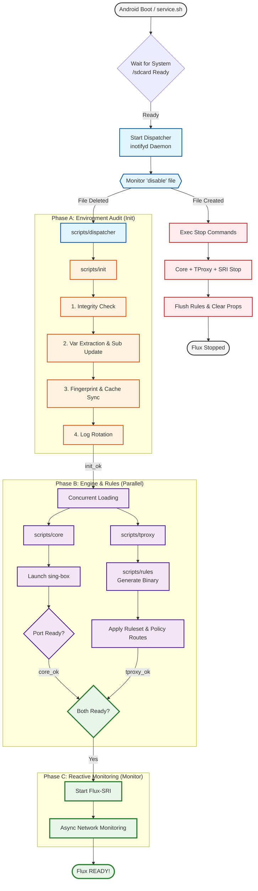
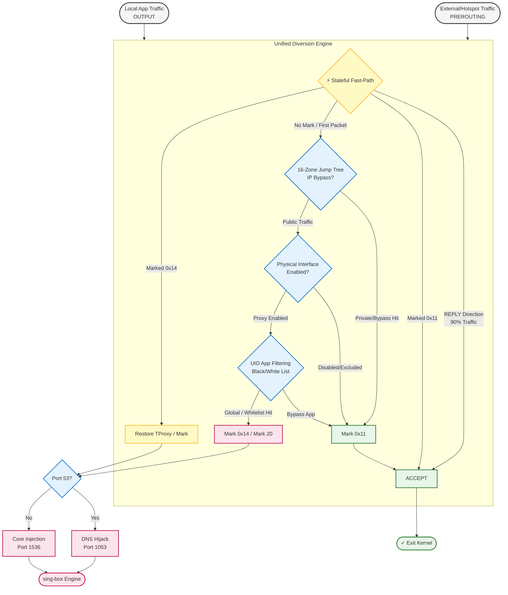

# Flux


[English](README.md) | [简体中文](README_zh.md)

> Seamlessly redirect your network flux.

A powerful Android transparent proxy module powered by [sing-box](https://sing-box.sagernet.org/), designed for Magisk / KernelSU / APatch.

> [!IMPORTANT]
> **Flux v1.2.0 is here!** This version is a major architectural leap, introducing the **SRI 2.0** state router and **High-Concurrency Funnel** rule architecture. See [CHANGELOG.md](CHANGELOG.md) for full update details.

## Features

### Core Components
- **sing-box Integration**: Uses sing-box as the core proxy engine
- **Subconverter Built-in**: Automatic subscription conversion and node filtering
- **jq Processor**: JSON manipulation for configuration generation

### Architecture & Optimization (v1.2.0+)
- **SRI 2.0 (State-driven Routing Injector)**: A new reactive monitoring engine utilizing FIFO pipes for sub-second IP route injection, preventing "leaks" during rapid network transitions.
- **Industrial Packet Funnel**: Refactored IPTables logic using a "Triple-Layer Filter" model (Physical Bypass -> Stateful Direct -> Exponential Jump Tree) for the shortest possible in-kernel processing path.
- **16-Zone Jump Tree (O(n/16))**: Large CIDR/IP bypass lists are now partitioned into 16 zones by subnet prefix, reducing CPU consumption by ~85% in heavy list environments.
- **Multi-tier Cache System**: Advanced fingerprinting-based caching engine (Kernel/Rules/Config/Meta) minimizes I/O and CPU overhead.
- **Atomic Reliability Layer**: 100% data integrity via temp-and-swap strategy for all critical configuration and module updates.

### Proxy Modes
- **TPROXY** (default): High-performance transparent proxying with full TCP/UDP support.
- **REDIRECT**: Reliable fallback for older kernels without TPROXY support.
- **Auto Detection**: Intelligent mode selection based on cached kernel capabilities.
- **Smart Extraction**: Automatically parses sing-box `config.json` for `mixed`/`tproxy`/`redirect` inbounds and ports.

### Network Support
- **Dual-Stack**: Full IPv4 and IPv6 proxy support
- **DNS Hijacking**: TProxy/Redirect mode DNS interception
- **FakeIP ICMP Fix**: Enables ping to work correctly with FakeIP DNS

### Interface Control
Independent proxy switches for each network interface:
- Mobile Data (`rmnet_data+`)
- Wi-Fi (`wlan0`)
- Hotspot (`wlan2`)
- USB Tethering (`rndis+`)

### Filtering Mechanisms
- **Per-App Proxy**: UID-based blacklist/whitelist mode with caching
- **Anti-Loopback**: Built-in route marking and user group protection to prevent traffic loops
- **Dynamic IP Monitor**: Automatically handles temporary IPv6 addresses with flush+re-add strategy

### Subscription Management
- Automatic download, conversion, and configuration generation
- Node filtering by region (regex-based country matching via `country_map.json`)
- Configurable update interval with smart caching
- Manual force update via `updater.sh`

### Interaction
- **[Vol+] / [Vol-]**: Choose whether to preserve configuration during installation
- **Module Toggle**: Enable/disable via Magisk Manager (reactive inotify-based)
- **Update Subscription**: Auto-updates on boot if `UPDATE_INTERVAL` has passed; run `updater.sh` to update manually
- **Web Dashboard**: Zashboard UI at `http://127.0.0.1:9090/ui/`

---

## Directory Structure

All module files are located at `/data/adb/flux/`:

```
/data/adb/flux/
├── bin/
│   └── sing-box              # sing-box core binary
│
├── conf/
│   ├── config.json           # Generated sing-box configuration
│   └── settings.ini          # User configuration file
│
├── run/
│   ├── flux.log              # Module runtime logs (with rotation)
│   ├── sing-box.pid          # sing-box process PID
│   ├── ipmonitor.pid         # IP monitor process PID
│   ├── ipmonitor.fifo        # IP monitor named pipe
│   └── event/                # Internal event signals
│
├── scripts/
│   ├── cache                 # Cache manager (validation & sig generation)
│   ├── config                # Config loader & robust JSON extractor
│   ├── const                 # Central path and constant definitions
│   ├── core                  # sing-box process control
│   ├── dispatcher            # Central Event handler (inotifyd)
│   ├── init                  # Environment & integrity initialization
│   ├── iphandler             # Interface-local IP synchronization
│   ├── ipmonitor             # Background network change daemon
│   ├── log                   # Flash-friendly logging & prop management
│   ├── rules                 # High-efficiency IPTables rule generator
│   ├── tproxy                # TProxy/Redirect routing orchestration
│   └── updater.sh            # Subscription sync & config merger
│
└── tools/
    ├── base/
    │   ├── country_map.json  # Country regex mapping for node filtering
    │   └── singbox.json      # sing-box configuration template
    ├── jq                    # jq binary for JSON processing
    ├── pref.toml             # Subconverter preferences
    └── subconverter          # Subconverter binary

```

## Workflow Visualization

### 1. Module Lifecycle
Tracing the flow from Android boot to steady-state monitoring with precision:



### 2. High-Concurrency Packet Funnel
Visualizing multi-layer O(1) kernel logic for sub-second precision steering:



---
### Magisk Module Directory (`/data/adb/modules/flux/`)

```
/data/adb/modules/flux/
├── webroot/
│   └── index.html            # Redirect to dashboard UI
├── service.sh                # Boot service launcher
├── module.prop               # Module metadata
└── disable                   # (Created when module is disabled)
```

---

## Configuration

Main configuration file: `/data/adb/flux/conf/settings.ini`. Changes take effect after service restart.

### 1. General Configuration
| Option | Description | Default |
|--------|-------------|---------|
| `SUBSCRIPTION_URL` | Subscription link for node conversion | (empty) |
| `UPDATE_TIMEOUT` | Download timeout in seconds | `15` |
| `RETRY_COUNT` | Number of retries for failed downloads | `2` |
| `UPDATE_INTERVAL` | Auto-update interval in seconds (86400=24h, 0=Disable) | `86400` |

### 2. Logging & Debugging
| Option | Description | Default |
|--------|-------------|---------|
| `LOG_LEVEL` | `0`=OFF, `1`=Error, `2`=Warn, `3`=Info, `4`=Debug | `3` |
| `LOG_MAX_SIZE` | Log size limit before rotation (bytes) | `1048576` |

### 3. Core Process
| Option | Description | Default |
|--------|-------------|---------|
| `CORE_USER` | Execution user for sing-box | `root` |
| `CORE_GROUP` | Execution group for sing-box | `root` |
| `CORE_TIMEOUT` | Core startup timeout in seconds | `5` |

### 4. Proxy Engine
| Option | Description | Default |
|--------|-------------|---------|
| `PROXY_MODE` | `0`=Auto, `1`=TProxy, `2`=Redirect | `0` |
| `DNS_HIJACK_ENABLE` | `0`=Disable, `1`=TProxy (Mangle), `2`=Redirect (NAT) | `1` |
| `DNS_PORT` | DNS Local listening port | `1053` |

### 5. Network Interfaces
| Option | Description | Default IF Name |
|--------|-------------|-----------------|
| `MOBILE_INTERFACE` | Mobile data interface pattern | `rmnet_data+` |
| `WIFI_INTERFACE` | Wi-Fi interface name | `wlan0` |
| `HOTSPOT_INTERFACE` | Hotspot interface name | `wlan2` |
| `USB_INTERFACE` | USB tethering interface pattern | `rndis+` |

### 6. Proxy Granularity
| Option | Description | Default |
|--------|-------------|---------|
| `PROXY_MOBILE` / `PROXY_WIFI` | Interface proxy switches (0=Bypass, 1=Proxy) | `1` |
| `PROXY_HOTSPOT` / `PROXY_USB` | Interface proxy switches (0=Bypass, 1=Proxy) | `0` |
| `PROXY_TCP` | Enable/Disable TCP Proxying | `1` |
| `PROXY_UDP` | Enable/Disable UDP Proxying | `1` |
| `PROXY_IPV6` | Enable/Disable IPv6 Proxying | `0` |

### 7. Network & Routing
| Option | Description | Default |
|--------|-------------|---------|
| `TABLE_ID` | IPTables Table ID | `2025` |
| `MARK_VALUE` | Fwmark for IPv4 rules | `20` |
| `MARK_VALUE6` | Fwmark for IPv6 rules | `25` |
| `ROUTING_MARK` | Core/Bypass Routing Mark (empty=UID match) | (empty) |

### 8. Application Filtering
| Option | Description | Default |
|--------|-------------|---------|
| `APP_PROXY_MODE` | `0`=Disable, `1`=Blacklist, `2`=Whitelist | `0` |
| `APP_LIST` | Package names (space/newline separated) | (empty) |

### 9. Performance & Compatibility
| Option | Description | Default |
|--------|-------------|---------|
| `SKIP_CHECK_FEATURE`| Skip kernel capability detection | `0` |
| `ENABLE_CONNTRACK`| Use Conntrack to optimize performance | `1` |
| `MSS_CLAMP_ENABLE`| Enable TCP MSS Clamping | `1` |
| `DEBOUNCE_INTERVAL` | Network change batch interval (seconds) | `10` |
| `EXCLUDE_INTERFACES`| List of interfaces to explicitly ignore | (empty) |

---

## Installation

1. Download the latest release ZIP from [Releases](https://github.com/Chth1z/Flux/releases)
2. Install via Magisk Manager / KernelSU / APatch
3. During installation:
   - Press **[Vol+]** to preserve existing configuration
   - Press **[Vol-]** to use fresh default configuration
4. Configure your subscription URL in `/data/adb/flux/conf/settings.ini`
5. Reboot to start

---

## Disclaimer

- This project is for educational and research purposes only. Do not use for illegal purposes.
- Modifying system network settings may cause instability or conflicts. Use at your own risk.
- The developer is not responsible for any data loss or device damage caused by using this module.

---

## Credits

- [SagerNet/sing-box](https://github.com/SagerNet/sing-box) - The universal proxy platform
- [taamarin/box_for_magisk](https://github.com/taamarin/box_for_magisk) - Magisk module patterns and inspiration
- [CHIZI-0618/box4magisk](https://github.com/CHIZI-0618/box4magisk) - Magisk module reference
- [asdlokj1qpi233/subconverter](https://github.com/asdlokj1qpi233/subconverter) - Subscription format converter
- [jqlang/jq](https://github.com/jqlang/jq) - Command-line JSON processor

---

## License

[GPL-3.0](LICENSE)