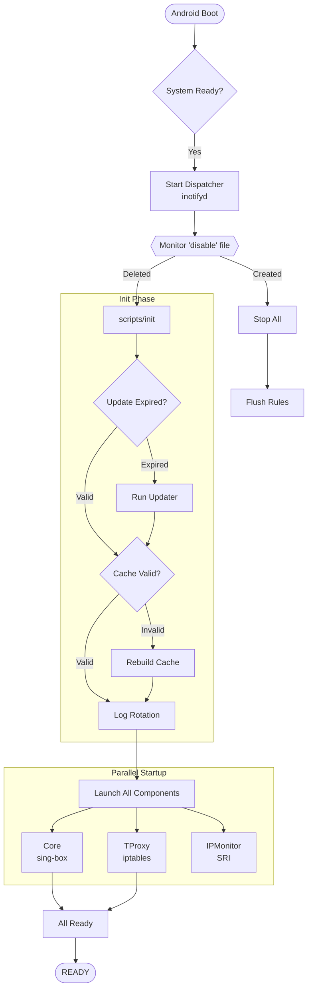
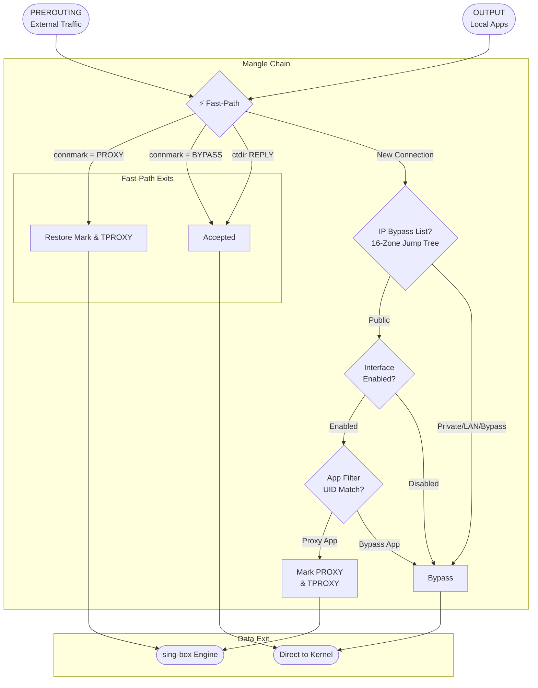

# Flux

[English](README.md) | [简体中文](README_zh.md)

> Seamlessly redirect your network Flux.

A powerful Android transparent proxy module powered by [sing-box](https://sing-box.sagernet.org/), designed for Magisk / KernelSU / APatch.

## Features

### Core Components
- **sing-box Integration**: Uses sing-box as the core proxy engine
- **Built-in Subscription Converter**: Automatic subscription conversion and node filtering
- **jq Processor**: JSON manipulation for configuration generation

### Architecture & Optimization
- **SRI (Selective Routing Injector)**: Unified AWK engine combining initial sync and real-time monitoring with three-layer IP filtering for zero-redundancy rule operations
- **High-Performance Packet Funnel**: Triple-layer filtering (Physical Bypass → Stateful Direct → 16-Zone Jump Tree) for minimal in-kernel processing path
- **16-Zone Jump Tree**: Large CIDR/IP bypass lists partitioned by subnet prefix, reducing CPU consumption by ~85%
- **inotify-Based Cache**: Real-time configuration monitoring with instant cache invalidation
- **Atomic Reliability**: 100% data integrity via temp-and-swap strategy for all critical operations

### Proxy Modes
- **TPROXY**: High-performance, protocol-agnostic transparent proxying (TCP/UDP).
- **Smart Extraction**: Automatically parses sing-box `config.json` for `mixed`/`tproxy` inbounds and ports.

### Network Support
- **Dual-Stack**: Full IPv4 and IPv6 proxy support
- **DNS Hijacking**: TProxy/Redirect mode DNS interception
- **FakeIP ICMP Fix**: Enables ping to work correctly with FakeIP DNS

### Interface Control
Independent proxy switches for each network interface:
- Mobile Data (`rmnet_data+`)
- Wi-Fi (`wlan0`)
- Hotspot (`wlan2`)
- USB Tethering (`rndis+`)

### Filtering Mechanisms
- **Per-App Proxy**: UID-based blacklist/whitelist mode with caching
- **Anti-Loopback**: Built-in route marking and user group protection to prevent traffic loops
- **Dynamic IP Monitor**: Unified AWK engine with memory-state deduplication automatically handles temporary IPv6 addresses

### Subscription Management
- Automatic download, conversion, and configuration generation
- Node filtering by region
- Configurable update interval with smart caching
- Manual force update via `updater.sh`

### Interaction
- **[Vol+] / [Vol-]**: Choose whether to preserve configuration during installation
- **Module Toggle**: Enable/disable via Magisk Manager (reactive inotify-based)
- **Update Subscription**: Auto-updates on boot if `UPDATE_INTERVAL` has passed; run `updater.sh` to update manually
- **Web Dashboard**: Zashboard UI at `http://127.0.0.1:9090/ui/`

---

## Installation

1. Download the latest release ZIP from [Releases](https://github.com/Chth1z/Flux/releases)
2. Install via Magisk Manager / KernelSU / APatch
3. During installation:
   - Press **[Vol+]** to preserve existing configuration
   - Press **[Vol-]** to use fresh default configuration
4. Configure your subscription URL in `/data/adb/flux/conf/settings.ini`
5. Reboot to start

---

## Workflow Visualization

### 1. Module Lifecycle



### 2. High-Concurrency Packet Funnel



## Directory Structure

All module files are located at `/data/adb/flux/`:

```
/data/adb/flux/
├── bin/
│   ├── jq                    # JSON processor
│   └── sing-box              # Core proxy engine
│
├── conf/
│   ├── config.json           # Generated sing-box configuration
│   ├── settings.ini          # User configuration file
│   └── template.json         # Configuration template
│
├── run/
│   ├── flux.log              # Module runtime logs
│   ├── sing-box.pid          # Sing-box process PID
│   ├── ipmonitor.pid         # IP Monitor process PID
│   └── event/                # Event signals
│
└── scripts/
    ├── cache                 # Cache manager
    ├── config                # Config loader
    ├── const                 # Constants
    ├── core                  # Process control
    ├── dispatcher            # Event handler
    ├── init                  # Initialization
    ├── ipmonitor             # Network monitor
    ├── log                   # Logging system
    ├── rules                 # IPTables generator
    ├── tproxy                # Routing logic
    └── updater.sh            # Subscription manager
```

---
### Magisk Module Directory (`/data/adb/modules/flux/`)

```
/data/adb/modules/flux/
├── webroot/
│   └── index.html            # Redirect to dashboard UI
├── service.sh                # Boot service launcher
├── module.prop               # Module metadata
└── disable                   # (Created when module is disabled)
```

---

## Configuration

Main configuration file: `/data/adb/flux/conf/settings.ini`. Changes take effect after service restart.

### 1. General Configuration
| Option | Description | Default |
|--------|-------------|---------|
| `SUBSCRIPTION_URL` | Subscription link for node conversion | (empty) |
| `UPDATE_TIMEOUT` | Download timeout in seconds | `5` |
| `RETRY_COUNT` | Number of retries for failed downloads | `2` |
| `UPDATE_INTERVAL` | Auto-update interval in seconds (86400=24h, 0=Disable) | `86400` |
| `PREF_CLEANUP_EMOJI` | Remove Emoji from node names (0=Keep, 1=Remove) | `1` |

### 2. Logging & Debugging
| Option | Description | Default |
|--------|-------------|---------|
| `LOG_LEVEL` | `0`=OFF, `1`=Error, `2`=Warn, `3`=Info, `4`=Debug | `3` |
| `LOG_MAX_SIZE` | Log size limit before rotation (bytes) | `1048576` |

### 3. Core Process
| Option | Description | Default |
|--------|-------------|---------|
| `CORE_USER` | Execution user for sing-box | `root` |
| `CORE_GROUP` | Execution group for sing-box | `root` |
| `CORE_TIMEOUT` | Core startup timeout in seconds | `5` |

### 4. Proxy Engine
| Option | Description | Default |
|--------|-------------|---------|
| `PROXY_PORT` | Proxy listening port (Auto-extracted) | `1536` |
| `FAKEIP_RANGE_V4` | FakeIP IPv4 address range (Auto-extracted) | `198.18.0.0/15` |
| `FAKEIP_RANGE_V6` | FakeIP IPv6 address range (Auto-extracted) | `fc00::/18` |

### 5. Network Interfaces
| Option | Description | Default IF Name |
|--------|-------------|-----------------|
| `MOBILE_INTERFACE` | Mobile data interface pattern | `rmnet_data+` |
| `WIFI_INTERFACE` | Wi-Fi interface name | `wlan0` |
| `HOTSPOT_INTERFACE` | Hotspot interface name | `wlan2` |
| `USB_INTERFACE` | USB tethering interface pattern | `rndis+` |

### 6. Proxy Granularity
| Option | Description | Default |
|--------|-------------|---------|
| `PROXY_MOBILE` / `PROXY_WIFI` | Interface proxy switches (0=Bypass, 1=Proxy) | `1` |
| `PROXY_HOTSPOT` / `PROXY_USB` | Interface proxy switches (0=Bypass, 1=Proxy) | `0` |
| `PROXY_IPV6` | Enable/Disable IPv6 Proxying | `0` |

### 7. Routing Mark
| Option | Description | Default |
|--------|-------------|---------|
| `ROUTING_MARK` | Core/Bypass Routing Mark (empty=UID match) | (empty) |

### 8. Application Filtering
| Option | Description | Default |
|--------|-------------|---------|
| `APP_PROXY_MODE` | `0`=Disable, `1`=Blacklist, `2`=Whitelist | `0` |
| `APP_LIST` | Package names (space/newline separated) | (empty) |

### 9. Performance & Compatibility
| Option | Description | Default |
|--------|-------------|---------|
| `MSS_CLAMP_ENABLE`| Enable TCP MSS Clamping | `1` |
| `EXCLUDE_INTERFACES`| List of interfaces to explicitly ignore (OUTPUT) | (empty) |
| `INCLUDE_INTERFACES`| List of additional interfaces to proxy (PREROUTING) | (empty) |

---

## Disclaimer

- This project is for educational and research purposes only. Do not use for illegal purposes.
- Modifying system network settings may cause instability or conflicts. Use at your own risk.
- The developer is not responsible for any data loss or device damage caused by using this module.

---

## Credits

- [SagerNet/sing-box](https://github.com/SagerNet/sing-box) - The universal proxy platform
- [taamarin/box_for_magisk](https://github.com/taamarin/box_for_magisk) - Magisk module patterns and inspiration
- [CHIZI-0618/box4magisk](https://github.com/CHIZI-0618/box4magisk) - Magisk module reference
- [jqlang/jq](https://github.com/jqlang/jq) - Command-line JSON processor

---

## License

[GPL-3.0](LICENSE)