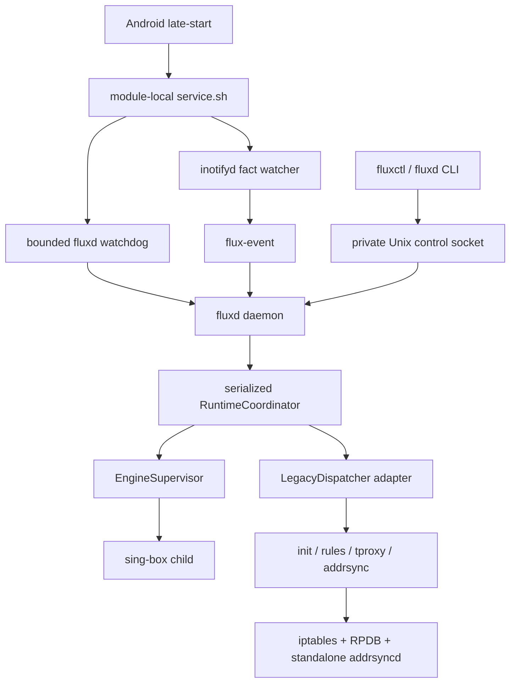

# Flux

[English](README.md) | [简体中文](README_zh.md)

> Seamlessly redirect your network Flux.

Flux is an Android transparent-proxy module for Magisk, KernelSU, and APatch. It uses
[sing-box](https://sing-box.sagernet.org/) as an external proxy engine and is being migrated to a
single Rust controller, `fluxd`.

## Current release contract

The current branch is a Phase-1 bridge, not the completed native rewrite:

- `fluxd` owns administrative intent, serialized lifecycle, Generation recovery, and the Sing-Box
  child process.
- Shell adapters remain the sole writers of iptables policy routing and address-derived rules.
- The shipped bridge accepts only `PROXY_MODE="tproxy"`. TUN fields are reserved for a future
  single-owner implementation and are rejected before activation.
- Production capture verification is still structural. The stricter functional local-OUTPUT
  canary exists as staged development work but is not yet an Android release qualification.
- Kernels below 5.10 remain queryable in a non-mutating read-only state.
- eBPF is optional future observation/acceleration work. Flux packages no `.ko`, KPM, or opaque
  kernel-module payload and invokes no explicit module-loading API. The legacy shell bridge has not
  yet proved that every xtables dependency is already active without implicit kernel autoload.

The detailed design and current gates are documented under [`docs/`](docs/README.md).

## Capabilities

- Dual-stack TCP/UDP TPROXY compatibility path.
- Interface controls for mobile data, Wi-Fi, hotspot, and USB tethering.
- UID-based application allow/deny policy with Android user/profile scope.
- Dynamic address-rule reconciliation through the standalone bridge `addrsyncd`.
- Generation-scoped configuration snapshots, bounded rollback, and startup recovery.
- Subscription download, filtering, template merge, and Sing-Box validation.
- CLI control through the private `fluxd` Unix socket.
- Zashboard redirect at `http://127.0.0.1:9090/ui/` when the configured Sing-Box API is available.

## Installation and upgrades

1. Download a release ZIP from [Releases](https://github.com/Chth1z/Flux/releases).
2. Install it through Magisk Manager, KernelSU, or APatch.
3. Configure `/data/adb/flux/conf/settings.ini` and, when needed, the strict daemon configuration
   `/data/adb/flux/conf/flux.toml`.
4. Reboot.

Upgrade preservation is per file:

- `flux.toml` is always preserved because it is the authoritative Rust-controller configuration.
- `settings.ini` is always migrated into the newly packaged schema.
- `template.json` and `addrsyncd.toml` each receive their own Vol+/Vol− keep/reset prompt.
- The generated bridge cache is cleared. Existing `run/`, `state/`, and generated `config.json`
  records are retained so startup recovery can reconcile them; later update/reload policy decides
  when the Sing-Box configuration is regenerated.

TUN and multi-user values are preserved during migration even when a current bridge cannot activate
the selected future mode. A failed post-extraction migration/restore aborts installation and the
installer attempts to restore the retained pre-upgrade configuration before deleting its backup.

## Runtime lifecycle


```mermaid
flowchart TD
    Boot["Android late-start"] --> Service["module-local service.sh"]
    Service --> Watchdog["bounded fluxd watchdog"]
    Watchdog --> Fluxd["fluxd daemon"]
    Service --> Inotify["inotifyd fact watcher"]
    Inotify --> Event["flux-event"]
    Event --> Fluxd
    CLI["fluxctl / fluxd CLI"] --> Socket["private Unix control socket"]
    Socket --> Fluxd
    Fluxd --> Coordinator["serialized RuntimeCoordinator"]
    Coordinator --> Engine["EngineSupervisor"]
    Engine --> SingBox["sing-box child"]
    Coordinator --> Bridge["LegacyDispatcher adapter"]
    Bridge --> Rules["init / rules / tproxy / addrsync"]
    Rules --> Kernel["iptables + RPDB + standalone addrsyncd"]
```

There is no parallel IPMonitor owner in the Rust-owned bridge. Event facts enter `fluxd`, and all
mutating bridge phases run through one serialized worker.

## Packet-policy bridge

The retained compatibility path compiles a fixed bounded-zone iptables classifier. Existing
connection marks take the fast path; new flows pass through mandatory/local bypasses, interface
policy, and application policy before either direct acceptance or TPROXY delivery to Sing-Box.

`BYPASS_SET_BACKEND="zone"` is the only implemented backend. `ipset` and `auto` are intentionally
rejected until distinct adapters, capability probes, and parity tests exist.

The legacy bridge still uses fixed table/priority `2025` and low-byte marks. These values overlap
Android mark policy and are not approved for the future native backend; see the warning under
Routing marks below.

## Installed layout

Runtime files live under `/data/adb/flux/`:

```text
/data/adb/flux/
├── bin/
│   ├── fluxd                 # Rust controller and CLI
│   ├── addrsyncd             # Bridge address-rule reconciler / rollback binary
│   ├── jq                    # JSON adapter used by the bridge
│   └── sing-box              # External proxy engine
├── conf/
│   ├── flux.toml             # Strict fluxd schema
│   ├── settings.ini          # Legacy networking/subscription settings
│   ├── addrsyncd.toml
│   ├── template.json
│   ├── config.json           # Generated Sing-Box configuration
│   └── manifest.json         # Release provenance contract
├── cache/                    # Generated shared bridge artifacts
├── state/
│   └── administrative-intent.json
├── run/
│   ├── fluxd.sock
│   ├── fluxd.pid
│   ├── fluxd.log
│   ├── generations/          # Immutable prepared Generation snapshots
│   └── capture.* / engine.*  # Generation ownership and recovery records
└── scripts/
    ├── fluxctl               # Compatibility CLI wrapper
    ├── flux-event            # Raw inotify fact adapter
    ├── dispatcher            # Serialized shell phase adapter
    ├── init / config / updater.sh
    ├── rules / tproxy / addrsync
    └── lib / log / core      # Shared and rollback-only helpers
```

The module manager directory `/data/adb/modules/flux/` contains `service.sh`, `module.prop`, the
dashboard redirect, and the manager-owned `disable` marker. The installer removes obsolete global
`/data/adb/*/service.d/flux_service.sh` launchers so only the module-local watchdog owns `fluxd`.

## Configuration

`flux.toml` configures the Rust daemon. Its schema is strict: unknown or missing fields fail, and
changes currently require a daemon restart. `settings.ini` configures the retained networking and
subscription bridge.

### Subscription and logging

| Option | Description | Default |
|---|---|---|
| `SUBSCRIPTION_URL` | Subscription URL | empty |
| `UPDATE_TIMEOUT` | Download timeout in seconds | `5` |
| `RETRY_COUNT` | Download retry count | `2` |
| `UPDATE_INTERVAL` | Refresh interval; `0` disables automatic refresh | `86400` |
| `PREF_CLEANUP_EMOJI` | Remove emoji from node names | `1` |
| `LOG_LEVEL` | `0` off through `4` debug | `3` |
| `LOG_MAX_SIZE` | Log rotation threshold in bytes | `1048576` |

### Proxy engine

| Option | Description | Default |
|---|---|---|
| `CORE_USER` / `CORE_GROUP` | Sing-Box execution identity | `root` / `root` |
| `CORE_TIMEOUT` | Engine startup timeout in seconds | `5` |
| `PROXY_PORT` | TPROXY listener port; extracted only from a `tproxy` inbound | `1536` |
| `FAKEIP_V4_RANGE` | FakeIP IPv4 range | `198.18.0.0/15` |
| `FAKEIP_V6_RANGE` | FakeIP IPv6 range | `fc00::/18` |
| `PROXY_MODE` | Shipped bridge mode; only `tproxy` is accepted | `tproxy` |
| `TUN_INTERFACE`, `TUN_INET4_ADDRESS`, `TUN_INET6_ADDRESS`, `TUN_MTU` | Reserved and migrated, but unsupported in Phase 1 | packaged values |

A `mixed` inbound is not a transparent TPROXY listener and is therefore not used for automatic
port extraction.

### Interfaces and application scope

| Option | Description | Default |
|---|---|---|
| `MOBILE_INTERFACE` | Mobile interface pattern | `rmnet_data+` |
| `WIFI_INTERFACE` | Wi-Fi interface | `wlan0` |
| `HOTSPOT_INTERFACE` | Hotspot interface | `wlan2` |
| `USB_INTERFACE` | USB tethering interface pattern | `rndis+` |
| `PROXY_MOBILE`, `PROXY_WIFI`, `PROXY_HOTSPOT`, `PROXY_USB` | Per-interface proxy switches | `1` |
| `PROXY_IPV6` | Enable IPv6 proxy rules | `0` |
| `APP_PROXY_MODE` | `0` disabled, `1` denylist/bypass listed apps, `2` allowlist/proxy listed apps | `0` |
| `APP_LIST` | Package-name list | empty |
| `APP_USER_SCOPE` | `owner`, `all`, or `list` | `owner` |
| `APP_USER_LIST` | Android user IDs used by `list` scope | `0` |

### Routing marks and compatibility

> [!WARNING]
> The values in this table describe the legacy shell bridge. Its `0xff` mask overlaps Android's
> low-16-bit `netId` field and is not an approved default for the native Rust planner. Native
> mutation requires a device-qualified mark grant and a complete live conflict census.

| Option | Description | Default |
|---|---|---|
| `ROUTING_MARK` | Optional engine bypass mark; empty uses owner matching | empty |
| `MARK_MASK` | Legacy connmark mask | `0xff` |
| `RULE_BACKEND` | Implemented rules adapter | `iptables_restore` |
| `BYPASS_SET_BACKEND` | Implemented bypass classifier | `zone` |
| `MSS_CLAMP_ENABLE` | TCP MSS clamp | `1` |
| `BLOCK_QUIC` | Block UDP/443 | `0` |

Additional compatibility fields are documented in [`conf/settings.ini`](conf/settings.ini).

## CLI

```bash
/data/adb/flux/scripts/fluxctl status [--json]
/data/adb/flux/scripts/fluxctl start
/data/adb/flux/scripts/fluxctl stop
/data/adb/flux/scripts/fluxctl restart
/data/adb/flux/scripts/fluxctl reload
/data/adb/flux/scripts/fluxctl resync
/data/adb/flux/scripts/fluxctl diagnose
/data/adb/flux/scripts/fluxctl rules-preview
/data/adb/flux/scripts/fluxctl logs [file]
```

`status` is authoritative `fluxd` status, including the Rust-owned Sing-Box runtime state. Mutating
commands use only the private control socket and never fall back to direct shell mutation.

## Development status

Build, test, privileged canary, Android cross-build, staging, and release-verification instructions
are in [`docs/development.md`](docs/development.md). A staged development tree is not release-ready
until `cargo xtask verify-package` validates the complete module layout, AArch64 ELF artifacts,
immutable-revision provenance and hashes, recognized SPDX/`LicenseRef` records cross-bound to the
SBOM, hashed device evidence, pinned build metadata, complete package checksums, and confirms that
no `.ko`/`.kpm` payload is present.

## Disclaimer

- This project is for educational and research use. Do not use it for illegal purposes.
- Transparent proxy and policy-routing changes can conflict with Android VPN/netd policy.
- Keep a rollback path and test on a supported device before relying on the module.

## Credits

- [SagerNet/sing-box](https://github.com/SagerNet/sing-box)
- [taamarin/box_for_magisk](https://github.com/taamarin/box_for_magisk)
- [CHIZI-0618/box4magisk](https://github.com/CHIZI-0618/box4magisk)
- [jqlang/jq](https://github.com/jqlang/jq)

## License

[GPL-3.0](LICENSE)
