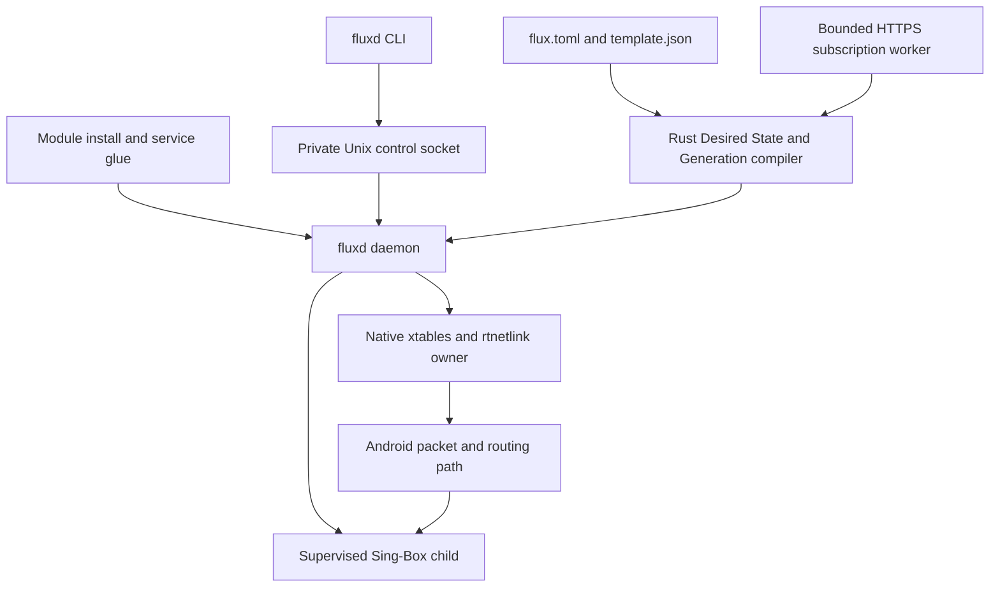

# Flux

[English](README.md) | [简体中文](README_zh.md)

> Seamlessly redirect your network Flux.

Flux is a development-stage Android transparent-proxy module for Magisk, KernelSU, and APatch.
`fluxd` is the single Rust controller; [Sing-Box](https://sing-box.sagernet.org/) remains the
external proxy engine.

## Status

This branch is not a release artifact. The R4-R6 cutover removed the legacy shell networking
runtime, standalone `addrsyncd`, packaged `jq`, compatibility configuration, and the dual package
profiles. Current source has:

- one Rust-owned daemon for configuration, subscriptions, Generation lifecycle, Sing-Box
  supervision, native xtables/rtnetlink mutation, exact readback, rollback, and recovery;
- one deterministic `auto`/exact Capture Path selector whose complete selected or rejected decision
  is bound to Generation identity, runtime status, and explain output;
- one `native` development package profile with an exact 13-file inventory;
- only platform-required shell glue for install, boot launch/restart, and uninstall delegation;
- no runtime `scripts/` tree and no shell networking writer or fallback;
- no packaged kernel module and no production code that loads or unloads `.ko` or KPM payloads.

The remaining release work is not another compatibility bridge. It includes a production Android
behavioral-qualification producer for the selector, VPN/canary Adapter qualification, bounded
physical-device testing, complete provenance and licensing metadata, payload-bound evidence,
SBOM/build metadata/checksums, and explicit promotion from `development-only`.

## Architecture


```mermaid
flowchart TD
    Glue["Module install and service glue"] --> Fluxd["fluxd daemon"]
    CLI["fluxd CLI"] --> Socket["Private Unix control socket"]
    Socket --> Fluxd
    Config["flux.toml and template.json"] --> Compiler["Rust Desired State and Generation compiler"]
    Subscription["Bounded HTTPS subscription worker"] --> Compiler
    Compiler --> Fluxd
    Fluxd --> Engine["Supervised Sing-Box child"]
    Fluxd --> Native["Native xtables and rtnetlink owner"]
    Native --> Kernel["Android packet and routing path"]
    Kernel --> Engine
```

The architecture is capability-first. Flux observes exact device/kernel facts, qualifies candidate
paths through behavioral evidence, and selects the highest-ranked admissible path. The model covers
nftables, legacy xtables, managed TUN, ipset, and optional eBPF facts, but that must not be confused
with production support:

| Path | Current boundary |
|---|---|
| Native xtables TPROXY | Implemented Rust owner and the only production Adapter; current Android behavioral evidence is deliberately unqualified, so packaged startup remains read-only |
| nftables | Capability/probe model exists; production mutation adapter is deferred |
| Managed TUN | Modeled fallback; production ownership and route adapter are deferred |
| eBPF | Optional observation/qualification input only; never required for correctness |

An exact path request never silently falls back. If no complete, fresh authority exists,
`fluxd` stays queryable but does not mutate networking state.

## Safety Model

- One writer owns every Flux networking object; writer identity and durable recovery records are
  checked before mutation.
- Candidate Generations are prepared before activation. Failure compensates in reverse order and
  keeps ownership evidence when clean rollback cannot be proved.
- Kernel objects, routes, rules, engine identity, and process state are read back instead of being
  inferred from command success.
- Unverified, malformed, drifting, denied, or incomplete capability evidence fails closed for
  mutation.
- Stop and uninstall are fail-open for device networking: the daemon detaches capture before
  retiring the engine, and offline cleanup is implemented in Rust.
- Android fwmark/RPDB placement is device-qualified; Flux does not treat unused-looking mark bits or
  a kernel version as allocation authority.

## Package Layout

The checked package profile contains exactly these 13 files:

```text
META-INF/com/google/android/update-binary
META-INF/com/google/android/updater-script
bin/fluxd
bin/sing-box
conf/flux.toml
conf/template.json
conf/manifest.json
webroot/index.html
customize.sh
flux_service.sh
uninstall.sh
module.prop
LICENSE
```

Installation places the runtime payload under `/data/adb/flux` and installs
`flux_service.sh` as the module-local `service.sh`. The installer is intentionally fresh-only: it
refuses an existing `/data/adb/flux` rather than migrating unknown or customized state in shell.
The boot service waits for Android boot completion and runs a bounded `fluxd daemon` restart loop.
The uninstaller asks the live daemon to stop, then falls back to `fluxd cleanup --offline` if the
daemon is unavailable.

Runtime-created state is private and includes the control socket, logs, immutable Generation
artifacts, administrative intent, subscription snapshots, native owner journals, and recovery
records. None of those generated files belongs in a module archive.

## Configuration

[`conf/flux.toml`](conf/flux.toml) is the sole Flux product-policy source. Schema 4 rejects unknown,
duplicate, or missing fields. [`conf/template.json`](conf/template.json) contains Sing-Box-specific
DNS, routing, outbound, and API policy; it does not authorize kernel capture.

| Section | Owns |
|---|---|
| `[daemon]` | Fail-open policy, reconciliation debounce, queue capacity, and Generation retention |
| `[engine]` / `[listener]` | Sing-Box identity, lifecycle/restart limits, and TPROXY listener |
| `[capture]` | Capture Path request, traffic domains, address families, and protocols |
| `[applications]` | Package/user selection policy |
| `[interfaces]` / `[bypass]` | Interface roles and canonical CIDR bypasses |
| `[subscription]` | HTTPS refresh source and bounded resource limits |
| `[safety]` | Android VPN and functional-canary requirements |

The packaged development default requests `auto` for local-output IPv4 TCP/UDP. The current
production Adapter inventory contains only xtables TPROXY, but no production behavioral probe may
mark it qualified yet; startup therefore retains a typed rejection and stays read-only. Forwarded
ingress, IPv6, Android VPN coexistence, and a required functional canary need corresponding reviewed
device authority before release use.

## CLI

```text
/data/adb/flux/bin/fluxd status [--json]
/data/adb/flux/bin/fluxd start|stop|restart|reload|resync
/data/adb/flux/bin/fluxd diagnose [--json]
/data/adb/flux/bin/fluxd logs [runtime|daemon|engine] [--lines 1..1000] [--json]
/data/adb/flux/bin/fluxd backend explain [--json]
/data/adb/flux/bin/fluxd plan [--dry-run] [--json]
/data/adb/flux/bin/fluxd rules-preview [--json]
/data/adb/flux/bin/fluxd subscription update
/data/adb/flux/bin/fluxd cleanup --offline
```

Online commands use protocol v8 over the private same-effective-UID Unix socket. Status binds each
active Generation to its exact Capture Path selection and reports the latest completed selection
attempt separately; explain labels whether either request still matches Desired State. Read-only
diagnostics and previews are bounded and grant no mutation authority. `cleanup --offline` acquires
the daemon lease and refuses while a daemon is active or starting.

## Build And Verify

Rust `1.93.0`, Android API 31, and NDK `27.3.13750724` are pinned by the repository.

```text
cargo xtask ci
cargo xtask build-android
```

`build-android` produces `target/aarch64-linux-android/release/fluxd` and verifies every ELF
`PT_LOAD` segment has at least 16 KiB alignment.

To create the exact development module tree, place an independently reviewed ARM64 `sing-box`
binary in a runtime-binary directory and run:

```text
cargo xtask stage-module --stage dist/module --runtime-binaries /path/to/runtime-binaries
```

The stage command refuses a non-empty destination, missing payload, unsafe path, or extra file. The
full release verifier is:

```text
cargo xtask verify-package --stage dist/module
```

It intentionally cannot pass from the placeholder manifest alone. A release candidate additionally
needs a clean source tree, complete binary provenance/version/hash/license fields, trusted
payload-bound device evidence, SPDX, pinned build metadata, and complete checksums.

The bounded, read-only Android fwmark census requires an explicit ADB device and command path:

```text
cargo --quiet xtask collect-android-arm64-fwmark-census --serial SERIAL --adb PROGRAM
```

Before freezing any authority-bearing Android production-canary run, perform the exact
qualification-only ordered-cohort preflight on the same boot:

```text
cargo --quiet xtask preflight-functional-canary-android --serial SERIAL --adb PROGRAM
```

This preflight is read-only and credential-free. It consumes no subscription input, creates no
facility or run ID, and grants no planning or networking mutation authority; a rejected cohort
must stop the later canary transaction.

Run device probes only against a recoverable test device after reviewing the command's mutation and
cleanup boundaries.

## Disclaimer

- This project is for educational and research use. Do not use it for illegal purposes.
- Transparent proxy and policy-routing changes can conflict with Android VPN/netd and customized
  root modules.
- Keep a recoverable backup and complete device-specific cleanup proof before relying on the module.

## Credits

- [SagerNet/sing-box](https://github.com/SagerNet/sing-box)
- [taamarin/box_for_magisk](https://github.com/taamarin/box_for_magisk)
- [CHIZI-0618/box4magisk](https://github.com/CHIZI-0618/box4magisk)

## License

[GPL-3.0](LICENSE)
