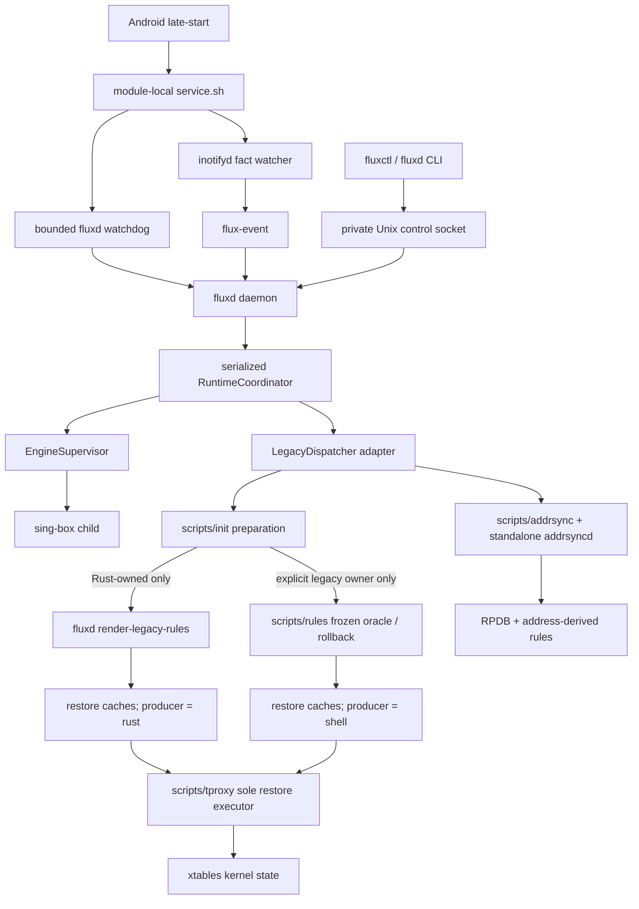

# Flux

[English](README.md) | [简体中文](README_zh.md)

> Seamlessly redirect your network Flux.

Flux is an Android transparent-proxy module for Magisk, KernelSU, and APatch. It uses
[sing-box](https://sing-box.sagernet.org/) as an external proxy engine and is being migrated to a
single Rust controller, `fluxd`.

## Pre-release rewrite contract

The current Rust rewrite branch is development-only and is not a releasable module. There will be
no public bridge, alpha, beta, or release-candidate build from this line until the intended runtime
is fully Rust-owned and the legacy runtime components have been removed. Intermediate commits may
break obsolete internal schemas and compatibility surfaces when that accelerates a cleaner Rust
design.

The current development checkpoint is a Phase-1 bridge:

- `fluxd` owns administrative intent, serialized lifecycle, Generation recovery, and the Sing-Box
  child process.
- Rust-owned preparation exclusively invokes `fluxd render-legacy-rules` to compile the retained
  source-shape restore caches and records `rust` as their producer. It never silently falls back to
  the shell generator.
- Explicit legacy ownership exclusively sources `scripts/rules`, records `shell` as the cache
  producer, and remains a mutually exclusive rollback path. `scripts/rules` is otherwise retained
  as the frozen oracle.
- `scripts/tproxy` remains the sole restore executor and xtables kernel writer. Shell adapters also
  retain policy-routing and address-derived rule mutation until their later ownership cutovers.
- The development bridge accepts only `PROXY_MODE="tproxy"`. TUN fields are reserved for a future
  single-owner implementation and are rejected before activation.
- Current pre-release bridge capture verification is still structural. The stricter functional local-OUTPUT
  canary exists as staged development work but is not yet an Android release qualification.
- Kernels below 5.10 remain queryable in a non-mutating read-only state.
- eBPF is optional future observation/acceleration work. Flux packages no `.ko`, KPM, or opaque
  kernel-module payload and invokes no explicit module-loading API. The legacy shell bridge has not
  yet proved that every xtables dependency is already active without implicit kernel autoload.

The detailed design and current gates are documented under [`docs/`](docs/README.md).

Temporary shell components remain only because they are still the sole proven writer/oracle for
specific networking state. They are not a compatibility promise: each is removed as soon as its
Rust replacement passes the required readback, rollback, recovery, single-writer, and Android
cutover gates. The final package may retain only platform-required installation/boot/disable/uninstall glue;
that glue will contain no networking policy or cleanup implementation.

## Capabilities

- Dual-stack TCP/UDP TPROXY compatibility path.
- Interface controls for mobile data, Wi-Fi, hotspot, and USB tethering.
- UID-based application allow/deny policy with Android user/profile scope.
- Dynamic address-rule reconciliation through the standalone bridge `addrsyncd`.
- Generation-scoped configuration snapshots, bounded rollback, and startup recovery.
- Subscription download, filtering, template merge, and Sing-Box validation.
- CLI control through the private `fluxd` Unix socket.
- Zashboard redirect at `http://127.0.0.1:9090/ui/` when the configured Sing-Box API is available.

## Existing published builds

The [Releases](https://github.com/Chth1z/Flux/releases) page may contain legacy or incomplete
hybrid/pre-policy artifacts. Those artifacts are not releases of the completed Rust rewrite.
Development staging from this branch is for controlled testing only and must not be presented as an
installable rewrite release. No further rewrite alpha, beta, release candidate, or public release is
permitted until the full-Rust release gate passes.

The current installer migration behavior below documents the temporary development bridge and may
change incompatibly before release:

Upgrade preservation is per file:

- `flux.toml` is always preserved because it is the authoritative Rust-controller configuration.
- `settings.ini` is always migrated into the newly packaged schema.
- `template.json` and `addrsyncd.toml` each receive their own Vol+/Vol− keep/reset prompt.
- The generated bridge cache is cleared. Existing `run/`, `state/`, and generated `config.json`
  records are retained so startup recovery can reconcile them; later update/reload policy decides
  when the Sing-Box configuration is regenerated.

TUN and multi-user values are preserved during migration even when a current bridge cannot activate
the selected future mode. A failed post-extraction migration/restore aborts installation and the
installer attempts to restore the retained pre-upgrade configuration before deleting its backup.

## Runtime lifecycle


```mermaid
flowchart TD
    Boot["Android late-start"] --> Service["module-local service.sh"]
    Service --> Watchdog["bounded fluxd watchdog"]
    Watchdog --> Fluxd["fluxd daemon"]
    Service --> Inotify["inotifyd fact watcher"]
    Inotify --> Event["flux-event"]
    Event --> Fluxd
    CLI["fluxctl / fluxd CLI"] --> Socket["private Unix control socket"]
    Socket --> Fluxd
    Fluxd --> Coordinator["serialized RuntimeCoordinator"]
    Coordinator --> Engine["EngineSupervisor"]
    Engine --> SingBox["sing-box child"]
    Coordinator --> Bridge["LegacyDispatcher adapter"]
    Bridge --> Init["scripts/init preparation"]
    Init -->|"Rust-owned only"| Renderer["fluxd render-legacy-rules"]
    Init -->|"explicit legacy owner only"| Oracle["scripts/rules frozen oracle / rollback"]
    Renderer --> Cache["restore caches; producer = rust"]
    Oracle --> CacheLegacy["restore caches; producer = shell"]
    Cache --> Tproxy["scripts/tproxy sole restore executor"]
    CacheLegacy --> Tproxy
    Tproxy --> Kernel["xtables kernel state"]
    Bridge --> AddrSync["scripts/addrsync + standalone addrsyncd"]
    AddrSync --> KernelPolicy["RPDB + address-derived rules"]
```

There is no parallel IPMonitor owner in the Rust-owned bridge. Event facts enter `fluxd`, and all
mutating bridge phases run through one serialized worker.

An explicit legacy restart validates fresh settings, rebuilds and checks the replacement Sing-Box
configuration, and prepares every replacement restore cache before stopping the active runtime. A
replacement preparation failure leaves the running legacy instance untouched.

## Packet-policy bridge

The retained compatibility path compiles a fixed bounded-zone iptables classifier. During
Rust-owned preparation, `scripts/init` exclusively calls `fluxd render-legacy-rules` for the apply
and cleanup restore documents and records `rust` in the cache producer marker. When application UID
resolution is needed, `scripts/init` invokes
`fluxd snapshot-legacy-packages --source PATH`; the command opens without following symlinks,
validates a bounded regular stable descriptor, and streams one immutable snapshot so every render
observes the same input. Otherwise preparation publishes an empty snapshot without reading the
Android package inventory. A render failure
fails preparation without switching writers or falling back to shell.

Explicit legacy ownership is the only path that sources `scripts/rules`; it records `shell` as the
producer and exists as a mutually exclusive rollback path. The script is otherwise retained as a
frozen byte-level oracle. Both paths publish restore caches, while `scripts/tproxy` remains their
sole executor and the only component authorized to mutate xtables state.

The Rust implementation used by the executed bridge is a legacy compatibility/source-shape
renderer. It reproduces the retained shell contract, including ordering and duplicate forms needed
for differential parity; it is not the canonical lowering of the backend-neutral Capture Program
and grants no native writer authority. Existing connection marks take the fast path; new flows pass
through mandatory/local bypasses, interface policy, and application policy before either direct
acceptance or TPROXY delivery to Sing-Box.

Separately, `flux-platform` now contains an extension-free schema-v1 canonical lowerer for
forwarded-ingress Capture Programs. It emits deterministic generation-namespaced but unattached
prepare/retire mangle chains with ordered uncached direct returns and protocol-qualified TCP/UDP
TPROXY rules. Local OUTPUT is rejected because MARK-only OUTPUT does not prove PREROUTING traversal
or delivery to the TPROXY listener. Established-flow caching, transparent-socket DIVERT, FakeIP
ICMP, QUIC rejection, and MSS clamping are also rejected. These artifacts are not used by the bridge
and grant no authority to execute restore, perform readback or rollback, write or own kernel state,
or activate capture.

`BYPASS_SET_BACKEND="zone"` is the only implemented backend. `ipset` and `auto` are intentionally
rejected until distinct adapters, capability probes, and parity tests exist.

The legacy bridge still uses fixed table/priority `2025` and low-byte marks. These values overlap
Android mark policy and are not approved for the future native backend; see the warning under
Routing marks below.

## Installed layout

Runtime files live under `/data/adb/flux/`:

```text
/data/adb/flux/
├── bin/
│   ├── fluxd                 # Rust controller and CLI
│   ├── addrsyncd             # Bridge address-rule reconciler / rollback binary
│   ├── jq                    # JSON adapter used by the bridge
│   └── sing-box              # External proxy engine
├── conf/
│   ├── flux.toml             # Strict fluxd schema
│   ├── settings.ini          # Legacy networking/subscription settings
│   ├── addrsyncd.toml
│   ├── template.json
│   ├── config.json           # Generated Sing-Box configuration
│   └── manifest.json         # Release provenance contract
├── cache/
│   ├── cache_rules_* / cache_cleanup_*  # Rust- or shell-produced restore documents
│   ├── cache_packages       # Rust package snapshot; absent for shell, empty when resolution is inactive
│   └── cache_valid          # Cache producer marker: rust or shell
├── state/
│   └── administrative-intent.json
├── run/
│   ├── fluxd.sock
│   ├── fluxd.pid
│   ├── fluxd.log
│   ├── generations/          # Immutable prepared Generation snapshots
│   └── capture.* / engine.*  # Generation ownership and recovery records
└── scripts/
    ├── fluxctl               # Compatibility CLI wrapper
    ├── flux-event            # Raw inotify fact adapter
    ├── dispatcher            # Serialized shell phase adapter
    ├── init / config / updater.sh
    ├── rules                # Frozen source-shape oracle and explicit legacy rollback generator
    ├── tproxy               # Sole restore executor and xtables kernel writer
    ├── addrsync
    └── lib / log / core      # Shared and rollback-only helpers
```

The module manager directory `/data/adb/modules/flux/` contains `service.sh`, `module.prop`, the
dashboard redirect, and the manager-owned `disable` marker. The installer removes obsolete global
`/data/adb/*/service.d/flux_service.sh` launchers so only the module-local watchdog owns `fluxd`.

## Configuration

`flux.toml` configures the Rust daemon. Its schema is strict: unknown or missing fields fail, and
changes currently require a daemon restart. `settings.ini` configures the retained networking and
subscription bridge.

### Subscription and logging

| Option | Description | Default |
|---|---|---|
| `SUBSCRIPTION_URL` | Subscription URL | empty |
| `UPDATE_TIMEOUT` | Download timeout in seconds | `5` |
| `RETRY_COUNT` | Download retry count | `2` |
| `UPDATE_INTERVAL` | Refresh interval; `0` disables automatic refresh | `86400` |
| `PREF_CLEANUP_EMOJI` | Remove emoji from node names | `1` |
| `LOG_LEVEL` | `0` off through `4` debug | `3` |
| `LOG_MAX_SIZE` | Log rotation threshold in bytes | `1048576` |

### Proxy engine

| Option | Description | Default |
|---|---|---|
| `CORE_USER` / `CORE_GROUP` | Sing-Box execution identity | `root` / `root` |
| `CORE_TIMEOUT` | Engine startup timeout in seconds | `5` |
| `PROXY_PORT` | TPROXY listener port; extracted only from a `tproxy` inbound | `1536` |
| `FAKEIP_V4_RANGE` | FakeIP IPv4 range | `198.18.0.0/15` |
| `FAKEIP_V6_RANGE` | FakeIP IPv6 range | `fc00::/18` |
| `PROXY_MODE` | Current development bridge mode; only `tproxy` is accepted | `tproxy` |
| `TUN_INTERFACE`, `TUN_INET4_ADDRESS`, `TUN_INET6_ADDRESS`, `TUN_MTU` | Reserved and migrated, but unsupported in Phase 1 | packaged values |

A `mixed` inbound is not a transparent TPROXY listener and is therefore not used for automatic
port extraction.

### Interfaces and application scope

| Option | Description | Default |
|---|---|---|
| `MOBILE_INTERFACE` | Mobile interface pattern | `rmnet_data+` |
| `WIFI_INTERFACE` | Wi-Fi interface | `wlan0` |
| `HOTSPOT_INTERFACE` | Hotspot interface | `wlan2` |
| `USB_INTERFACE` | USB tethering interface pattern | `rndis+` |
| `PROXY_MOBILE`, `PROXY_WIFI`, `PROXY_HOTSPOT`, `PROXY_USB` | Per-interface proxy switches | `1` |
| `PROXY_IPV6` | Enable IPv6 proxy rules | `0` |
| `APP_PROXY_MODE` | `0` disabled, `1` denylist/bypass listed apps, `2` allowlist/proxy listed apps | `0` |
| `APP_LIST` | Package-name list | empty |
| `APP_USER_SCOPE` | `owner`, `all`, or `list` | `owner` |
| `APP_USER_LIST` | Android user IDs used by `list` scope | `0` |

### Routing marks and compatibility

> [!WARNING]
> The values in this table describe the legacy shell bridge. Its `0xff` mask overlaps Android's
> low-16-bit `netId` field and is not an approved default for the native Rust planner. Native
> mutation requires a device-qualified mark grant and a complete live conflict census.

| Option | Description | Default |
|---|---|---|
| `ROUTING_MARK` | Optional engine bypass mark; empty uses owner matching | empty |
| `MARK_MASK` | Legacy connmark mask | `0xff` |
| `RULE_BACKEND` | Implemented rules adapter | `iptables_restore` |
| `BYPASS_SET_BACKEND` | Implemented bypass classifier | `zone` |
| `MSS_CLAMP_ENABLE` | TCP MSS clamp | `1` |
| `BLOCK_QUIC` | Block UDP/443 | `0` |

Additional compatibility fields are documented in [`conf/settings.ini`](conf/settings.ini).

## CLI

```bash
/data/adb/flux/scripts/fluxctl status [--json]
/data/adb/flux/scripts/fluxctl start
/data/adb/flux/scripts/fluxctl stop
/data/adb/flux/scripts/fluxctl restart
/data/adb/flux/scripts/fluxctl reload
/data/adb/flux/scripts/fluxctl resync
/data/adb/flux/scripts/fluxctl diagnose
/data/adb/flux/scripts/fluxctl rules-preview
/data/adb/flux/scripts/fluxctl logs [file]
```

`status` is authoritative `fluxd` status, including the Rust-owned Sing-Box runtime state. Mutating
commands use only the private control socket and never fall back to direct shell mutation.

## Development status

Build, test, privileged canary, Android cross-build, staging, and package-consistency instructions
are in [`docs/development.md`](docs/development.md). The current `cargo xtask verify-package` checks
the temporary hybrid stage and cannot make it releasable. Before publication, its inventory must be
changed to the Rust-only runtime and reject standalone `addrsyncd`, `jq`, legacy runtime scripts,
and compatibility wrappers, in addition to enforcing AArch64 ELF, immutable provenance/hashes,
SBOM/license binding, trusted device evidence, pinned build metadata, checksums, and the no-kernel-
payload policy.

The delivered bridge renderer is only the first non-mutating xtables cutover: Rust prepares
compatibility bytes, while shell still owns restore execution, readback, rollback, and kernel
mutation. A separate non-executed schema-v1 forwarded-ingress canonical lowerer is also delivered,
but local OUTPUT, its five rejected extensions, stable hook attachment, and native ownership remain
separate gated work. nftables, TUN, eBPF, and `.ko`/KPM module paths remain deferred and are not
activated by either compiler.

## Disclaimer

- This project is for educational and research use. Do not use it for illegal purposes.
- Transparent proxy and policy-routing changes can conflict with Android VPN/netd policy.
- Keep a rollback path and test on a supported device before relying on the module.

## Credits

- [SagerNet/sing-box](https://github.com/SagerNet/sing-box)
- [taamarin/box_for_magisk](https://github.com/taamarin/box_for_magisk)
- [CHIZI-0618/box4magisk](https://github.com/CHIZI-0618/box4magisk)
- [jqlang/jq](https://github.com/jqlang/jq)

## License

[GPL-3.0](LICENSE)
