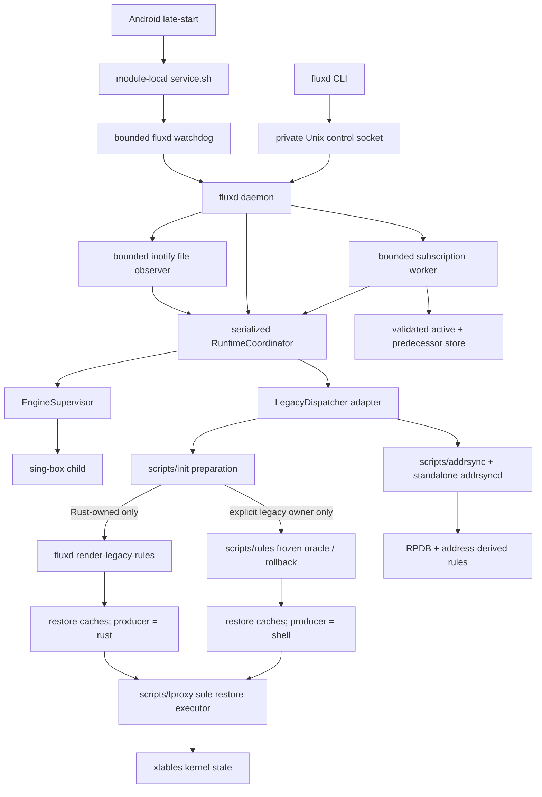

# Flux

[English](README.md) | [简体中文](README_zh.md)

> Seamlessly redirect your network Flux.

Flux is an Android transparent-proxy module for Magisk, KernelSU, and APatch. It uses
[sing-box](https://sing-box.sagernet.org/) as an external proxy engine and is being migrated to a
single Rust controller, `fluxd`.

## Pre-release rewrite contract

The current Rust rewrite branch is development-only and is not a releasable module. There will be
no public bridge, alpha, beta, or release-candidate build from this line until the intended runtime
is fully Rust-owned and the legacy runtime components have been removed. Intermediate commits may
break obsolete internal schemas and compatibility surfaces when that accelerates a cleaner Rust
design.

The current development checkpoint is a Phase-1 bridge:

- `fluxd` owns administrative intent, serialized lifecycle, Generation recovery, and the Sing-Box
  child process.
- Schema-3 `flux.toml` is the sole product-policy source for Rust-owned preparation. `fluxd`
  atomically publishes canonical `config.json` plus a strict compatibility environment; shell may
  append observed `KFEAT_*` facts but does not read policy from `settings.ini` or inspect generated
  JSON with `jq`.
- `fluxd` owns bounded HTTPS subscription retrieval, decoding, normalization, rule-asset storage,
  Sing-Box validation, startup recovery/bootstrap, periodic refresh, and the manual
  `subscription update` command. Only an accepted snapshot enters the existing Generation reload
  path; failed admission restores the exact prior durable snapshot.
- Rust-owned preparation exclusively invokes `fluxd render-legacy-rules` to compile the retained
  source-shape restore caches and records `rust` as their producer. It never silently falls back to
  the shell generator.
- Explicit legacy ownership exclusively sources `scripts/rules`, records `shell` as the cache
  producer, and remains a mutually exclusive rollback path. `scripts/rules` is otherwise retained
  as the frozen oracle.
- `scripts/tproxy` remains the sole restore executor and xtables kernel writer. Shell adapters also
  retain policy-routing and address-derived rule mutation until the single Gate 1 networking-writer
  cutover.
- The development bridge accepts only `PROXY_MODE="tproxy"`. TUN fields are reserved for a future
  single-owner implementation and are rejected before activation.
- Current pre-release bridge capture verification is still structural. The stricter functional local-OUTPUT
  canary exists as staged development work but is not yet an Android release qualification.
- Kernels below 5.10 remain queryable in a non-mutating read-only state.
- Capability Profile schema 2 can carry exact Android product/build/vendor/security-patch,
  verified-boot, kernel-build, SELinux-policy, netd/Connectivity, tool-artifact, and network-
  namespace identity. Device-qualified mark policy and census evidence now require that complete,
  namespace-consistent identity. The Android-target collector now reads and rechecks exact system
  properties, loaded policy, netd, the active Connectivity APEX, the running Flux binary, and its
  network namespace. Incomplete AVB evidence remains non-authorizing. The compile-time reviewed
  policy-catalog selector now exists, but its production entry table is empty pending independent
  physical ARM64 review, so no new mutation is admitted. Source-pinned Android `netId` and
  inventory-bound RPDB fragments now model six of the 27 fwmark census cells. The pinned netd
  incoming-packet writers overlap the complete device-qualified candidate envelope, but source
  tracing places them in mangle INPUT after PREROUTING and input route selection. That exact packet
  write is an ordered lifetime/coexistence qualification blocker rather than a proven simultaneous
  collision; it remains non-authorizing. Expansion of the other 21 cells is paused until a physical
  ARM64 target can bind the runtime netd profile and prove listener/observer mark preservation, and
  the fragments still cannot be assembled into planning authority. An explicit-serial read-only
  ARM64 preflight now checks whether a rooted device has the required identity inputs, namespaces,
  enforcing SELinux, initialized mangle tables, exact INPUT hook, and supported interface-scoped
  writers; even a passing report remains diagnostic and grants no authority.
- eBPF is optional future observation/acceleration work. Flux packages no `.ko`, KPM, or opaque
  kernel-module payload and invokes no explicit module-loading API. The legacy shell bridge has not
  yet proved that every xtables dependency is already active without implicit kernel autoload.

The detailed design and current gates are documented under [`docs/`](docs/README.md).

Temporary shell components remain only because they are still the sole proven writer/oracle for
specific networking state. They are not a compatibility promise: Gate 1 removes the networking
writers together after the complete Rust replacement passes the required readback, rollback,
recovery, single-writer, and Android gates. The final package may retain only platform-required
installation/boot/disable/uninstall glue; that glue will contain no networking policy or cleanup
implementation.

## Capabilities

- Dual-stack TCP/UDP TPROXY compatibility path.
- Interface controls for mobile data, Wi-Fi, hotspot, and USB tethering.
- UID-based application allow/deny policy with Android user/profile scope.
- Dynamic address-rule reconciliation through the standalone bridge `addrsyncd`.
- Generation-scoped configuration snapshots, bounded rollback, and startup recovery.
- Rust-owned subscription download, filtering, template merge, content-addressed rule assets, and
  bounded active/predecessor recovery are production-connected through `fluxd`.
- CLI control through the private `fluxd` Unix socket.
- Zashboard redirect at `http://127.0.0.1:9090/ui/` when the configured Sing-Box API is available.

## Existing published builds

The [Releases](https://github.com/Chth1z/Flux/releases) page may contain legacy or incomplete
hybrid/pre-policy artifacts. Those artifacts are not releases of the completed Rust rewrite.
Development staging from this branch is for controlled testing only and must not be presented as an
installable rewrite release. No further rewrite alpha, beta, release candidate, or public release is
permitted until the full-Rust release gate passes.

The current installer migration behavior below documents the temporary development bridge and may
change incompatibly before release:

Upgrade preservation is per file:

- `flux.toml` is always preserved because it is the authoritative Rust-controller configuration.
- `settings.ini` is always migrated for the explicit legacy rollback path; it is not consulted by
  Rust-owned preparation.
- `template.json` and `addrsyncd.toml` each receive their own Vol+/Vol− keep/reset prompt.
- The generated bridge cache is cleared. Existing `run/`, `state/`, and generated `config.json`
  records are retained so startup recovery can reconcile them; later update/reload policy decides
  when the Sing-Box configuration is regenerated.

TUN and multi-user values are preserved during migration even when a current bridge cannot activate
the selected future mode. A failed post-extraction migration/restore aborts installation and the
installer attempts to restore the retained pre-upgrade configuration before deleting its backup.

## Runtime lifecycle


```mermaid
flowchart TD
    Boot["Android late-start"] --> Service["module-local service.sh"]
    Service --> Watchdog["bounded fluxd watchdog"]
    Watchdog --> Fluxd["fluxd daemon"]
    CLI["fluxd CLI"] --> Socket["private Unix control socket"]
    Socket --> Fluxd
    Fluxd --> Observer["bounded inotify file observer"]
    Observer --> Coordinator
    Fluxd --> Coordinator["serialized RuntimeCoordinator"]
    Fluxd --> Subscription["bounded subscription worker"]
    Subscription --> Store["validated active + predecessor store"]
    Subscription --> Coordinator
    Coordinator --> Engine["EngineSupervisor"]
    Engine --> SingBox["sing-box child"]
    Coordinator --> Bridge["LegacyDispatcher adapter"]
    Bridge --> Init["scripts/init preparation"]
    Init -->|"Rust-owned only"| Renderer["fluxd render-legacy-rules"]
    Init -->|"explicit legacy owner only"| Oracle["scripts/rules frozen oracle / rollback"]
    Renderer --> Cache["restore caches; producer = rust"]
    Oracle --> CacheLegacy["restore caches; producer = shell"]
    Cache --> Tproxy["scripts/tproxy sole restore executor"]
    CacheLegacy --> Tproxy
    Tproxy --> Kernel["xtables kernel state"]
    Bridge --> AddrSync["scripts/addrsync + standalone addrsyncd"]
    AddrSync --> KernelPolicy["RPDB + address-derived rules"]
```

There is no parallel IPMonitor owner in the Rust-owned bridge. Event facts enter `fluxd`, and all
mutating bridge phases run through one serialized worker.

An explicit legacy restart validates fresh settings, rebuilds and checks the replacement Sing-Box
configuration, and prepares every replacement restore cache before stopping the active runtime. A
replacement preparation failure leaves the running legacy instance untouched.

## Packet-policy bridge

The retained compatibility path compiles a fixed bounded-zone iptables classifier. During
Rust-owned preparation, `scripts/init` exclusively calls `fluxd render-legacy-rules` for the apply
and cleanup restore documents and records `rust` in the cache producer marker. When application UID
resolution is needed, `scripts/init` invokes
`fluxd snapshot-legacy-packages --source PATH`; the command opens without following symlinks,
validates a bounded regular stable descriptor, and streams one immutable snapshot so every render
observes the same input. Otherwise preparation publishes an empty snapshot without reading the
Android package inventory. A render failure
fails preparation without switching writers or falling back to shell.

Explicit legacy ownership is the only path that sources `scripts/rules`; it records `shell` as the
producer and exists as a mutually exclusive rollback path. The script is otherwise retained as a
frozen byte-level oracle. Both paths publish restore caches, while `scripts/tproxy` remains their
sole production xtables restore executor and writer. `scripts/addrsync` and standalone `addrsyncd`
still own the bridge's policy-routing and address-derived mutations.

The Rust implementation used by the executed bridge is a legacy compatibility/source-shape
renderer. It reproduces the retained shell contract, including ordering and duplicate forms needed
for differential parity; it is not the canonical lowering of the backend-neutral Capture Program
and grants no native writer authority. Existing connection marks take the fast path; new flows pass
through mandatory/local bypasses, interface policy, and application policy before either direct
acceptance or TPROXY delivery to Sing-Box.

Separately, `flux-platform` now contains an extension-free canonical Capture Program lowerer.
Forwarded-ingress-only input preserves the exact schema-v1 bytes and digests in private `F` chains.
Any input containing local OUTPUT selects schema v2: private `O` chains classify eligible TCP/UDP by
setting the masked proxy mark, private `P` chains describe the mark-qualified loopback PREROUTING
TPROXY companion, and mixed programs may also contain `F` chains. Typed metadata binds the stable-
hook selectors, transparent listener, loop escape, per-family RPDB/local-route identities, lifecycle
order, digests, and resource budgets. The prepare/retire documents still create and remove only
unattached implementation chains; they do not modify built-in hooks. Established-flow caching,
transparent-socket DIVERT, FakeIP ICMP, QUIC rejection, and MSS clamping remain rejected.

These canonical artifacts are not used by the bridge, and the lowerer itself grants no mutation or
activation authority. A private `NativeXtablesOwner` now consumes only independently admitted
targets behind `converge(target)` and `recover()`. It owns stable `FLX{4|6}SP` PREROUTING and
`FLX{4|6}SO` OUTPUT roots, coherent descriptor-pinned command/restore/save execution, exact xtables
and policy-routing readback, rollback, durable journal recovery, cleanup, and a shell-visible
transition lease. Owner-payload schema 3 stores only the target and optional previous identities;
each identity binds the source artifact, coherent tool set, complete private runtime plan, and the
IPv4/IPv6 policy-routing audit including exact loopback name/index identity. The checksum-protected
`native_xtables.targets` archive retains exact recovery material for at most the active and
replacement targets. One no-follow runtime lock spans archive refresh/staging, journal and kernel
convergence, and archive settling. The owner validates live interface binding in both directions and
audits both xtables families and both routing identities before publishing `Active` or `CleanAbsent`,
so opposite-family residue cannot be hidden by a single-family target.

The shared writer fence authenticates shell ownership with PID, `/proc` start ticks, and boot ID.
The canonical v2 record retains the parent PID/start identity and an optional child PID/start
identity under the same boot ID. Either live participant keeps the fence busy. Each parent-bound
mutating `addrsync` or `tproxy` phase invocation uses the single child slot, so those writers are
serialized and a surviving phase child remains blocking if the parent dies. It does not replace the
parent, and a live parent can reclaim a dead child. Both-dead, PID-reused, and previous-boot records
are retired only after exact revalidation. Bare, malformed, mixed-owner, or otherwise unverifiable
locks remain deliberately fail-closed.

A current terminal journal is likewise not accepted as `CleanAbsent` from disk alone. Recovery keeps
the native guard, shared writer fence, and optional surviving lease until fresh global IPv4/IPv6
xtables and policy-routing absence passes, then removes the terminal artifacts. The exact
previous-boot revision-1 `Activating` pre-lease boundary is recoverable when its native-owner scope is
coherent; same-boot or mismatched missing-lease state remains blocking. Every legacy start, stop,
restart, and failure-cleanup phase transaction claims this fence before `addrsync` or `tproxy`
mutation. The retained standalone `addrsyncd` daemon is still legacy runtime ownership and must be
removed by the production component cutover.
The real Adapter passed deterministic tests and a rooted disposable WSA Android 13 x86_64
apply/recover/stop run.

Production target admission remains deliberately uninhabited, so the production xtables driver is
still `Unsupported` and `scripts/tproxy` remains the production bridge writer. The WSA result is
mechanism evidence only; Android 5.10/ARM64 qualification, mark/RPDB authority, functional receipts,
daemon cutover, and deletion of replaced shell duties remain open.

`BYPASS_SET_BACKEND="zone"` is the only implemented backend. `ipset` and `auto` are intentionally
rejected until distinct adapters, capability probes, and parity tests exist.

The legacy bridge still uses fixed table/priority `2025` and low-byte marks. These values overlap
Android mark policy and are not approved for the future native backend; see the warning under
Routing marks below.

## Installed layout

Runtime files live under `/data/adb/flux/`:

```text
/data/adb/flux/
├── bin/
│   ├── fluxd                 # Rust controller and CLI
│   ├── addrsyncd             # Bridge address-rule reconciler / rollback binary
│   ├── jq                    # Explicit legacy-rollback JSON adapter
│   └── sing-box              # External proxy engine
├── conf/
│   ├── flux.toml             # Strict fluxd schema
│   ├── settings.ini          # Explicit legacy-rollback settings
│   ├── addrsyncd.toml
│   ├── template.json
│   ├── config.json           # Canonical Rust-generated Sing-Box configuration
│   └── manifest.json         # Release provenance contract
├── cache/
│   ├── cache_rules_* / cache_cleanup_*  # Rust- or shell-produced restore documents
│   ├── cache_packages       # Rust package snapshot; absent for shell, empty when resolution is inactive
│   └── cache_valid          # Cache producer marker: rust or shell
├── state/
│   ├── administrative-intent.json
│   └── subscription/         # Rust-owned validated snapshots and local rule assets
├── run/
│   ├── fluxd.sock
│   ├── fluxd.pid
│   ├── fluxd.lease             # Kernel-backed daemon/offline exclusion; presence is not liveness
│   ├── fluxd.log
│   ├── desired-state.env     # Read-only Rust-to-shell bridge input
│   ├── generations/          # Immutable prepared Generation snapshots
│   └── capture.* / engine.*  # Generation ownership and recovery records
└── scripts/
    ├── dispatcher            # Serialized shell phase adapter
    ├── init / config
    ├── rules                # Frozen source-shape oracle and explicit legacy rollback generator
    ├── tproxy               # Sole restore executor and xtables kernel writer
    ├── addrsync
    └── lib / log / core      # Shared and rollback-only helpers
```

The module manager directory `/data/adb/modules/flux/` contains `service.sh`, `uninstall.sh`, `module.prop`, the
dashboard redirect, and the manager-owned `disable` marker. The installer removes obsolete global
`/data/adb/*/service.d/flux_service.sh` launchers so only the module-local watchdog owns `fluxd`.

## Configuration

[`conf/flux.toml`](conf/flux.toml) is the sole Flux routing, capture, and lifecycle-policy source
during Rust-owned operation. Schema 3 rejects unknown, duplicate, or missing fields. A
mutation-capable daemon observes `flux.toml`, its selected engine template, its selected subscription
URL file, and the module `disable` entry; changes are coalesced into the existing serialized
coordinator without requiring a daemon restart. Settled read-only profiles attach no file observer.
Sing-Box-specific routing, DNS, outbound, and API content remains in the separately validated
`template.json`; it is an engine source document, not a second Flux capture-policy authority.

| Section | Owns |
|---|---|
| `[daemon]` | Fail-open policy, reconciliation debounce, queue capacity, and Generation retention |
| `[engine]` / `[listener]` | Sing-Box path and template, numeric UID/GID, lifecycle/restart timeouts, and TPROXY port |
| `[capture]` | Explicit xtables backend, local/forwarded domains, address families, and TCP/UDP selection |
| `[applications]` | All/allowlist/denylist package policy and Android user scope |
| `[interfaces]` / `[bypass]` | Forwarded, local-bypass, excluded interfaces, and additional canonical CIDRs |
| `[subscription]` | Rust HTTPS refresh policy, URL file, interval, encoded/decoded byte limits, and node limit |
| `[safety]` | Android VPN and functional-canary intent; positive values await their authority gates |

`template.json` remains the separate Sing-Box source document. With subscriptions disabled, Rust
opens it with bounded no-follow checks and compiles the canonical engine artifact directly. With
subscriptions enabled, the bounded worker downloads and normalizes the supported sources and rule
assets, validates the exact merged candidate with Sing-Box, and publishes it through the same
read-only `config.json` plus `run/desired-state.env` bridge preparation. An observed template, URL,
or Desired State change schedules that worker after successful configuration reconciliation;
changes observed while disabled remain dirty and are consumed when `disable` is removed.

The temporary shell renderer can express only a strict subset of schema 3. It requires local and
forwarded capture, TCP and UDP, IPv4 or dual stack, no user bypass CIDRs, disabled VPN and
required-canary intent, and at most four forwarded or local-bypass interface roles. Enabled
subscriptions require an accepted Rust snapshot and the packaged root-owned Sing-Box identity;
non-root traversal of the private snapshot store is not yet supported. A valid configuration
outside those bridge limits fails preparation instead of being silently narrowed. The shell
validates the exact 41-field environment allowlist and may append only observed `KFEAT_*` values.
The replaced `scripts/updater.sh` and `scripts/flux-event` entry points are retired from source and
both package profiles; manifest schema 3 denies either path in every staged package. `settings.ini`
and `jq` remain only in the development bridge for explicit legacy rollback. The exact Rust-only
stage excludes them, while the remaining nine scripts stay fenced until the Gate 1 writer transfer.

### Routing marks and compatibility

> [!WARNING]
> The values in this table describe the legacy shell bridge. Its `0xff` mask overlaps Android's
> low-16-bit `netId` field and is not an approved default for the native Rust planner. Native
> mutation requires a device-qualified mark grant and a complete live conflict census.

| Option | Description | Default |
|---|---|---|
| `ROUTING_MARK` | Fixed empty bridge value; owner matching provides loop escape | empty |
| `MARK_MASK` | Legacy connmark mask | `0xff` |
| `RULE_BACKEND` | Implemented rules adapter | `iptables_restore` |
| `BYPASS_SET_BACKEND` | Implemented bypass classifier | `zone` |
| `MSS_CLAMP_ENABLE` | TCP MSS clamp | `1` |
| `BLOCK_QUIC` | Block UDP/443 | `0` |

These values are reviewed bridge constants emitted by Rust, not user configuration. They disappear
with the shell writer rather than becoming the native planner's defaults.

## CLI

```bash
/data/adb/flux/bin/fluxd status [--json]
/data/adb/flux/bin/fluxd start|stop|restart|reload|resync
/data/adb/flux/bin/fluxd diagnose [--json]
/data/adb/flux/bin/fluxd logs [runtime|daemon|engine] [--lines 1..1000] [--json]
/data/adb/flux/bin/fluxd backend explain [--json]
/data/adb/flux/bin/fluxd plan [--dry-run] [--json]
/data/adb/flux/bin/fluxd rules-preview [--json]
/data/adb/flux/bin/fluxd subscription update
/data/adb/flux/bin/fluxd cleanup --offline
```

`status` is authoritative `fluxd` status, including the Rust-owned Sing-Box runtime state. Mutating
commands use only the private control socket and never fall back to direct shell mutation.
`diagnose`, fixed-stream logs, and explain/preview are same-user, bounded, read-only socket
operations. Logs read at most a 256 KiB source tail and never accept an arbitrary path. Explain
compiles schema-3 Desired State and canonical engine JSON in memory without publishing a Generation,
cache, receipt, or writer lease; it does not yet resolve Android package UIDs or live network
inventory into a complete Capture Program. The package exposes no shell control/diagnostic wrapper,
and direct Rust preview never enters the dispatcher or publishes shared caches. `cleanup --offline`
is a pre-socket Rust command: it acquires `run/fluxd.lease`, runs bounded durable-record recovery,
and refuses with exit `75` while a daemon is active or starting. The lease inode, PID file, and socket
are not liveness signals. Module `uninstall.sh` delegates to Rust `stop` when the daemon answers and
otherwise invokes this offline command; it contains no networking or record-cleanup policy.

## Development status

Build, test, privileged canary, Android cross-build, staging, and package-consistency instructions
are in [`docs/development.md`](docs/development.md). `cargo xtask verify-package --profile bridge`
checks the temporary hybrid stage and always labels a pass development-only. The separate
`--profile rust-only` gate already requires the final 13-path inventory and forbids standalone
`addrsyncd`, `jq`, both legacy configuration files, and all current runtime scripts, but remains
explicitly `failing-until-complete`. It selects two minimal tracked installer/watchdog sources,
enforces the no-networking-policy glue contract, and refuses an existing runtime root rather than
migrating bridge state in shell. Neither profile can bypass ADR-0011, trusted physical-device
evidence, immutable provenance/hashes, SBOM/license binding, pinned build metadata, checksums, or the
no-kernel-payload policy.

The delivered bridge renderer is only the first non-mutating xtables cutover: Rust prepares
compatibility bytes, while shell still owns restore execution, readback, rollback, and kernel
mutation. The separate canonical lowerer now represents forwarded ingress and the complete
schema-v2 local-OUTPUT `O`/`P` transaction, while preserving frozen schema-v1 forwarded-only
identities. The crate-private native owner now supplies stable-hook mutation, exact transaction-local
policy routing, dual-family readback/residue auditing, rollback, recovery, cleanup, and transition
leasing for independently admitted targets. Production target admission, listener/engine/canary
authority, reviewed Android 5.10/ARM64 qualification, and the shell-writer cutover remain gated, so
the production driver is still `Unsupported`. nftables and TUN remain deferred; eBPF is optional and
no production path loads `.ko`/KPM modules.

## Disclaimer

- This project is for educational and research use. Do not use it for illegal purposes.
- Transparent proxy and policy-routing changes can conflict with Android VPN/netd policy.
- Keep a rollback path and test on a supported device before relying on the module.

## Credits

- [SagerNet/sing-box](https://github.com/SagerNet/sing-box)
- [taamarin/box_for_magisk](https://github.com/taamarin/box_for_magisk)
- [CHIZI-0618/box4magisk](https://github.com/CHIZI-0618/box4magisk)
- [jqlang/jq](https://github.com/jqlang/jq)

## License

[GPL-3.0](LICENSE)
