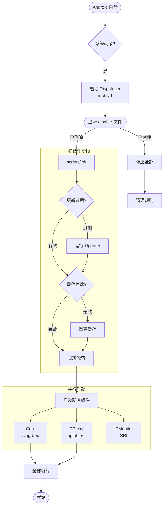
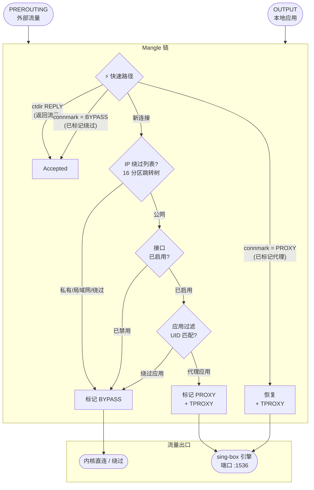

# Flux

[English](README.md) | [简体中文](README_zh.md)

> 无缝重定向您的网络流量。

一个强大的 Android 透明代理模块，由 [sing-box](https://sing-box.sagernet.org/) 驱动，专为 Magisk / KernelSU / APatch 设计。

## 功能特性

### 核心组件
- **sing-box 集成**：使用 sing-box 作为核心代理引擎
- **内置订阅转换器**：自动订阅转换和节点过滤
- **jq 处理器**：用于生成配置的 JSON 处理

### 架构与优化
- **SRI (选择性路由注入器)**：统一的 AWK 引擎，整合初始同步与实时监控，通过三层 IP 过滤实现去冗余规则操作
- **高性能数据包漏斗**：三层过滤（物理绕过 → 状态直连 → 16 分区跳转树）实现最短内核处理路径
- **16 分区跳转树**：大规模 CIDR/IP 绕过列表按子网前缀分区，CPU 消耗降低约 85%
- **基于 inotify 的缓存**：实时配置监控，即时缓存失效
- **原子可靠性**：所有关键操作采用 temp-and-swap 策略，确保 100% 数据完整性

### 代理模式
- **TPROXY**（默认）：高性能、协议无关的透明代理 (TCP/UDP)。
- **智能探测**：自动解析 sing-box `config.json` 获取 `mixed`/`tproxy` 入站端口。

### 过滤机制
- **按应用代理**：基于 UID 的黑白名单模式（含缓存）
- **防环路**：内置路由标记和用户组保护，防止流量环路
- **动态 IP 监控**：统一的 AWK 引擎配合内存状态去重，自动处理临时 IPv6 地址

### 订阅管理
- 自动下载、转换和配置生成
- 按地区过滤节点（通过 `country_map.json` 进行基于正则的国家匹配）
- 具有智能缓存的可配置更新间隔
- 通过 `updater.sh` 手动强制更新

### 交互方式
- **[音量+] / [音量-]**：在安装过程中选择是否保留现有配置
- **模块开关**：通过 Magisk 管理器启用/禁用（基于 inotify 的反应式处理）
- **更新订阅**：若已超过 `UPDATE_INTERVAL`，则在启动时自动更新；运行 `updater.sh` 手动更新
- **Web 面板**：Zashboard UI 位于 `http://127.0.0.1:9090/ui/`

---

## 安装

1. 从 [Releases](https://github.com/Chth1z/Flux/releases) 下载最新的发布 ZIP 压缩包
2. 通过 Magisk 管理器 / KernelSU / APatch 安装
3. 安装过程中：
- 按 **[音量+]** 保留现有配置
- 按 **[音量-]** 使用全新的默认配置
4. 在 `/data/adb/flux/conf/settings.ini` 中配置您的订阅链接
5. 重启以启动

---

## 工作流程可视化

### 1. 模块启动与生命周期
展示从 Android 引导、事件监听、环境校验到双驱并行启动的全过程：



### 2. 极致性能漏斗：数据包分流决策树
展示数据包如何在内核中通过多层 O(1) 逻辑实现亚秒级精确分流：



---

## 目录结构

所有模块文件位于 `/data/adb/flux/`：

```
/data/adb/flux/
├── bin/
│   ├── jq                    # JSON 处理器
│   └── sing-box              # 核心代理引擎
│
├── conf/
│   ├── config.json           # 生成的 sing-box 配置
│   ├── settings.ini          # 用户配置文件
│   └── template.json         # 配置模板
│
├── run/
│   ├── flux.log              # 模块运行日志
│   ├── sing-box.pid          # sing-box 进程 PID
│   ├── ipmonitor.pid         # IP 监控进程 PID
│   └── event/                # 内部事件信号
│
└── scripts/
    ├── cache                 # 缓存管理器
    ├── config                # 配置加载器
    ├── const                 # 常量定义
    ├── core                  # 进程控制
    ├── dispatcher            # 事件处理器
    ├── init                  # 初始化
    ├── ipmonitor             # 网络监控
    ├── log                   # 日志系统
    ├── rules                 # IPTables 生成器
    ├── tproxy                # 路由逻辑
    └── updater.sh            # 订阅管理器
```

### Magisk 模块目录 (`/data/adb/modules/flux/`)

```
/data/adb/modules/flux/
├── webroot/
│   └── index.html            # 重定向至面板 UI
├── service.sh                # 启动服务加载器
├── module.prop               # 模块元数据
└── disable                   # (模块被禁用时创建)
```

---

## 配置说明

主配置文件：`/data/adb/flux/conf/settings.ini`。更改在服务重启后生效。

### 1. 基础订阅配置
| 选项 | 描述 | 默认值 |
|--------|-------------|---------|
| `SUBSCRIPTION_URL` | 用于节点转换的订阅链接 | (空) |
| `UPDATE_TIMEOUT` | 下载超时时间（秒） | `5` |
| `RETRY_COUNT` | 下载失败重试次数 | `2` |
| `UPDATE_INTERVAL` | 自动更新间隔（秒，86400=24h, 0=禁用） | `86400` |
| `PREF_CLEANUP_EMOJI` | 移除节点名称中的 Emoji (0=保留, 1=移除) | `1` |

### 2. 日志与调试
| 选项 | 描述 | 默认值 |
|--------|-------------|---------|
| `LOG_LEVEL` | `0`=关闭, `1`=错误, `2`=警告, `3`=信息, `4`=调试 | `3` |
| `LOG_MAX_SIZE` | 日志轮转前的最大尺寸 (字节) | `1048576` |

### 3. 核心进程
| 选项 | 描述 | 默认值 |
|--------|-------------|---------|
| `CORE_USER` | sing-box 执行用户 | `root` |
| `CORE_GROUP` | sing-box 执行用户组 | `root` |
| `CORE_TIMEOUT` | 核心启动超时时间（秒） | `5` |

### 4. 代理引擎
| 选项 | 描述 | 默认值 |
|--------|-------------|---------|
| `PROXY_PORT` | 代理监听端口（自动提取）| `1536` |
| `FAKEIP_RANGE_V4` | FakeIP IPv4 地址范围（自动提取）| `198.18.0.0/15` |
| `FAKEIP_RANGE_V6` | FakeIP IPv6 地址范围（自动提取）| `fc00::/18` |

### 5. 网络接口
| 选项 | 描述 | 默认接口名 |
|--------|-------------|-----------------|
| `MOBILE_INTERFACE` | 移动数据接口模式 (支持 + 通配符) | `rmnet_data+` |
| `WIFI_INTERFACE` | Wi-Fi 接口名 | `wlan0` |
| `HOTSPOT_INTERFACE` | 热点接口名 | `wlan2` |
| `USB_INTERFACE` | USB 共享接口模式 | `rndis+` |

### 6. 代理细粒度控制
| 选项 | 描述 | 默认值 |
|--------|-------------|---------|
| `PROXY_MOBILE` / `PROXY_WIFI` | 接口代理开关 (0=绕过, 1=代理) | `1` |
| `PROXY_HOTSPOT` / `PROXY_USB` | 接口代理开关 (0=绕过, 1=代理) | `0` |
| `PROXY_IPV6` | 启用 IPv6 代理 | `0` |

### 7. 路由标识
| 选项 | 描述 | 默认值 |
|--------|-------------|---------|
| `ROUTING_MARK` | 核心直连标记 (为空则使用 UID 匹配) | (空) |

### 8. 应用过滤
| 选项 | 描述 | 默认值 |
|--------|-------------|---------|
| `APP_PROXY_MODE` | `0`=禁用, `1`=黑名单, `2`=白名单 | `0` |
| `APP_LIST` | 应用包名列表 (空格或换行分隔) | (空) |

### 9. 性能与兼容性
| 选项 | 描述 | 默认值 |
|--------|-------------|---------|
| `MSS_CLAMP_ENABLE`| 启用 TCP MSS 钳制 | `1` |
| `EXCLUDE_INTERFACES`| 显式忽略的接口列表 (OUTPUT) | (空) |
| `INCLUDE_INTERFACES`| 额外需要代理的接口列表 (PREROUTING) | (空) |

---

## 免责声明

- 本项目仅供教育和研究目的使用。请勿用于非法用途。
- 修改系统网络设置可能会导致不稳定或冲突，请自行承担风险。
- 开发者不对因使用本模块而导致的任何数据丢失或设备损坏负责。

---

## 鸣谢

- [SagerNet/sing-box](https://github.com/SagerNet/sing-box) - 通用代理平台
- [taamarin/box_for_magisk](https://github.com/taamarin/box_for_magisk) - Magisk 模块模式与灵感
- [CHIZI-0618/box4magisk](https://github.com/CHIZI-0618/box4magisk) - Magisk 模块参考
- [jqlang/jq](https://github.com/jqlang/jq) - 命令行 JSON 处理器

---

## 许可证

[GPL-3.0](LICENSE)
