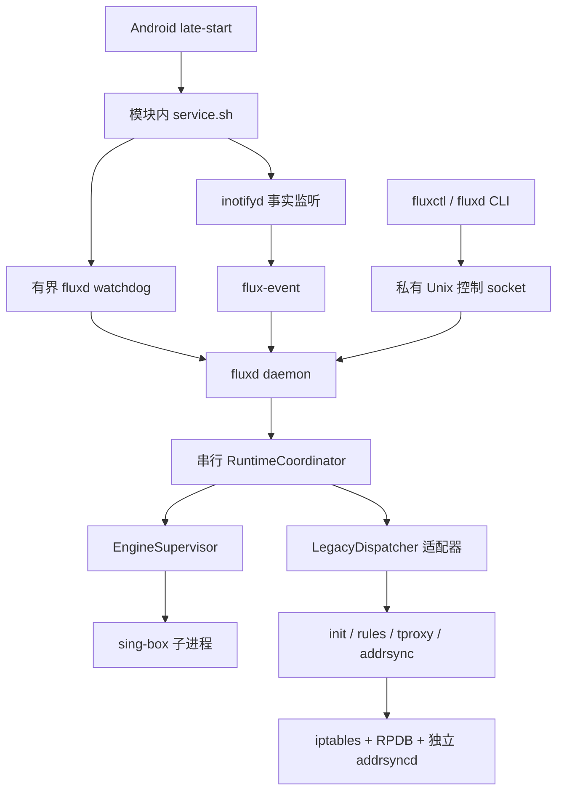

# Flux

[English](README.md) | [简体中文](README_zh.md)

> 无缝重定向您的网络流量。

Flux 是面向 Magisk、KernelSU 与 APatch 的 Android 透明代理模块。它将
[sing-box](https://sing-box.sagernet.org/) 作为独立代理引擎，并正在迁移到由单一 Rust
控制器 `fluxd` 统一编排的架构。

## 当前发布契约

当前分支仍是 Phase 1 过渡桥接版本，并非已经完成的原生 Rust 重写：

- `fluxd` 负责管理意图、串行生命周期、Generation 恢复以及 Sing-Box 子进程。
- shell 适配器仍是 iptables、策略路由和地址派生规则的唯一写入者。
- 当前桥接仅接受 `PROXY_MODE="tproxy"`。TUN 字段为未来单一所有者方案保留，在激活前会被拒绝。
- 生产路径的抓取验证仍是结构验证。更严格的本地 OUTPUT 功能 canary 已分阶段实现，但尚未构成
  Android 发布资格证据。
- 低于 5.10 的内核保持可查询、不可变更的只读状态。
- eBPF 仅是未来可选的观测/加速能力。Flux 不打包 `.ko`、KPM 或不透明内核模块载荷，也不调用
  显式模块加载 API；但当前旧 shell 桥接尚未证明所有 xtables 依赖均已预先启用、不会触发内核隐式
  自动加载。

详细设计和当前门槛见 [`docs/`](docs/README.md)。

## 当前能力

- 双栈 TCP/UDP TPROXY 兼容路径。
- 移动网络、Wi-Fi、热点与 USB 共享网络的独立开关。
- 基于 UID 的应用允许/拒绝策略，以及 Android 用户/工作资料范围。
- 通过过渡期独立进程 `addrsyncd` 动态协调本机地址规则。
- Generation 级配置快照、有界回滚和启动恢复。
- 订阅下载、过滤、模板合并和 Sing-Box 配置校验。
- 通过 `fluxd` 私有 Unix socket 提供命令行控制。
- 配置的 Sing-Box API 可用时，可通过 `http://127.0.0.1:9090/ui/` 进入 Zashboard。

## 安装与升级

1. 从 [Releases](https://github.com/Chth1z/Flux/releases) 下载发布 ZIP。
2. 使用 Magisk Manager、KernelSU 或 APatch 安装。
3. 配置 `/data/adb/flux/conf/settings.ini`；需要时同时配置严格校验的
   `/data/adb/flux/conf/flux.toml`。
4. 重启设备。

升级时按文件分别处理：

- `flux.toml` 始终保留，因为它是 Rust 控制器的权威配置。
- `settings.ini` 始终迁移到新包所带的 schema。
- `template.json` 与 `addrsyncd.toml` 分别显示独立的音量键保留/重置提示。
- 生成的桥接缓存会被清理；已有 `run/`、`state/` 和生成的 `config.json` 会保留，供启动恢复进行
  协调，后续更新/重载策略再决定何时重新生成 Sing-Box 配置。

即使当前桥接不能激活未来模式，TUN 和多用户配置值也会在升级时保留。解包后的迁移/恢复失败会中止
安装，安装器会先尝试恢复升级前保留的配置，再删除临时备份。

## 运行生命周期


```mermaid
flowchart TD
    Boot["Android late-start"] --> Service["模块内 service.sh"]
    Service --> Watchdog["有界 fluxd watchdog"]
    Watchdog --> Fluxd["fluxd daemon"]
    Service --> Inotify["inotifyd 事实监听"]
    Inotify --> Event["flux-event"]
    Event --> Fluxd
    CLI["fluxctl / fluxd CLI"] --> Socket["私有 Unix 控制 socket"]
    Socket --> Fluxd
    Fluxd --> Coordinator["串行 RuntimeCoordinator"]
    Coordinator --> Engine["EngineSupervisor"]
    Engine --> SingBox["sing-box 子进程"]
    Coordinator --> Bridge["LegacyDispatcher 适配器"]
    Bridge --> Rules["init / rules / tproxy / addrsync"]
    Rules --> Kernel["iptables + RPDB + 独立 addrsyncd"]
```

Rust 所有权路径中不存在并行 IPMonitor 所有者。事件事实先进入 `fluxd`，所有会修改系统状态的桥接阶段
都在同一个串行 worker 中执行。

## 数据包策略桥接

保留的兼容路径会生成固定的有界 zone iptables 分类器。已有连接标记走快速路径；新流量依次经过
强制/本地绕过、接口策略和应用策略，最后选择直接放行或交给 Sing-Box 的 TPROXY 监听器。

`BYPASS_SET_BACKEND="zone"` 是唯一已实现的后端。在独立适配器、能力探测和一致性测试完成前，
`ipset` 与 `auto` 会被明确拒绝。

旧桥接仍使用固定 table/priority `2025` 和低字节 mark。这些值会与 Android mark 策略重叠，不是未来
原生后端可接受的默认值；详见下方“路由 mark”警告。

## 安装目录

运行文件位于 `/data/adb/flux/`：

```text
/data/adb/flux/
├── bin/
│   ├── fluxd                 # Rust 控制器与 CLI
│   ├── addrsyncd             # 过渡期地址规则协调器/回滚二进制
│   ├── jq                    # 桥接 JSON 适配器
│   └── sing-box              # 独立代理引擎
├── conf/
│   ├── flux.toml             # 严格 fluxd schema
│   ├── settings.ini          # 旧网络/订阅设置
│   ├── addrsyncd.toml
│   ├── template.json
│   ├── config.json           # 生成的 Sing-Box 配置
│   └── manifest.json         # 发布 provenance 契约
├── cache/                    # 生成的共享桥接产物
├── state/
│   └── administrative-intent.json
├── run/
│   ├── fluxd.sock
│   ├── fluxd.pid
│   ├── fluxd.log
│   ├── generations/          # 不可变的待激活 Generation 快照
│   └── capture.* / engine.*  # Generation 所有权与恢复记录
└── scripts/
    ├── fluxctl               # 兼容 CLI 包装器
    ├── flux-event            # 原始 inotify 事实适配器
    ├── dispatcher            # 串行 shell 阶段适配器
    ├── init / config / updater.sh
    ├── rules / tproxy / addrsync
    └── lib / log / core      # 公共与仅回滚使用的辅助脚本
```

模块管理目录 `/data/adb/modules/flux/` 包含 `service.sh`、`module.prop`、面板重定向页以及由管理器
维护的 `disable` 标记。安装器会移除旧的全局 `/data/adb/*/service.d/flux_service.sh`，确保只有模块内
watchdog 拥有 `fluxd`。

## 配置说明

`flux.toml` 配置 Rust 守护进程。它采用严格 schema：未知或缺失字段会失败，当前修改后需要重启
守护进程。`settings.ini` 配置保留的网络与订阅桥接。

### 订阅与日志

| 选项 | 描述 | 默认值 |
|---|---|---|
| `SUBSCRIPTION_URL` | 订阅地址 | 空 |
| `UPDATE_TIMEOUT` | 下载超时（秒） | `5` |
| `RETRY_COUNT` | 下载重试次数 | `2` |
| `UPDATE_INTERVAL` | 刷新间隔；`0` 禁用自动刷新 | `86400` |
| `PREF_CLEANUP_EMOJI` | 删除节点名称中的 emoji | `1` |
| `LOG_LEVEL` | `0` 关闭至 `4` 调试 | `3` |
| `LOG_MAX_SIZE` | 日志轮转阈值（字节） | `1048576` |

### 代理引擎

| 选项 | 描述 | 默认值 |
|---|---|---|
| `CORE_USER` / `CORE_GROUP` | Sing-Box 执行身份 | `root` / `root` |
| `CORE_TIMEOUT` | 引擎启动超时（秒） | `5` |
| `PROXY_PORT` | TPROXY 监听端口；只从 `tproxy` inbound 自动提取 | `1536` |
| `FAKEIP_V4_RANGE` | FakeIP IPv4 范围 | `198.18.0.0/15` |
| `FAKEIP_V6_RANGE` | FakeIP IPv6 范围 | `fc00::/18` |
| `PROXY_MODE` | 当前桥接模式；仅接受 `tproxy` | `tproxy` |
| `TUN_INTERFACE`、`TUN_INET4_ADDRESS`、`TUN_INET6_ADDRESS`、`TUN_MTU` | 会迁移保留，但 Phase 1 不支持 | 包内默认值 |

`mixed` inbound 不是透明 TPROXY 监听器，因此不会用于自动提取端口。

### 接口与应用范围

| 选项 | 描述 | 默认值 |
|---|---|---|
| `MOBILE_INTERFACE` | 移动网络接口模式 | `rmnet_data+` |
| `WIFI_INTERFACE` | Wi-Fi 接口 | `wlan0` |
| `HOTSPOT_INTERFACE` | 热点接口 | `wlan2` |
| `USB_INTERFACE` | USB 共享接口模式 | `rndis+` |
| `PROXY_MOBILE`、`PROXY_WIFI`、`PROXY_HOTSPOT`、`PROXY_USB` | 各接口代理开关 | `1` |
| `PROXY_IPV6` | 启用 IPv6 代理规则 | `0` |
| `APP_PROXY_MODE` | `0` 禁用，`1` 拒绝列表/绕过列出应用，`2` 允许列表/仅代理列出应用 | `0` |
| `APP_LIST` | 应用包名列表 | 空 |
| `APP_USER_SCOPE` | `owner`、`all` 或 `list` | `owner` |
| `APP_USER_LIST` | `list` 范围使用的 Android 用户 ID | `0` |

### 路由 mark 与兼容字段

> [!WARNING]
> 下表描述旧 shell 桥接。其 `0xff` 掩码与 Android 低 16 位 `netId` 字段重叠，不是原生 Rust
> 规划器可接受的默认值。原生写入必须获得设备限定的 mark 授权，并完成实时冲突普查。

| 选项 | 描述 | 默认值 |
|---|---|---|
| `ROUTING_MARK` | 可选的引擎绕过 mark；为空时使用 owner 匹配 | 空 |
| `MARK_MASK` | 旧 connmark 掩码 | `0xff` |
| `RULE_BACKEND` | 已实现的规则适配器 | `iptables_restore` |
| `BYPASS_SET_BACKEND` | 已实现的绕过分类器 | `zone` |
| `MSS_CLAMP_ENABLE` | TCP MSS 钳制 | `1` |
| `BLOCK_QUIC` | 阻断 UDP/443 | `0` |

其他兼容字段见 [`conf/settings.ini`](conf/settings.ini)。

## CLI

```bash
/data/adb/flux/scripts/fluxctl status [--json]
/data/adb/flux/scripts/fluxctl start
/data/adb/flux/scripts/fluxctl stop
/data/adb/flux/scripts/fluxctl restart
/data/adb/flux/scripts/fluxctl reload
/data/adb/flux/scripts/fluxctl resync
/data/adb/flux/scripts/fluxctl diagnose
/data/adb/flux/scripts/fluxctl rules-preview
/data/adb/flux/scripts/fluxctl logs [file]
```

`status` 直接返回权威的 `fluxd` 状态，其中包括由 Rust 管理的 Sing-Box 运行状态。所有修改命令只通过
私有控制 socket 执行，不会回退到直接调用 shell 修改系统。

## 开发状态

构建、测试、特权 canary、Android 交叉编译、模块暂存和发布验证说明见
[`docs/development.md`](docs/development.md)。开发暂存目录不等于可发布产物；只有在
`cargo xtask verify-package` 验证完整模块布局、AArch64 ELF、带不可变 revision 的来源与哈希、和 SBOM
交叉绑定的已识别 SPDX/`LicenseRef`、带哈希的设备证据、固定工具链构建元数据、完整包校验和，并确认
不存在 `.ko`/`.kpm` 载荷后，才满足当前发布验证边界。

## 免责声明

- 本项目仅供教育和研究使用，请勿用于非法用途。
- 透明代理和策略路由修改可能与 Android VPN/netd 策略冲突。
- 在依赖本模块前，请保留回滚路径并在受支持设备上完成测试。

## 鸣谢

- [SagerNet/sing-box](https://github.com/SagerNet/sing-box)
- [taamarin/box_for_magisk](https://github.com/taamarin/box_for_magisk)
- [CHIZI-0618/box4magisk](https://github.com/CHIZI-0618/box4magisk)
- [jqlang/jq](https://github.com/jqlang/jq)

## 许可证

[GPL-3.0](LICENSE)
