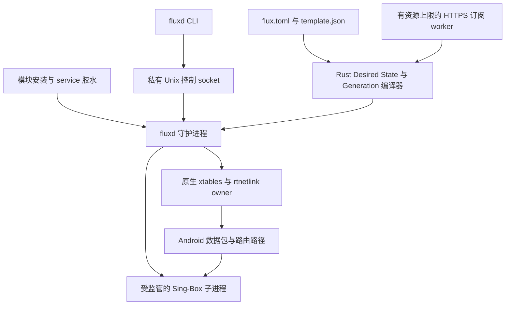

# Flux

[English](README.md) | [简体中文](README_zh.md)

> 让网络流向自然切换。

Flux 是面向 Magisk、KernelSU 和 APatch 的 Android 透明代理模块，目前仍处于开发阶段。
`fluxd` 是唯一的 Rust 控制器；[Sing-Box](https://sing-box.sagernet.org/) 仍作为外部代理引擎。

## 当前状态

本分支不是发布产物。R4-R6 切换已经移除旧 shell 网络运行时、独立 `addrsyncd`、打包的
`jq`、兼容配置以及双 package profile。当前源码只保留：

- 一个 Rust 守护进程，负责配置、订阅、Generation 生命周期、Sing-Box 监管、原生
  xtables/rtnetlink 修改、精确回读、回滚和恢复；
- 一个确定性的 `auto`/精确 Capture Path 选择器；完整的选中或拒绝决策会绑定到 Generation
  身份、运行时状态和 explain 输出；
- 一个名为 `native` 的开发 package profile，其清单固定为 13 个文件；
- 仅用于安装、开机启动/有限重启以及委托卸载的必要 shell 胶水；
- 不再包含运行时 `scripts/` 目录，也不存在 shell 网络写入者或隐式回退；
- 不打包内核模块，生产代码也不会加载或卸载 `.ko`/KPM 载荷。

剩余发布工作不是再造兼容桥。下一步包括为选择器实现生产 Android 行为资格证据生产者、验证
VPN/canary Adapter、执行有边界的真机测试、补齐来源与许可证元数据、绑定实际 payload 的设备
证据、SBOM/构建元数据/校验和，以及从 `development-only` 明确晋级。

## 架构


```mermaid
flowchart TD
    Glue["模块安装与 service 胶水"] --> Fluxd["fluxd 守护进程"]
    CLI["fluxd CLI"] --> Socket["私有 Unix 控制 socket"]
    Socket --> Fluxd
    Config["flux.toml 与 template.json"] --> Compiler["Rust Desired State 与 Generation 编译器"]
    Subscription["有资源上限的 HTTPS 订阅 worker"] --> Compiler
    Compiler --> Fluxd
    Fluxd --> Engine["受监管的 Sing-Box 子进程"]
    Fluxd --> Native["原生 xtables 与 rtnetlink owner"]
    Native --> Kernel["Android 数据包与路由路径"]
    Kernel --> Engine
```

Flux 采用 capability-first 设计：先观察精确的设备与内核事实，再用行为证据验证候选路径，
最后选择排序最高且可准入的路径。数据模型覆盖 nftables、legacy xtables、managed TUN、
ipset 和可选 eBPF 事实，但这不等于它们都已可在生产环境修改系统：

| 路径 | 当前边界 |
|---|---|
| 原生 xtables TPROXY | Rust owner 已实现，也是唯一的生产 Adapter；当前 Android 行为证据刻意保持未验证，因此打包后的启动保持只读 |
| nftables | 已有 capability/probe 模型；生产 mutation adapter 尚未实现 |
| Managed TUN | 已建模为候选回退；生产 ownership 与 route adapter 尚未实现 |
| eBPF | 仅作为可选观察/资格输入；不属于正确性必需路径 |

精确指定的路径不会静默回退。当完整且新鲜的 authority 不存在时，`fluxd` 保持可查询，
但不会修改网络状态。

## 安全模型

- 每个 Flux 网络对象只有一个 writer；修改前验证 writer 身份和持久恢复记录。
- 候选 Generation 先准备后激活；失败时按逆序补偿，无法证明清理完成时保留 ownership 证据。
- 内核对象、路由、规则、引擎身份和进程状态均通过回读确认，而不是根据命令退出码推断。
- 未验证、格式错误、发生漂移、被拒绝或不完整的 capability 证据会阻止 mutation。
- 停止与卸载以恢复设备直连为目标：守护进程先移除 capture，再结束引擎；离线清理由 Rust 实现。
- Android fwmark/RPDB 位置必须经过设备资格验证；Flux 不会把“看起来未使用”的 mark 位或内核版本
  当作分配权限。

## 包结构

当前 package profile 精确包含以下 13 个文件：

```text
META-INF/com/google/android/update-binary
META-INF/com/google/android/updater-script
bin/fluxd
bin/sing-box
conf/flux.toml
conf/template.json
conf/manifest.json
webroot/index.html
customize.sh
flux_service.sh
uninstall.sh
module.prop
LICENSE
```

安装器把运行时 payload 放到 `/data/adb/flux`，并将 `flux_service.sh` 安装为模块本地
`service.sh`。安装器刻意只支持全新安装：发现已有 `/data/adb/flux` 时立即拒绝，不会让
shell 迁移未知或高度定制的用户状态。开机 service 等待 Android 启动完成，然后以固定次数运行
`fluxd daemon`。卸载脚本先请求在线守护进程停止；守护进程不可用时改由
`fluxd cleanup --offline` 完成 Rust 离线恢复。

运行期间生成的私有状态包括控制 socket、日志、不可变 Generation 文件、管理意图、订阅快照、
native owner journal 和恢复记录。这些生成文件都不属于模块压缩包。

## 配置

[`conf/flux.toml`](conf/flux.toml) 是唯一的 Flux 产品策略来源。Schema 4 拒绝未知、重复或缺失字段。
[`conf/template.json`](conf/template.json) 保存 Sing-Box 的 DNS、路由、出站与 API 策略，不能授予
内核 capture 权限。

| Section | 职责 |
|---|---|
| `[daemon]` | Fail-open 策略、reconcile debounce、队列容量和 Generation 保留量 |
| `[engine]` / `[listener]` | Sing-Box 身份、生命周期/重启上限和 TPROXY listener |
| `[capture]` | Capture Path 请求、流量域、地址族和协议 |
| `[applications]` | 应用包与 Android 用户选择策略 |
| `[interfaces]` / `[bypass]` | 接口角色与规范化 CIDR 绕过项 |
| `[subscription]` | HTTPS 刷新来源和资源上限 |
| `[safety]` | Android VPN 与功能 canary 要求 |

开发默认配置使用 `auto` 请求本机输出的 IPv4 TCP/UDP。当前生产 Adapter 清单只有 xtables
TPROXY，但尚无生产行为探针可以把它标记为 qualified；启动会保留类型化拒绝并保持只读。转发
流量、IPv6、Android VPN 共存和强制功能 canary 都需要相应的目标设备 reviewed authority。

## CLI

```text
/data/adb/flux/bin/fluxd status [--json]
/data/adb/flux/bin/fluxd start|stop|restart|reload|resync
/data/adb/flux/bin/fluxd diagnose [--json]
/data/adb/flux/bin/fluxd logs [runtime|daemon|engine] [--lines 1..1000] [--json]
/data/adb/flux/bin/fluxd backend explain [--json]
/data/adb/flux/bin/fluxd plan [--dry-run] [--json]
/data/adb/flux/bin/fluxd rules-preview [--json]
/data/adb/flux/bin/fluxd subscription update
/data/adb/flux/bin/fluxd cleanup --offline
```

在线命令通过同一有效 UID 可访问的私有 Unix socket 使用 protocol v8。状态将活动 Generation 与
其精确 Capture Path 选择绑定，并单独报告最近一次已完成的选择尝试；explain 会标明两者的请求
是否仍与 Desired State 一致。只读诊断和 preview 有固定输入/输出上限，不会生成 mutation
authority。`cleanup --offline` 会先取得 daemon lease；已有守护进程正在运行或启动时，该命令会
拒绝执行。

## 构建与验证

仓库固定使用 Rust `1.93.0`、Android API 31 和 NDK `27.3.13750724`。

```text
cargo xtask ci
cargo xtask build-android
```

`build-android` 生成 `target/aarch64-linux-android/release/fluxd`，并确认每个 ELF `PT_LOAD`
segment 至少按 16 KiB 对齐。

要创建精确的开发模块目录，先把独立审查过的 ARM64 `sing-box` 放入 runtime-binary 目录，再运行：

```text
cargo xtask stage-module --stage dist/module --runtime-binaries /path/to/runtime-binaries
```

stage 命令会拒绝非空目标目录、缺失 payload、不安全路径或任何额外文件。完整发布验证命令为：

```text
cargo xtask verify-package --stage dist/module
```

仅凭当前 placeholder manifest，该命令按设计无法通过。候选发布还必须具备干净源码状态、完整的
二进制来源/版本/hash/license 字段、可信且绑定 payload 的设备证据、SPDX、固定构建元数据和完整
校验和。

有界、只读的 Android fwmark census 必须显式指定 ADB 设备和命令路径：

```text
cargo --quiet xtask collect-android-arm64-fwmark-census --serial SERIAL --adb PROGRAM
```

仅应在可恢复的测试设备上运行设备探针，并先审查命令的变更与清理范围。

## 免责声明

- 本项目仅用于教育与研究，请勿用于违法用途。
- 透明代理和策略路由可能与 Android VPN/netd 以及高度定制的 root 模块冲突。
- 在依赖本模块前，必须保留可恢复备份并完成设备专属的清理证明。

## 致谢

- [SagerNet/sing-box](https://github.com/SagerNet/sing-box)
- [taamarin/box_for_magisk](https://github.com/taamarin/box_for_magisk)
- [CHIZI-0618/box4magisk](https://github.com/CHIZI-0618/box4magisk)

## 许可证

[GPL-3.0](LICENSE)
