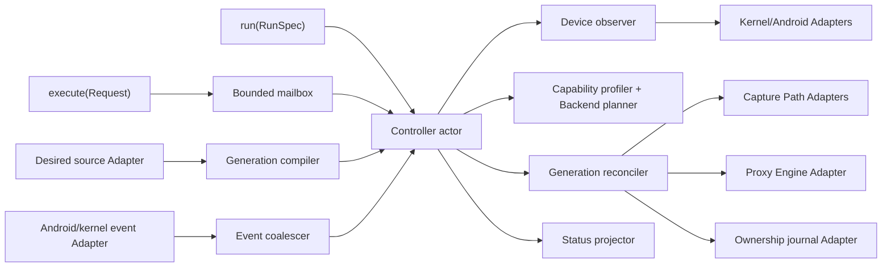

# Alternative A: minimal mailbox Interface

## Decision summary

This alternative makes the Flux Controller a deep Module with exactly two external entry points:

1. `run` starts the long-lived controller and does not return until orderly shutdown or a fatal invariant failure.
2. `execute` submits one typed request to the running controller and returns one typed reply.

There are no external start/stop/restart/resync/backend/Proxy Engine methods. Those verbs expose implementation steps and force callers to understand ordering. Instead:

- `Converge(Configured)` means “load the canonical sources and move Observed State toward Desired State.”
- `Converge(Disabled)` means “make disabled Desired State true while keeping the controller alive for status and event watching.”
- `Inspect` returns a stable projection of Desired State, Observed State, Generation, Network Epoch, Capability Profile, Backend Plan, Proxy Engine health, Degraded State, and outstanding drift.

Repeated `Converge(Configured)` repairs the current Generation if the semantic Desired State is unchanged. It creates a new immutable Generation only when the compiled Desired State digest changes. This removes “restart” from the architecture.

The external Seam sits above configuration parsing, capability probing, Backend Plan selection, kernel mutation, event watching, Sing-Box supervision, and crash recovery. Those concerns remain local to the Module.

## 1. Concrete Rust Interface

```rust
use std::path::PathBuf;
use std::time::Duration;

/// Entry point 1: own the controller until shutdown or fatal loss of safety.
pub async fn run(spec: RunSpec) -> Result<RunExit, FatalError>;

/// Entry point 2: perform one versioned request/reply exchange.
pub async fn execute(
    endpoint: &ControlEndpoint,
    request: ControlRequest,
) -> Result<ControlReply, ControlError>;

#[derive(Clone, Debug)]
pub struct RunSpec {
    /// Read-only Magisk module root containing binaries and canonical sources.
    pub module_root: PathBuf,
    /// Writable boot-local state, journal, socket, and diagnostics root.
    pub runtime_root: PathBuf,
    /// Local authenticated request/reply endpoint.
    pub control: ControlEndpoint,
    /// Bounded controller resource policy, not device capability claims.
    pub limits: ControllerLimits,
}

#[derive(Clone, Debug)]
pub struct ControlEndpoint {
    pub socket_path: PathBuf,
    pub protocol: ProtocolVersion,
}

#[derive(Clone, Debug)]
pub struct ControllerLimits {
    pub mailbox_capacity: usize,
    pub event_coalesce_window: Duration,
    pub settle_timeout: Duration,
    pub max_status_diagnostics: usize,
}

#[derive(Clone, Copy, Debug, Eq, PartialEq, Hash)]
pub struct ProtocolVersion(pub u16);

#[derive(Clone, Debug)]
pub enum ControlRequest {
    Converge(ConvergeRequest),
    Inspect(InspectRequest),
}

#[derive(Clone, Debug)]
pub struct ConvergeRequest {
    /// Makes client retries safe across a dropped local connection.
    pub request_id: RequestId,
    pub target: DesiredTarget,
    pub wait: WaitPolicy,
}

#[derive(Clone, Copy, Debug, Eq, PartialEq)]
pub enum DesiredTarget {
    /// Load settings, validated Subscription Snapshot, and other canonical
    /// local sources; compile or repair the resulting Generation.
    Configured,
    /// Desired State contains no active Capture Policy. The controller remains
    /// alive and continues observing the device.
    Disabled,
}

#[derive(Clone, Copy, Debug, Eq, PartialEq)]
pub enum WaitPolicy {
    /// Return after the request has been authenticated, deduplicated, ordered,
    /// and assigned an operation.
    Accepted,
    /// Wait until the operation reaches Active, Degraded, Inactive, or Blocked.
    Settled { timeout: Duration },
}

#[derive(Clone, Debug)]
pub struct InspectRequest {
    /// Cached is O(1). Observed schedules a read-only device observation and
    /// waits for a snapshot incorporating it.
    pub consistency: StatusConsistency,
    /// Long-poll until a newer status revision exists. None returns immediately.
    pub after: Option<StatusRevision>,
    pub wait_for_change: Duration,
}

#[derive(Clone, Copy, Debug, Eq, PartialEq)]
pub enum StatusConsistency {
    Cached,
    Observed { timeout: Duration },
}

#[derive(Clone, Debug)]
pub enum ControlReply {
    Converge(ConvergeReceipt),
    Inspect(InspectReply),
}

#[derive(Clone, Debug)]
pub struct ConvergeReceipt {
    pub request_id: RequestId,
    pub operation_id: OperationId,
    pub generation: Option<GenerationId>,
    pub disposition: ConvergeDisposition,
    pub status_revision: StatusRevision,
}

#[derive(Clone, Debug)]
pub enum ConvergeDisposition {
    Accepted,
    Settled(SettledState),
}

#[derive(Clone, Debug)]
pub enum SettledState {
    Active {
        generation: GenerationId,
        network_epoch: NetworkEpochId,
    },
    Degraded {
        generation: GenerationId,
        network_epoch: NetworkEpochId,
        limitations: Vec<Limitation>,
    },
    Inactive {
        generation: GenerationId,
    },
    Blocked {
        generation: Option<GenerationId>,
        safe_state: SafeState,
        issues: Vec<Issue>,
    },
}

#[derive(Clone, Debug)]
pub enum InspectReply {
    Snapshot(StatusSnapshot),
    Unchanged { revision: StatusRevision },
}

#[derive(Clone, Debug)]
pub struct StatusSnapshot {
    pub revision: StatusRevision,
    pub phase: ControllerPhase,
    pub desired: DesiredSummary,
    pub prepared_generation: Option<GenerationId>,
    pub active_generation: Option<GenerationId>,
    pub network_epoch: NetworkEpochId,
    pub capabilities: CapabilityProfileSummary,
    pub plan: Option<BackendPlanSummary>,
    pub proxy_engine: ProxyEngineSummary,
    pub reconciliation: ReconciliationSummary,
    pub managed_objects: ManagedObjectSummary,
    pub degraded: Vec<Limitation>,
    pub last_issue: Option<Issue>,
}

#[derive(Clone, Copy, Debug, Eq, PartialEq)]
pub enum ControllerPhase {
    Recovering,
    Inactive,
    Preparing,
    Activating,
    Active,
    Degraded,
    Retiring,
    Blocked,
}

#[derive(Clone, Copy, Debug, Eq, PartialEq)]
pub enum SafeState {
    DirectConnectivity,
    ExplicitFailClosed,
    ObservationOnly,
}

#[derive(Clone, Debug)]
pub struct Issue {
    pub code: IssueCode,
    pub scope: IssueScope,
    pub message: String,
    pub errno: Option<i32>,
    pub evidence: Vec<Evidence>,
    pub retry: RetryClass,
}

#[derive(Clone, Copy, Debug, Eq, PartialEq)]
pub enum RetryClass {
    Automatic,
    OnNetworkEpoch,
    OnSourceChange,
    OperatorActionRequired,
    Unsupported,
}

#[derive(Clone, Debug, thiserror::Error)]
pub enum ControlError {
    #[error("Flux Controller is unavailable")]
    Unavailable,
    #[error("caller is not authorized for this request")]
    Unauthorized,
    #[error("control protocol mismatch: client={client:?}, controller={controller:?}")]
    ProtocolMismatch {
        client: ProtocolVersion,
        controller: ProtocolVersion,
    },
    #[error("invalid request: {0}")]
    InvalidRequest(String),
    #[error("request mailbox is full")]
    Busy,
    #[error("operation {operation_id:?} did not settle before the deadline")]
    DeadlineExceeded {
        operation_id: OperationId,
        last_revision: StatusRevision,
    },
    #[error("local control transport failed: {0}")]
    Transport(String),
}

#[derive(Clone, Debug, thiserror::Error)]
pub enum FatalError {
    #[error("another controller owns the runtime lease")]
    ExclusiveLease,
    #[error("control endpoint cannot be established safely: {0}")]
    ControlEndpoint(String),
    #[error("durable ownership journal cannot be recovered: {0}")]
    OwnershipJournal(String),
    #[error("controller invariant violated: {0}")]
    Invariant(String),
}

#[derive(Clone, Copy, Debug, Eq, PartialEq)]
pub enum RunExit {
    ShutdownSignal,
    ModuleDisabled,
    UpgradeHandoff,
}
```

The omitted ID and summary types are opaque, serializable value types. They must not expose internal structs from the planner, kernel Adapters, or Sing-Box Adapter.

### Why `Configured` does not carry Desired State

The caller names an intention, not a construction recipe. The controller owns:

- reading and validating settings;
- selecting the current immutable Subscription Snapshot;
- resolving package/user inputs into Traffic Scope;
- compiling Capture Policy and Bypass Policy;
- assigning a Generation ID;
- observing Android VPN/netd state;
- deriving a Capability Profile and Backend Plan.

If callers passed a fully assembled Desired State, all of that knowledge would move through the external Seam. The Module would become shallow and every caller would need to change when configuration semantics changed.

An in-memory Desired State Adapter exists at an internal Seam for tests. It is not part of the external Interface.

## 2. Interface invariants

These invariants are part of the Interface even though most are not visible in the Rust type declarations.

### 2.1 Single-writer and linearization

1. Exactly one `run` invocation owns the runtime lease for a boot.
2. All mutating requests and internally detected events enter one bounded mailbox.
3. The controller assigns a total order to mailbox items.
4. At most one Generation may be in Activating or Retiring at a time.
5. A newer Desired State fence prevents an older prepared Generation from becoming active.

This serial order is intentional. Kernel networking state is shared and ordering-sensitive; parallel mutation would reduce locality and make crash recovery ambiguous.

### 2.2 Generation invariants

1. A Generation is immutable after its semantic digest and Generation ID are assigned.
2. Re-reading sources with the same semantic digest reuses the Generation and performs Reconciliation against fresh Observed State.
3. A changed semantic digest creates a new Generation.
4. The active Generation pointer changes only after Proxy Engine readiness, bypass readiness, Managed Object staging, capture publication, and verification succeed.
5. A Generation is retired only after capture is unpublished and its owned Managed Objects are verified absent or transferred to the successor.

### 2.3 Android coexistence invariants

1. Android-owned marks, RPDB rules, routes, netfilter chains/tables, cgroup programs, qdiscs, and VPN state are Observed State, never Managed Objects.
2. Mark writes are masked merges only after the current technical specification's device-qualified planning authority and a later activation lease both succeed; observation alone never allocates the complement of seen masks.
3. The default policy respects Android VPN, always-on VPN, and lockdown routing.
4. A Backend Plan is rejected or Degraded if safe rule priority, mark authority, hook placement, or ownership cannot be proven.
5. netd restart begins a new Network Epoch and invalidates affected observations and leases.
6. Netlink loss or an inconsistent dump requires a full observation before further activation.

### 2.4 Publication and retirement order

Activation order is fixed:

1. load and validate canonical sources;
2. compile or select the immutable Generation;
3. observe device state and refresh the Capability Profile;
4. derive the Backend Plan;
5. start or reconfigure the Sing-Box Proxy Engine;
6. prove upstream loop prevention and listener/TUN readiness;
7. stage private Managed Objects;
8. stage RPDB/local-route state;
9. publish the capture hook last;
10. verify traffic canary and exact Managed Object state;
11. publish Active or Degraded status.

Retirement order is the inverse safety order, not simply the reverse call order:

1. unpublish capture first;
2. drain bounded in-flight work;
3. remove RPDB/local routes;
4. detach Flux-owned eBPF work and remove private netfilter state;
5. close TUN and stop or replace the Proxy Engine;
6. verify owned state is absent;
7. publish Inactive/retired status.

This makes the default failure direction direct connectivity. Explicit fail-closed behavior is a Desired State decision and appears in status.

### 2.5 Request idempotency

- `request_id` is deduplicated for the current boot.
- Retrying an accepted request returns the same operation identity and current disposition.
- Repeating `Converge(Configured)` always schedules observation and repair, even when no new Generation is compiled.
- Repeating `Converge(Disabled)` is a verified no-op after the disabled Generation is settled.

### 2.6 Status invariants

- `StatusRevision` is monotonic within a boot.
- Every phase, issue, Backend Plan, Proxy Engine transition, and drift change publishes a new immutable snapshot.
- `Inspect(Cached)` never performs kernel I/O.
- `Inspect(Observed)` may refresh Observed State but does not change Desired State.
- Long-poll returns `Unchanged` on timeout, not a transport error.
- Status reports capability evidence and Degraded State without exposing raw Adapter structs.

### 2.7 Authorization

The production control transport authenticates local peers from Unix credentials:

- mutation requests require the configured privileged UID/domain;
- read-only inspection may be granted to a narrower diagnostic group;
- request fields never allow a caller to claim an identity or event cause.

## 3. Error and outcome model

The Interface distinguishes three classes deliberately.

### 3.1 Control errors

`ControlError` means the request/reply exchange itself could not be honored: unavailable daemon, authorization, protocol mismatch, malformed input, bounded-mailbox backpressure, local transport failure, or a caller-selected settle deadline.

A deadline does not cancel an accepted operation. The caller receives its `OperationId` and can use `Inspect`.

### 3.2 Settled Blocked state

Unsupported kernel, wrong network namespace, denied capability, unsafe mark collision, Android VPN conflict, unavailable nft expression, failed TUN probe, failed Sing-Box validation, or unrecoverable drift are **not** control errors. They are a settled `Blocked` result with a safe state and typed issues.

Keeping the controller alive preserves status, automatic retry, event watching, and recovery.

### 3.3 Fatal errors

`run` exits only when it cannot preserve the controller's fundamental safety claims:

- it cannot obtain exclusive ownership;
- it cannot create/authenticate the control endpoint;
- the ownership journal is corrupt in a way that prevents safe identification of Managed Objects;
- an internal invariant is violated.

Ordinary backend, kernel, Proxy Engine, or network failures must settle to Blocked or Degraded rather than terminate the controller.

## 4. Performance characteristics

These characteristics are part of the Interface:

| Operation | Expected work |
|---|---|
| `Converge + Accepted` | One local request/reply, authentication, deduplication, bounded mailbox enqueue: O(1) with no synchronous kernel mutation |
| `Inspect + Cached` | Atomic load/clone of an immutable status snapshot: O(1) |
| `Inspect + Observed` | Device dumps and verification: O(number of relevant kernel objects) |
| Desired State compilation | O(Traffic Scope + Subscription Snapshot + policy inputs) |
| Reconciliation | O(observed/desired Managed Object diff), with backend batching |
| Long-poll Inspect | One held local connection with no polling loop inside the client |

Implementation requirements:

- expensive compilation and parsing run off the mailbox reactor;
- only small immutable results return to the actor;
- route/netfilter netlink uses batched messages and extended ACKs;
- nft changes use atomic batches;
- legacy xtables uses complete Flux-owned restore payloads under the xtables lock;
- event bursts are coalesced by semantic key;
- Proxy Engine stdout/stderr is drained independently so it cannot block supervision;
- status snapshots use shared immutable storage and bounded diagnostics;
- the mailbox is bounded and returns `Busy` rather than allowing unbounded memory growth.

The single actor serializes decisions, not all I/O. Independent observation, parsing, and process-log tasks may run concurrently, but only the actor commits state transitions.

## 5. Usage examples

### 5.1 Magisk boot glue

`service.sh` only executes the daemon. The Rust entry point remains small:

```rust
use flux_controller::{
    run, ControlEndpoint, ControllerLimits, ProtocolVersion, RunSpec,
};
use std::path::PathBuf;
use std::time::Duration;

#[tokio::main(flavor = "multi_thread")]
async fn main() -> Result<(), Box<dyn std::error::Error>> {
    let exit = run(RunSpec {
        module_root: PathBuf::from("/data/adb/flux"),
        runtime_root: PathBuf::from("/data/adb/flux/run"),
        control: ControlEndpoint {
            socket_path: PathBuf::from("/data/adb/flux/run/control.sock"),
            protocol: ProtocolVersion(1),
        },
        limits: ControllerLimits {
            mailbox_capacity: 256,
            event_coalesce_window: Duration::from_millis(100),
            settle_timeout: Duration::from_secs(30),
            max_status_diagnostics: 128,
        },
    })
    .await?;

    tracing::info!(?exit, "Flux Controller exited");
    Ok(())
}
```

### 5.2 Enable or repair configured behavior

```rust
use flux_controller::{
    execute, ControlRequest, ConvergeRequest, DesiredTarget, RequestId, WaitPolicy,
};
use std::time::Duration;

let reply = execute(
    &endpoint,
    ControlRequest::Converge(ConvergeRequest {
        request_id: RequestId::new(),
        target: DesiredTarget::Configured,
        wait: WaitPolicy::Settled {
            timeout: Duration::from_secs(30),
        },
    }),
)
.await?;

match reply {
    ControlReply::Converge(receipt) => println!("{receipt:#?}"),
    _ => unreachable!("reply type is correlated with request type"),
}
```

This same request replaces current `start`, `restart`, and `resync` commands:

- if disabled, it activates configured Desired State;
- if sources changed, it compiles and activates a successor Generation;
- if sources did not change, it repairs the current Generation;
- if the Network Epoch changed, it refreshes the Capability Profile and Backend Plan as needed.

### 5.3 Disable capture without losing observability

```rust
let reply = execute(
    &endpoint,
    ControlRequest::Converge(ConvergeRequest {
        request_id: RequestId::new(),
        target: DesiredTarget::Disabled,
        wait: WaitPolicy::Settled {
            timeout: Duration::from_secs(15),
        },
    }),
)
.await?;
```

The controller remains alive, watches Magisk/configuration/network events, supervises cleanup, and serves status.

### 5.4 Status and event-style watching through the same entry point

```rust
let mut after = None;

loop {
    let reply = execute(
        &endpoint,
        ControlRequest::Inspect(InspectRequest {
            consistency: StatusConsistency::Cached,
            after,
            wait_for_change: Duration::from_secs(30),
        }),
    )
    .await?;

    match reply {
        ControlReply::Inspect(InspectReply::Snapshot(snapshot)) => {
            after = Some(snapshot.revision);
            render(snapshot);
        }
        ControlReply::Inspect(InspectReply::Unchanged { revision }) => {
            after = Some(revision);
        }
        _ => unreachable!(),
    }
}
```

The client does not subscribe to kernel or Android events. The controller converts those events into monotonic status revisions.

## 6. Hidden implementation behind the external Seam

`run` composes internal Modules and Adapters, then enters one controller actor:



### 6.1 Internal Modules

| Internal Module | Hidden responsibility |
|---|---|
| Controller actor | Linearization, Generation fence, phase transitions, cancellation, retry, status publication |
| Desired source loader | Read settings and immutable Subscription Snapshot; validate source identity and atomicity |
| Generation compiler | Resolve Traffic Scope, compile Capture Policy/Bypass Policy, calculate semantic digest and Managed Object intentions |
| Device observer | Build Observed State from rtnetlink, nfnetlink, TUN, BPF, process, filesystem, Android properties, and peer credentials |
| Capability profiler | Classify supported/missing/policy-denied/conflicting/broken capability evidence |
| Backend planner | Select explainable nftables, legacy xtables, TUN, ipset/set, and eBPF assistance for the current Desired State and Capability Profile |
| Reconciler | Prepare, activate, verify, retire, and recover Generations with fixed safety order |
| Managed Object registry | Exact identity and ownership checks for routes, rules, marks, chains, sets, links, filters, TUN, and process generations |
| Proxy Engine supervisor | Validate configuration, spawn Sing-Box, track readiness with pidfd, drain logs, stop gracefully, classify exits, enforce backoff |
| Event multiplexer | Watch sources, Magisk toggle, Android properties, netd, rtnetlink, netfilter generations, pidfd, timers, signals, and netlink loss |
| Status projector | Convert internal state into the stable `StatusSnapshot` projection |

### 6.2 Adaptive Backend Plan

Backend variability is hidden completely:

1. Admit only kernel 5.10 or newer.
2. Functionally probe capabilities rather than trust kernel version or command presence.
3. Audit Android VPN/netd rules, mark masks, hook positions, qdiscs, cgroup attachments, and ownership.
4. Select exactly one primary Capture Path:
   - nftables TPROXY when the complete expression/transaction/coexistence probe passes;
   - otherwise legacy Android xtables TPROXY;
   - otherwise TUN;
   - otherwise Blocked observation-only state.
5. Select optional support independently:
   - nft native sets or ipset for large bypass membership;
   - TC eBPF only on a verified Generation-scoped TUN link under a Flux-owned qdisc/filter lease by default;
   - BPF ring buffer for telemetry only;
   - userspace path when optional eBPF work is denied or absent.
6. Record the evidence and rejected candidates in `BackendPlanSummary`.

The caller never sequences a backend migration. A successor Generation stages the new Capture Path, verifies it, publishes it once, and retires the previous path without duplicate capture.

### 6.3 Proxy Engine supervision

Sing-Box is hidden behind the Proxy Engine Adapter:

- materialize the Generation-specific Sing-Box configuration;
- run Sing-Box validation before spawn;
- spawn without an intermediary shell;
- retain pidfd/process identity to prevent PID reuse errors;
- establish listener/TUN readiness before capture publication;
- merge only Flux's mark field into outbound sockets where supported;
- monitor exit and readiness continuously;
- remove capture before restart after an unexpected exit;
- use bounded exponential backoff;
- preserve the last known diagnostic without treating process failure as a fatal controller error.

No external caller can start Sing-Box while capture is absent or install capture while Sing-Box is unready.

### 6.4 Event watching and Network Epoch

Event sources are converted into internal typed triggers:

- canonical source close-write/rename;
- Magisk disable/remove state;
- `sys.boot_completed` and netd lifecycle;
- route-netlink link/address/route/rule notifications;
- `ENOBUFS` and inconsistent dumps;
- Android VPN/default-network change;
- nft generation change;
- TUN removal or ifindex reuse;
- Proxy Engine exit/readiness loss;
- resume and periodic audit timer;
- Unix shutdown signals.

Events are hints, not truth. The actor coalesces them and asks the observer for fresh facts. A material topology or Android-policy change starts a new Network Epoch. The reconciler reuses the current Generation when Desired State is unchanged, but may derive a different Backend Plan for the new epoch.

### 6.5 Crash recovery

At `run` startup:

1. acquire the boot/runtime lease;
2. read boot ID, netns identity, and the last atomic ownership journal;
3. observe every journaled Managed Object;
4. if Proxy Engine readiness cannot be proven, unpublish stale capture first;
5. classify exact matches, missing objects, and ownership conflicts;
6. garbage-collect only exact stale Flux ownership;
7. load canonical Desired State;
8. reconcile into the current boot and Network Epoch;
9. publish Recovering, then Active/Degraded/Inactive/Blocked status.

The journal stores Generation intention and object identity, not inverse shell commands. Kernel observation is authoritative.

## 7. Dependency categories and internal Adapters

Internal dependency Seams are private to the implementation and its tests. They do not enlarge the external Interface.

### 7.1 In-process

These are pure or memory-only and should be deepened directly with no Adapter:

- Desired State normalization;
- Traffic Scope expansion from already resolved identities;
- Capture Policy and Bypass Policy compilation;
- Generation hashing and fencing;
- Backend Plan scoring from a Capability Profile;
- Managed Object diffing;
- phase transition validation;
- status projection and diagnostic truncation;
- event coalescing policy.

### 7.2 Local-substitutable

| Internal Seam | Production Adapter | Test Adapter |
|---|---|---|
| Desired source Interface | Atomic filesystem source Adapter | In-memory source Adapter |
| Device observation Interface | Android rtnetlink/nfnetlink/property Adapter | Deterministic model-device Adapter |
| Capture Path Interface | nftables, legacy xtables, and TUN Adapters | Model capture Adapter with fault injection |
| eBPF assistance Interface | TC-on-TUN/ringbuf Adapter or userspace-only Adapter | Scripted eBPF Adapter |
| Ownership journal Interface | Atomic filesystem journal Adapter | In-memory crash journal Adapter |
| Event Interface | inotify/property/netlink/pidfd/timer Adapter | Scripted event Adapter |
| Clock Interface | monotonic boot clock Adapter | manual clock Adapter |
| Control transport Interface | authenticated Unix `SOCK_SEQPACKET` Adapter | in-process request Adapter |

These are real Seams because behavior varies across multiple production Adapters or because a faithful local test Adapter exists.

### 7.3 True external

Sing-Box is a third-party executable and is represented by a private Proxy Engine port:

- production: `SingBoxProcessAdapter`;
- tests: `FakeProxyEngineAdapter` with readiness, exit, hang, malformed-output, and backoff scenarios.

The controller owns policy and ordering; the Adapter owns process-specific invocation and readiness interpretation.

### 7.4 Remote but owned

None are required in this alternative. Subscription retrieval is outside the controller; the controller consumes an already validated immutable Subscription Snapshot from the canonical local source Seam. Introducing a network port here would reduce locality without a current second deployment Adapter.

## 8. Testing through the Interface

The external Interface is the primary test surface:

1. start `run` with private internal test Adapters;
2. call only `execute`;
3. assert on replies, status revisions, simulated device state, and exact externally observable Managed Object effects;
4. inject events and failures through internal scripted Adapters;
5. avoid tests that call planner, reconciler, or supervisor methods directly.

Core scenario tests:

- first activation and idempotent repeated convergence;
- changed sources create one successor Generation;
- stale Generation cannot activate after a newer request;
- Sing-Box exits during preparation and after activation;
- capture is removed before worker restart;
- nft probe fails and legacy xtables is selected;
- xtables fails and TUN is selected;
- optional eBPF denial produces Degraded State without changing correctness;
- Android VPN/lockdown conflict blocks unsafe activation;
- netd restart starts a Network Epoch and repairs the same Generation;
- netlink `ENOBUFS` forces a full observation;
- crash after every activation step recovers safely;
- ownership-name collision with different semantics is never deleted;
- Disabled convergence removes capture but preserves status/event watching;
- cached status and long-poll status obey revision semantics;
- mailbox saturation returns `Busy` without memory growth.

Pure in-process logic may retain focused tests where useful, but those tests do not replace the Interface scenarios.

## 9. Trade-offs

### 9.1 Depth

Depth is very high. Two entry points exercise:

- Desired State loading and compilation;
- immutable Generations;
- capability probing;
- adaptive nftables/legacy xtables/TUN/eBPF planning;
- Android VPN/netd coexistence;
- Sing-Box supervision;
- event watching;
- crash recovery;
- status and diagnostics.

The deletion test is strong: deleting this Module would force boot glue and CLI callers to regain backend choice, process ordering, rollback, event handling, and ownership knowledge.

The main risk to Depth is `StatusSnapshot` growth. It must remain a projection of decisions and evidence, not a mirror of every internal struct. New diagnostics should prefer stable issue codes and bounded evidence over new control methods.

### 9.2 Leverage

Callers learn only:

- how to run the controller;
- how to request Configured or Disabled convergence;
- how to inspect a status revision.

The same Interface supports Magisk boot, `fluxctl`, a future UI, integration tests, recovery tools, and long-poll monitoring. Backend additions pay back across all callers without caller changes.

### 9.3 Locality

Locality is maximized around the controller actor and its private internal Seams:

- safety ordering changes in one reconciler;
- Android mark/VPN rules change in one planner/observer cluster;
- a new Capture Path adds an internal Adapter;
- Sing-Box invocation changes in one Adapter;
- status semantics change in one projector.

Shell scripts no longer encode partial copies of these decisions.

### 9.4 Seam placement

The external Seam is intentionally **above**:

- source parsing;
- Generation construction;
- backend selection;
- kernel object sequencing;
- process supervision.

The caller supplies intent, not mechanism.

Internal Seams sit where behavior truly varies:

- device observation;
- Capture Path;
- eBPF assistance;
- Proxy Engine;
- journal;
- events;
- transport.

This placement keeps device/vendor variability inside the Module while preserving replaceable Adapters for tests.

### 9.5 Costs

- A single actor can become a throughput bottleneck. This is acceptable because state transitions must be serialized; heavy I/O and computation remain concurrent.
- `execute` opens one local exchange per request. That is slightly less efficient than a large persistent client Interface, but long-poll holds a connection and controller work dominates the transport cost.
- Callers cannot micromanage backend selection or Sing-Box lifecycle. Expert preferences belong in Desired State; unsafe imperative overrides are deliberately excluded.
- The controller implementation is broad. That is acceptable because Depth is measured at the Interface, while private internal Modules preserve maintainability.
- A two-variant request enum can become a disguised large Interface. Governance is required: add fields to Desired State or status before adding another request variant. A new variant is justified only for a genuinely new caller-owned intention.
- Debugging cannot call raw backend methods through the external Seam. Instead, `Inspect` must expose sufficient evidence, rejected Backend Plan candidates, Managed Object drift, and recent issues.

## 10. Interface discipline

The following methods are intentionally rejected:

- `start_proxy_engine` / `stop_proxy_engine`;
- `apply_iptables` / `apply_nftables` / `create_tun`;
- `start_addrsync` / `resync_addresses`;
- `restart`;
- `handle_netlink_event`;
- `cleanup_rules`;
- `select_backend`;
- `probe_kernel_feature`.

Each would move ordering or mechanism knowledge across the external Seam and make the Module shallower.

Alternative A's rule is:

> External callers may request a Desired State target or inspect the controller's verified projection. Everything else is implementation.
