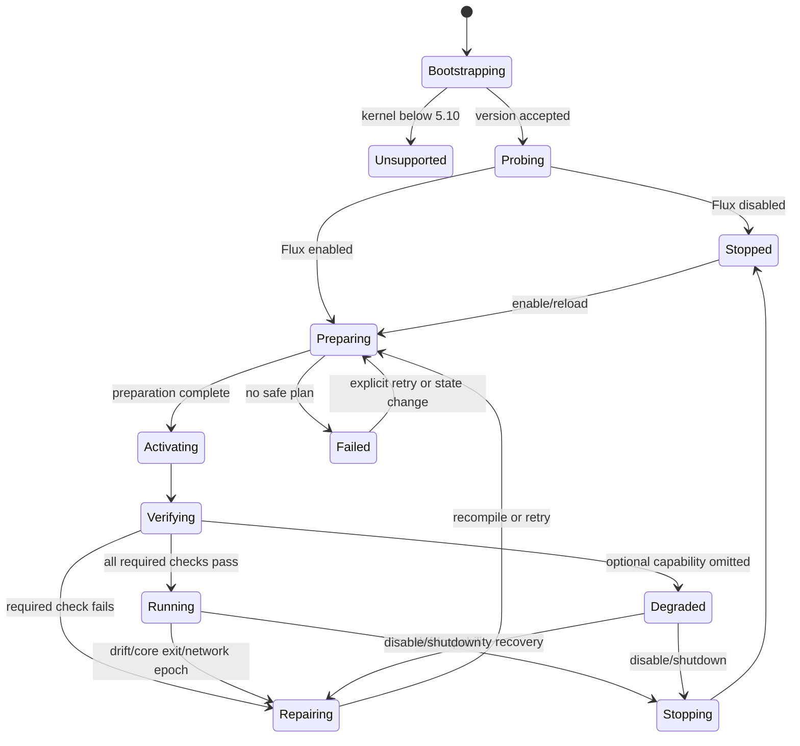

# Fluxd Rewrite Blueprint

- Status: accepted, evolving architecture
- Last updated: 2026-07-14
- Minimum supported kernel: Linux 5.10

## Executive decision

Flux should become a generation-based desired-state reconciler implemented in one Rust binary, `fluxd`. The binary absorbs `addrsyncd` and all runtime-critical shell behavior. Sing-Box remains an external, supervised Proxy Engine so it can be upgraded and validated independently from Flux.

The primary Capture Path is selected at runtime:

1. native nftables TPROXY when the complete required expression set can be actively verified;
2. xtables TPROXY, using ipset for large address sets when available and the current bounded jump structure otherwise;
3. a Flux-managed Sing-Box TUN path when explicitly requested or when transparent netfilter capture is unavailable;
4. unsupported, with an explainable capability report, when none of the safe paths can satisfy the requested Traffic Scope.

eBPF is a first-class optional plane with two stages: observability first, then verified acceleration. It does not replace nftables/xtables/TUN as the correctness path in the initial rewrite.

Migration is component-by-component rather than a big-bang shell deletion. During bridge releases,
the serialized shell networking path is frozen as the executable compatibility oracle and remains
the sole writer. Rust may compile and compare observation-only shadow artifacts before it owns a
backend, but an ownership transition occurs only after renderer, parity, readback, recovery,
rollback, and real-device gates pass for that component. See [ADR-0010](../adr/0010-freeze-shell-networking-as-a-shadow-compiler-oracle.md).

## Research basis

- [Current system baseline](../research/current-system-baseline.md)
- [Android network and kernel research](../research/android-network-kernel.md)
- [Sing-Box and related project research](../research/sing-box-and-projects.md)
- [Rust, eBPF, and netfilter research](../research/rust-ebpf-netfilter.md)
- [Expanded eBPF and kernel-extension assessment](../research/ebpf-and-kernel-extensions-2026-07.md)

## Goals

- Replace the runtime shell control plane and `addrsyncd` process with one Rust daemon.
- Make every runtime change idempotent, explainable, recoverable, and attributable to one Generation.
- Support kernel 5.10 and newer with adaptive feature selection driven by both version metadata and active probes.
- Add native nftables, real ipset selection, a managed TUN path, and advanced optional eBPF behavior.
- Preserve transparent TCP and UDP proxying, dual stack, tethering, per-app policy, DNS handling, FakeIP behavior, and loop prevention.
- Respect Android VPN, lockdown, explicit-network, and default-network semantics by default.
- Preserve Magisk, KernelSU, and APatch packaging with minimal shell glue.
- Keep Sing-Box independently replaceable and validate its exact version and configuration before activation.
- Provide deterministic local tests plus real-kernel and Android conformance gates.

## Non-goals for the first production generation

- Reimplementing Sing-Box protocols or embedding its Go runtime into `fluxd`.
- Making XDP the transparent-proxy mechanism.
- Treating a kernel version, `/proc/config.gz`, a binary on `PATH`, or a loaded module as proof that a feature is usable.
- Shipping or automatically loading `.ko`, KPM, or other opaque kernel-module payloads as a compatibility backend.
- Taking ownership of Android netd or vendor-created rules and routes.
- Supporting kernels older than 5.10, even when individual required syscalls appear to work.
- Shipping an eBPF-only Capture Path before correctness parity and device coverage exist.

## System architecture

```mermaid
flowchart LR
    subgraph Inputs["State and event inputs"]
        Config["Versioned Flux config"]
        Control["Local control socket"]
        Module["Magisk disable state"]
        Netlink["Link/address/route/rule events"]
        Package["Android package/user changes"]
        Child["Sing-Box exit and health"]
        Timer["Health/subscription timers"]
    end

    Inputs --> Controller["Flux Controller module"]
    Controller --> Compiler["Generation Compiler module"]
    Controller --> Reconciler["Runtime Reconciler module"]
    Compiler --> Plan["Immutable Generation + Backend Plan"]
    Plan --> Reconciler

    Reconciler --> Engine["Proxy Engine adapter"]
    Reconciler --> Kernel["Kernel Plane adapter"]
    Reconciler --> Store["Generation Store adapter"]
    Reconciler --> Telemetry["Telemetry adapter"]

    Engine --> SingBox["sing-box"]

    subgraph KernelPaths["Kernel Plane implementation"]
        NFT["nftables TPROXY"]
        XT["xtables + ipset/jump sets"]
        TUN["managed TUN routing"]
        BPF["eBPF observe/accelerate"]
        RTNL["rtnetlink topology + policy routing"]
    end

    Kernel --> KernelPaths
```



## Deep modules and seams

The crate graph should stay small. Most variation belongs behind internal seams, not in one crate per mechanism.

### 1. Flux Controller module

External Interface, selected after the [three-way comparison](interface-comparison.md):

```rust
#[derive(Clone)]
pub struct FluxController {
    inner: Arc<ControllerInner>,
}

impl FluxController {
    pub async fn submit(
        &self,
        command: ControllerCommand,
    ) -> Result<OperationHandle, ControlError>;

    pub fn snapshot(&self) -> Arc<SystemSnapshot>;

    pub fn watch(&self, after: StatusRevision) -> StatusStream;
}

pub enum ControllerCommand {
    Converge { target: DesiredTarget, reason: ReconcileReason },
    ReloadSources,
    Shutdown,
}
```

Boot recovery is part of daemon startup, not a caller-selected command. `submit` durably accepts and orders an intention; dropping its handle does not abandon an accepted transaction. `snapshot` is an O(1), syscall-free coherent projection with observation age. `watch` publishes bounded revisions and explicit gaps.

The implementation hides:

- config loading and migration;
- event coalescing;
- Desired State and Observed State ownership;
- capability refresh and backend selection;
- generation compilation;
- transaction scheduling;
- recovery and health policy;
- authorization and request deduplication.

This is the main external Seam used by the daemon and lifecycle tests. The control-socket/CLI client is an Adapter that exposes convenient `enable`, `disable`, `reload`, and `status` verbs without becoming another implementation of lifecycle policy. Expert plan explanation and maintenance operations use separate Modules.

### 2. Generation Compiler module

Interface:

```rust
pub fn enumerate_generation_candidates(
    desired: &DesiredState,
    capabilities: &CapabilityProfile,
    engine: &EngineCapabilityProfile,
    inventory: &NetworkInventory,
) -> Result<BoundedCandidateSet, CompileError>;

pub fn compile_generation(
    candidates: BoundedCandidateSet,
    evidence: PlanningEvidenceSet,
    selection: CandidateSelection,
) -> Result<GenerationArtifact, CompileError>;
```

Candidate enumeration may produce only bounded, non-authorizing syntactic/topology candidates. `PlanningEvidenceSet` is then passed by value and owns a bounded candidate-keyed set of freshness-bound authorities. In particular, an Android mark-dependent plan must carry the exact non-`Clone` `AndroidMarkPlanningAuthority`; the compiler does not manufacture it from negative scans or generic AOSP facts. Explicit selection evaluates only the named candidate and fails on missing/stale evidence. `auto` boundedly visits ranked candidates, retains evidence failures as rejection reasons, and selects the first candidate whose exact evidence remains fresh. Consuming the selected authority leaves a non-authorizing receipt in the artifact, binding the reviewed catalog entry/digest, candidate/topology, inventory epoch/snapshot, complete census observation identity/digest and collector revision, ownership-journal identity/revision, Capability Profile, boot, and namespace. Activation rechecks the receipt and still requires separate writer, observer, canary, topology, ownership, and mutation proofs.

The implementation is pure computation. It hides normalization, policy ordering, bounded mark/routing candidate enumeration and scoring, authorized candidate finalization, UID expansion, CIDR canonicalization, Sing-Box overlay generation, resource budgeting, and safety validation. It does not collect census evidence, assert device cooperation, allocate by complement, or turn planning evidence into an activation lease.

The compiler must return the same byte-for-byte candidate set for identical normalized discovery inputs and the same byte-for-byte `GenerationArtifact` for identical candidates/evidence/selection. It must not read files, invoke commands, or mutate the kernel. The Controller assigns a monotonic `GenerationId` and the Generation Store adds timestamps only after compilation; neither is part of the artifact digest.

The current Phase 2 tracer bullet stops below both interfaces above. A pure shadow compiler accepts
already typed and resolved compatibility inputs and emits deterministic, backend-neutral,
separately ordered local-OUTPUT and forwarded-ingress programs. It keeps a canonical mandatory
safety baseline distinct from configurable bypasses, retains optional inventory-host
snapshot/epoch provenance without claiming final freshness, enforces fixed resource budgets, and
reports a semantic version/digest plus explicit compatibility assumptions and deferred prerequisites. Its
product is for review and frozen-oracle fixture comparison only; it is not exposed as a public
packet-decision service.

The shadow artifact is not a `GenerationArtifact` or `CompiledGeneration`. It has no Generation ID,
Planning Authority or receipt, writer/ownership token, backend renderer, kernel object names,
prepared/active conversion, Runtime Reconciler entry point, or functional-canary authority. The
bridge shell remains the sole executed networking writer, and no shadow output is accepted by the
Phase 1 `RuntimeCoordinator`.

### 3. Runtime Reconciler module

Interface:

```rust
pub async fn converge(
    &mut self,
    generation: CompiledGeneration,
) -> Result<ConvergenceReport, ConvergenceError>;
```

The implementation hides the prepare/activate/verify/retire protocol, failure compensation, child supervision, recovery journal, and serialization of all kernel writes.

Only one reconciliation may commit at a time. New events may supersede pending work, but they cannot interleave kernel mutations from two Generations.

The delivered Phase 1 Adapter is `RuntimeCoordinator`, placed behind the existing `LegacyDispatcher` seam and executed by the bounded, serialized `LegacyControlBridge` worker. It composes a shell networking writer with the Rust `EngineSupervisor`, hiding start, stop, reload, rollback, abnormal-exit repair, and state-publication retry from control callers. Shell remains the networking writer in this phase; Rust owns Sing-Box and lifecycle ordering. Failed stop/failure compensation is represented explicitly as `DetachPending`: engine ownership, generation evidence, and terminal intent are retained, replacement is blocked, and neither engine retirement nor terminal publication may proceed until maintenance proves capture removal. Uncertain detach of a still-desired generation uses `CaptureRepairPending` instead and repairs that generation rather than treating it as terminal.

### 4. Kernel Plane module

Internal interface:

```rust
trait KernelPlane {
    async fn observe(&mut self) -> Result<KernelSnapshot>;
    async fn prepare(&mut self, generation: &CompiledGeneration)
        -> Result<PreparedKernelGeneration>;
    async fn activate(&mut self, prepared: PreparedKernelGeneration)
        -> Result<ActiveKernelGeneration>;
    async fn retire(&mut self, generation: &GenerationRecord) -> Result<RetireReport>;
}
```

The prepared and active values are opaque ownership tokens. Their Rust types enforce ordering: an unprepared generation cannot be activated, and a committed generation cannot be silently dropped without being recorded.

Production uses Linux/Android adapters. Tests use a deterministic in-memory kernel adapter with failure injection. This is a real seam because at least two adapters exist.

The first Phase 3 slice is deliberately observation-only. A `NetworkInventorySource` publishes immutable, canonical snapshots with a monotonic `NetworkEpoch`; raw rtnetlink messages, dump sequencing, batching, debounce, and loss recovery remain private implementation details. The production Adapter subscribes before its initial dump and shares the daemon's existing reactor. `MSG_TRUNC`, `ENOBUFS`, `NLMSG_OVERRUN`, interrupted or incomplete dumps, parse ambiguity, and sequence inconsistency discard partial state and require a full resync before another snapshot can be published. Native route/rule mutation is not admitted by this slice.

### 5. Proxy Engine module

Interface:

```rust
trait ProxyEngine {
    async fn validate(&self, spec: &EngineSpec) -> Result<ValidatedEngineSpec>;
    async fn stage(&mut self, spec: ValidatedEngineSpec) -> Result<StagedEngine>;
    async fn activate(&mut self, staged: StagedEngine) -> Result<ActiveEngine>;
    async fn stop(&mut self, expected: Option<EngineIdentity>) -> Result<()>;
}
```

The Sing-Box adapter owns version detection, configuration checking, process handles, pidfd use when permitted, readiness, bounded restart, log capture, and staged restart behavior.

### 6. Capability Registry module

Interface:

```rust
pub async fn probe_device(policy: &ProbePolicy) -> Result<CapabilityProfile>;
```

It returns structured evidence rather than booleans. Every capability has a status, source, relevant kernel range, probe result, errno or verifier detail, and last verification time.

### 7. Subscription module

Interface:

```rust
pub async fn refresh_subscription(
    source: &SubscriptionSource,
    previous: Option<&SubscriptionSnapshot>,
) -> Result<SubscriptionSnapshot>;
```

It owns bounded download, decoding, parsing, normalization, filtering, naming, template merge, validation, and atomic snapshot publication. Fetch transport is an internal seam so an external `curl` adapter can be retained during migration and replaced by a Rust TLS adapter later.

## Runtime state model



In the final architecture, `Running` means Observed State matches all required parts of Desired State. The Phase 1 projection uses `Running` as the operational engine/capture phase and reports verification orthogonally, so callers must require the appropriate verification state when functional authorization matters. `Degraded` is valid only when the compiler marked the missing behavior optional and the report names the omitted capability.

During Phase 1, status exposes two deliberately separate immutable views. `ControlSnapshot` reports desired/control progress (administrative state, in-flight intent, dirty configuration, and last completion). The independently revisioned `RuntimeSnapshot` reports observed runtime phase, capture state, engine state, orthogonal verification state, generation, and a bounded last error. Protocol version 3 requires verification as `structural_only`, `functional_pending`, `functional_passed`, or `functional_failed`; a verification-only transition advances the runtime revision. `RUNNING` remains an operational phase and does not by itself claim functional or Android qualification. A successful control response therefore does not substitute for runtime observation.

## Generation transaction protocol

Each reconciliation compiles an immutable Generation with a unique ID and content digest.

The Phase 1 bridge implements the first concrete generation fence before the full compiler lands. `prepare` allocates the ID inside the locked shell writer and snapshots immutable artifacts under `run/generations/<id>/`. The manifest carries that ID into Rust; capture start, capture verification, active/previous records, `RUNNING` publication, and rollback must all match it. This prevents a live-cache rewrite from changing the generation that was admitted by the supervisor.

### Prepare

1. Normalize and validate Desired State.
2. Refresh the Network Inventory if its epoch changed.
3. Select and explain a Backend Plan.
4. Render a generation-specific Sing-Box configuration and run `sing-box check`.
5. Create backend resources without attaching traffic to them:
   - nftables tables/chains/sets in one uncommitted message batch or under generation-specific names;
   - generation-specific ipsets populated before their generation chain is referenced;
   - xtables generation chains not yet referenced by stable entry chains;
   - eBPF maps/programs loaded but not attached;
   - policy routes whose marks cannot yet be produced;
   - TUN engine configuration with Flux-owned routing still inactive.
6. Persist a `prepared` journal record and fsync it.

### Activate

1. Stage or start Sing-Box and wait for generation-specific readiness.
2. Install policy-routing prerequisites.
3. Atomically attach the Capture Path:
   - commit one nftables batch;
   - atomically point stable xtables dispatch chains at generation chains that already reference generation-specific ipsets;
   - attach or update eBPF links in dormant/pass-through state and publish acceleration separately;
   - activate TUN routing rules after the interface is ready.
4. Persist the `activating` generation record using fsync plus rename.

### Verify

Verification is backend-specific but must include:

- Sing-Box process identity and readiness;
- expected kernel objects and ownership metadata;
- exact policy rules/routes and mark masks;
- no collision with Android-owned priorities or marks;
- IPv4 and enabled IPv6 path checks;
- loop-prevention checks for the Proxy Engine;
- backend health probes and optional counters;
- a bounded synthetic routing test where the device permits it.

Only after every mandatory verification succeeds does Flux publish the `active` record and `active.json` using fsync plus rename. Until that point the previous Generation remains authoritative in durable state.

### Retire

After the new Generation verifies, remove only Managed Objects belonging to the previous Generation. Keep the previous manifest until retirement completes, then retain it as the rollback candidate according to the configured history depth.

### Failure handling

- Failure before attachment deletes prepared resources and leaves the prior Generation active, except for a Sing-Box-owned TUN reload after the old TUN has entered its bounded stop/swap window; that path records an expected capture gap and attempts prior-generation restart rollback.
- Failure during attachment triggers backend-specific compensation and re-observation.
- If exact rollback cannot be proven, the default policy is fail-open: detach Flux capture first, retain diagnostics, and report `Failed`.
- Fail-closed is an explicit user policy and must never be silently selected.
- Functional-canary "fail-closed" evidence admission is orthogonal to that connectivity policy: weak or unavailable evidence cannot authorize the gate, but it does not silently select fail-closed traffic handling.
- On daemon restart, the journal is replayed against Observed State; it is never assumed that the last recorded phase completed.

In the Phase 1 implementation, failure to detach capture is not treated as fail-open success. Stop or activation-failure cleanup remains in `DetachPending`, retaining the child and Generation marker while blocking start/reload until detach is proven before engine retirement or `STOPPED`/`FAILED` publication. Failed or uncertain reload detach keeps the old engine in `CaptureRepairPending`; the candidate is not launched, and maintenance proves detach before republishing and freshly verifying old-Generation capture. A failed `RUNNING` publication is retried only after fresh engine observation, capture reassertion, structural verification, and the complete configured functional gate. Engine identity loss, repair/restoration, or address resynchronization invalidates a required-mode pass and schedules the same fresh gate. Verification uncertainty enters the capture-repair path; an observed exit takes repair precedence over publication.

## Kernel version and capability adaptation

### Hard floor

`fluxd` parses the numeric prefix of `uname(2)` output and rejects versions older than 5.10 before any persistent mutation. Vendor suffixes do not affect ordering. The daemon remains alive in a settled read-only `UnsupportedKernel` state so status and diagnostics work; one-shot mutating commands return a stable unsupported exit code. The boot watchdog does not restart this settled condition.

The installer also warns or aborts on an older running kernel, but runtime enforcement remains authoritative.

### Evidence model

Every capability is one of:

- `Supported`: an active probe succeeded;
- `Unsupported`: the facility or required operation is absent;
- `Denied`: it exists but current capabilities or SELinux policy reject it;
- `Conflicting`: the facility exists, but an Android/foreign owner or semantic collision makes it unsafe to claim;
- `Broken`: the probe exposed behavior that is present but unusable;
- `Unknown`: no safe probe was possible.

Transient timeout, busy, interrupted, or environmental failures are attempt-level evidence. They retain errno/extack/verifier context and a bounded retry/backoff decision, but they do not create a durable `Transient` capability class.

Evidence sources are retained separately:

- kernel version introduction/removal metadata;
- kernel config/module/procfs hints;
- filesystem/device presence;
- active create/load/attach/ack probe;
- runtime failure and demotion history.

Capability evidence is revisioned per boot. Every compiled Generation records the exact device-capability and Sing-Box Engine Capability Profile revisions used by its planner; a boot change, runtime demotion, or engine binary/profile change forces revalidation or recompilation before activation.

A hint can skip an impossible probe, but only a successful active probe selects an advanced backend in `auto` mode.

### Probe lifecycle

The profile is initialized once per boot and cached using:

- kernel release;
- boot ID;
- Flux binary version;
- SELinux enforcing state;
- relevant tool hashes and BTF identity;
- Android product/build/vendor and security-patch identity;
- kernel build identity and verified-boot state;
- SELinux policy identity;
- netd/Connectivity artifact identities;
- network namespace identity.

Probes use uniquely named temporary resources and mandatory cleanup. A permission error is not treated as feature absence. A selected feature that later returns a structural unsupported error is demoted for the current boot and causes plan recompilation.

The profile is revisioned again whenever tool or BTF identity changes, SELinux/policy evidence changes, an exact Engine Capability Profile changes, a structural runtime failure demotes a capability, or an administrator requests a refresh. “Once per boot” is therefore the initial probe epoch, not a ban on runtime invalidation.

### Selection policy

| Requested behavior | Preferred plan | Fallbacks |
|---|---|---|
| `capture = auto` | nftables TPROXY | xtables TPROXY, then managed TUN |
| `capture = tproxy` | nftables TPROXY | xtables TPROXY; fail if neither works |
| `capture = tun` | managed Sing-Box TUN | fail with missing-capability report |
| large bypass sets on nftables | interval sets | compile error if resource budget exceeded |
| large bypass sets on xtables | generation-specific ipset populated through verified restore/swap, then stable-jump cutover | bounded jump structure |
| `ebpf = auto` | production-qualified positive acceleration with parity and benchmark evidence | observation, then off |
| `ebpf = observe` | `xt_bpf` observation where xtables is selected, then TUN TC or proven proxy-child telemetry | off with Degraded State |
| `ebpf = accelerate` | verified acceleration plus a complete conventional correctness path | fail planning with capability evidence; do not disturb the active path |

An explicit backend request does not silently fall back to a different backend. `auto` is the only capture mode that changes mechanisms automatically. Explicit eBPF `accelerate` is strict; `observe` is intentionally best-effort because its absence does not change capture correctness.

Backend selection is compiled per bounded Traffic Domain, not as one global capture/routing tuple. Residual local OUTPUT, exact tether ingress, and a managed TUN may choose different mechanisms only when the compiler proves the requested scope is exhaustive, selector-disjoint, non-overlapping, and compatible in engine/listener, mark, route, address-set, activation, and cleanup ownership. A heterogeneous plan is never inferred merely because its individual facilities probe successfully.

## Capture Path designs

### Native nftables TPROXY

This is the preferred path because it provides native sets, typed expressions, counters, and atomic batch updates without depending on an `nft` executable.

Design requirements:

- target a narrow native nfnetlink implementation in Rust;
- use a fingerprinted `nft` JSON/stdin Adapter as the first tracer bullet and differential oracle because audited Rust crates do not yet cover the complete TPROXY expression set without native-library gaps;
- own a dedicated Flux table and never edit Android-owned tables;
- use family-aware address sets with interval semantics;
- use stable entry chains and generation-specific rules or atomically replace the entire owned table;
- preserve reserved mark bits and cache decisions in conntrack marks where safe;
- distinguish local OUTPUT classification from forwarded/tethered PREROUTING classification, and
  never promote ingress listener/counter evidence into local-OUTPUT evidence;
- apply mandatory loop/control/device-local safety exclusions before capture, then apply separately configured private, CGNAT, special-use, and other direct policy;
- support counters and drift observation without making counters part of correctness;
- use an output route hook or equivalent mark path that causes policy rerouting correctly;
- verify nftables TPROXY, socket, UID, set, counter, and batch behavior individually.

The compiler emits backend-neutral Capture Policy first, then an nftables program. It never constructs rule text by concatenating user input.

### xtables compatibility path

This path preserves broad Android compatibility.

Until Phase 4 transfers ownership, the existing shell implementation remains the frozen executed
oracle for this path. The Phase 2 shadow compiler may characterize its ordered semantics, but it
does not render or invoke restore commands and does not claim byte or device parity. The Rust
renderer is admitted later as a separate checkpoint; the shell writer is disabled before its first
native mutation so both implementations are never active writers.

Design requirements:

- invoke `iptables-restore` and `ip6tables-restore` with argument arrays and generated stdin, never through a shell;
- retain stable dispatch chains and generation-specific implementation chains;
- label rules with comments when the device supports the match, while keeping exact names and the journal authoritative;
- use generation-specific `ipset` `hash:net` sets; an optional verified swap may populate an unreferenced target, but only the stable xtables jump switches the active Generation;
- retain the current bounded jump structure only when ipset is unavailable;
- snapshot and verify restore output, then re-read the owned chains;
- serialize access around the xtables lock and expose lock timeout distinctly from syntax or feature errors.

### Managed TUN path

Sing-Box remains responsible for packet-stack processing. The shipping plan is `EngineOwnedTun`: Sing-Box owns the TUN queue FDs and packet I/O, while Flux owns capture policy and route lifecycle. A future `FluxOwnedTunFd` plan is eligible only when the exact Sing-Box version exposes a documented, tested FD-handoff contract.

Design requirements:

- require a Sing-Box Engine Capability Profile that proves automatic route management can be disabled; otherwise the Flux-owned-route TUN plan is unavailable rather than creating two route owners;
- select and report the Sing-Box TUN stack (`system`, `mixed`, or `gvisor`); explicit choices fail when unsupported, while `auto` follows a tested system → mixed → gVisor compatibility order;
- wait for the exact interface identity and validate its owner, MTU, addresses, and flags;
- install Flux-owned policy rules and routes only after Sing-Box is ready;
- exclude Sing-Box outbound sockets through a reserved mark and/or dedicated runtime UID;
- support per-app and per-user policy by marking before route selection or by verified UID-range rules;
- handle IPv4, IPv6, NAT64/CLAT, hotspot traffic, and default-network changes explicitly;
- in `EngineOwnedTun`, enable Sing-Box multiqueue, GSO, and checksum behavior only through version-qualified Engine Capability Profile settings plus end-to-end validation; Flux does not touch the queue FDs;
- reserve direct queue-count/offload ioctl control, `io_uring` queue workers, and `TUNSETSTEERINGEBPF` for the future `FluxOwnedTunFd` plan when both ends verify the handoff contract; keep `TUNSETFILTEREBPF` deferred;
- report traffic scopes that cannot be captured without netfilter as Degraded or unsupported rather than pretending parity.

Flux may add a direct `/dev/net/tun` adapter for probes and future FD handoff, but it should not build a second userspace IP stack in the first rewrite.

`EngineOwnedTun` reload is explicitly not a dual-generation transaction. After all non-binding preflight succeeds, Flux detaches old TUN capture/routes into a bounded fail-open gap, stops the old child/interface, starts and verifies the candidate, then reattaches capture. Candidate failure restarts the recorded prior config and routes; the status and journal record outage and rollback results.

## Advanced eBPF plan

### Stage A: observation

Ship eBPF as an optional diagnostic plane before it affects packet decisions.

Candidate programs:

- `xt_bpf` observation inside Flux-owned xtables chains first: update bounded counters and always return false so the complete classic classifier remains authoritative;
- tracepoint-based lifecycle signals only when BTF/tracepoint compatibility is verified.

For the follow-on TC roles introduced only after proxy-positive `xt_bpf` parity, AOSP netd removes `clsact` qdiscs from every extant interface during NetworkController startup. A legacy TUN TC attachment is therefore bound to link identity and Network Epoch and must be reverified after netd lifecycle changes. A verified 6.6+ TCX link is qdisc-less and is not removed by `clsact` cleanup, but still requires link-identity and foreign-program ordering revalidation. Physical/tether-interface TC remains experimental because Android tethering offload can share those resources.

Maps:

- per-CPU counters for packets, bytes, drops, and decision reasons;
- LRU flow map keyed by normalized tuple plus interface/network identity;
- probed ring buffer for sampled state changes and exceptional events, with perf-event-array fallback and counters-only degradation when neither transport is usable;
- generation/config array map shared by programs.

The daemon rate-limits and samples user-space events. Normal packet accounting stays in maps and is read in batches.

Functional-canary schema v2 reserves an exact `QualifiedCgroupBpf` delivery authority, but no
current cgroup program or attachment is qualified for that role. It remains optional and must
separately prove ancestor-chain compatibility, hook semantics, complete per-flow events, payload
visibility, loss accounting, and cleanup before it can construct authoritative evidence. Sampled
ring/perf telemetry and ordinary counters remain non-authoritative.

### Stage B: acceleration

Acceleration is allowed only when an equivalent non-eBPF path remains the correctness fallback.

Candidate behavior:

- use `xt_bpf` first for proxy-positive matches only; every miss, parse ambiguity, `overflowuid`, stale Generation, or map failure continues through the full classic classifier;
- after positive `xt_bpf` parity, add TC observation on a verified Generation-scoped TUN and optional proxy-child `sockops` telemetry proven available across the full cgroup ancestor chain; these roles remain observation-only even though they arrive in the second sequence stage;
- cache socket or flow decisions produced by Capture Policy;
- stamp only Flux-reserved mark bits on verified TC paths for independently proven Traffic Domains;
- short-circuit repeated UID/interface/prefix classification in nftables or xtables;
- own individual attachments with `bpf_link` where supported, use the shared control-map flip for BPF policy-slot publication, and retain an explicitly tested legacy attach adapter otherwise;
- preserve a generation ID in configuration maps so stale programs fail safe.

This sequence is implementation priority, not runtime coupling. Once the TUN TC or proxy-child
telemetry role exists, its Backend Plan eligibility depends only on its own domain, attachment,
probe, and conventional fallback evidence; an nftables/TUN plan does not need `xt_bpf` or xtables.

In the future `FluxOwnedTunFd` plan, add feature-gated `TUNSETSTEERINGEBPF` for flow-stable multiqueue selection. Defer `TUNSETFILTEREBPF`: a program returning zero drops traffic, and the kernel cannot distinguish a logic bug from an intended decision, so it has no automatic fail-open guarantee.

For out-of-chain TC/cgroup programs on the 5.10 baseline, the general BPF-to-netfilter bridge is reserved-mark stamping followed by ordinary nftables/xtables mark matching. `xt_bpf` is a separate direct Boolean match inside a referencing xtables rule. TC ingress may accelerate PREROUTING/tethered classification; TC egress occurs after local OUTPUT and cannot accelerate that path. nftables and xtables are never assumed to read Aya maps directly.

Linux 5.10 TC ingress socket assignment (`bpf_sk_assign`) is a separate exact-domain experiment. It still requires a correct local route, a same-netns compatible transparent listener, and miss behavior that cannot blackhole ordinary forwarding. Making it correctness-bearing would require a separate ADR; it is not part of the automatic acceleration ladder.

For hot updates, old and new program sets share a small control map. New links attach in dormant/pass-through mode with an immutable expected Generation; after every required link and per-generation policy map is ready, one control-map update selects the new BPF active-policy slot. Old programs then observe a mismatch and pass through before they are detached. This selector is internal to the optional eBPF plane and never updates the authoritative `active.json`; global Generation publication still follows mandatory engine/kernel verification. If shared-map or concurrent attachment semantics cannot be proven, acceleration is detached and reattached non-atomically while the conventional correctness path stays active.

### Portability strategy

- Prefer Aya for a Rust-native loader and `no_std` Rust eBPF programs unless implementation spikes prove a blocking Android verifier or relocation issue.
- Keep baseline programs on stable UAPI contexts such as `__sk_buff`; require CO-RE/BTF only for programs that genuinely need kernel types.
- Build CO-RE and non-CO-RE variants when useful.
- Capture verifier logs and exact load/attach errno in the capability report.
- Pin maps only when bpffs and SELinux access are verified; otherwise retain file descriptors and reconstruct on restart.
- Treat netfilter BPF as a kernel-6.4+ experimental feature and TCX link attachment as a kernel-6.6+ optimization, each still requiring a real load/attach probe.

### Explicit exclusions

- XDP is not the main Capture Path because it does not cover Android local OUTPUT semantics and lacks the socket, UID, route, and conntrack context required for equivalent policy.
- Physical-NIC TC/XDP is never enabled automatically in the first production release.
- Android's root cgroup hooks are never claimed or replaced. A Flux-owned child cgroup does not imply that the same attach types are available: an attachment at any ancestor can constrain descendants. Flux inventories the full ancestor chain and child, unless it has separately proved the child is directly under root. Only an exact unoccupied or explicitly compatible hook may be used, initially for optional proxy-child telemetry; arbitrary Android-app coverage remains experimental.
- eBPF must not silently alter Android-owned mark bits.
- A failed or detached eBPF accelerator must leave the nftables/xtables/TUN path correct.

## Android integration

### Network Inventory

The inventory merges:

- rtnetlink link, address, route, rule, and neighbor facts needed by Flux;
- interface roles inferred from Android and user configuration;
- default network and stacked-interface relationships;
- CLAT/NAT64 and VPN/TUN presence;
- Android user and package-to-UID mappings;
- network namespace identity;
- Flux and Android mark/rule ownership observations.

Material changes increment the Network Epoch and trigger a debounced reconciliation. Event loss or netlink overrun triggers a full dump before any new commit.

### Address-derived safety rules

The current `addrsyncd` behavior becomes an in-process policy that protects all active local interface addresses from proxy-loop policy routing. It uses the same rtnetlink socket ownership, batching, acknowledgement tracking, filtering, cleanup, and resync logic as the rest of the Kernel Plane.

The rewritten rule compiler treats these as the mandatory safety portion of generated Bypass Policy, not as an independent daemon concern. Configurable private, CGNAT, special-use, and user-direct prefixes are a separate policy layer and must not be conflated with loop/device-local safety.

### UID and Android users

- Build a typed package inventory rather than generating rules directly from a text file.
- Parse Android's authoritative package database in both text XML and ABX forms, including shared UIDs, isolated ranges, and SDK-sandbox mappings where present.
- Observe package database changes and user lifecycle changes.
- Treat UID reuse as an inventory invalidation.
- Represent user scope explicitly; do not assume user IDs are limited to `0..99`.
- Keep package names out of kernel objects; compile them to numeric UID sets for one Generation.

### netd coexistence

- Never flush global rule, route, nftables, or xtables state.
- Treat automatic and explicit mark/routing values as candidates subject to identical safety gates; explicit configuration is not an override.
- Do not reuse the current low-byte mask as a new-install default: AOSP netd uses bits 0–15 for `netId`, so Flux must preserve those and every other Android-owned bit.
- Generic AOSP grants no mark field. Bits 21–30 are only a device-qualified candidate envelope, never an inferred reservation.
- Accept a cooperative policy assertion only when it binds the exact candidate/topology, full Capability Profile and verified boot, network namespace, named policy plus nonzero SHA-256 artifact digest/revision, and its exact nonempty mark-plane set. Planning authority additionally requires that set to cover packet, socket, and conntrack marks.
- Select production policy assertions only from a compile-time reviewed catalog keyed by stable Android product/build/vendor, kernel-build, SELinux-policy, netd/Connectivity, and tool artifact identities. Then freshness-bind the selected assertion to the full Capability Profile, verified boot, boot ID, and observed network namespace. Runtime-only boot/namespace identities are not catalog keys, and a runtime manifest does not become trusted by hashing its own bytes.
- Require a fresh, consumed 27-cell census over Android `netId`, RPDB, device policy, xtables, nftables, TC/BPF, XFRM, connmark/socket transfers, and existing Flux ownership. Any external overlap or opaque RPDB evidence rejects.
- Default `respect_android_vpn` to true and place Flux rules only after evaluating netd's secure-VPN, per-UID, explicit-network, tethering, default-network, and unreachable policy lattice.
- Never implement loop prevention as a global root-UID bypass; identify only the Proxy Engine's owned sockets/process identity.
- Re-observe after netd or default-network changes; mark reauthorization consumes the prior authority and requires a newly collected census.
- Detect collisions and refuse activation rather than overwriting an unknown owner.
- Record enough evidence in diagnostics to explain the conflicting object.

## Sing-Box integration

- Keep the binary external and record its version, source, hash, and supported feature profile in the release manifest.
- Build an Engine Capability Profile before Generation compilation so version-sensitive TUN stacks, route-automation controls, reload behavior, marks, DNS fields, and listener handoff are planner inputs rather than late surprises.
- Generate a per-Generation runtime configuration; never mutate the user's source template in place.
- Validate with the exact packaged binary before changing capture.
- Start the new engine path before attaching traffic.
- Do not use the Clash `/configs` endpoints as reload: in the inspected Sing-Box source they do not perform a full configuration reload.
- Do not relay arbitrary Clash API traffic through `fluxd` in the first release. If the API is enabled, bind it to loopback with a generated credential; expose only typed, authorized status or selector operations through the Flux control plane.
- For TPROXY, prefer a second candidate Sing-Box process/port, switch one stable capture reference after readiness, then drain the old child.
- For TUN, use bounded stop/swap/rollback until an engine contract can accept a Flux-owned TUN FD.
- Treat `auto_route`, `auto_detect_interface`, default marks, DNS hijack, and TUN fields as negotiated capabilities, not timeless config keys.
- Capture stdout/stderr with rotation and correlation to the Generation.
- Use a dedicated UID/GID when device policy permits, while retaining a root compatibility mode.
- On unexpected exit, immediately begin fail-open repair unless the user explicitly selected fail-closed behavior.

The delivered Phase 1 Supervisor separates and composes two proofs. Descriptor-pinned validation of the exact binary, configuration, and optional launcher plus child-owned listener/TUN evidence is the pre-capture admission proof. The runtime handoff then publishes capture and checks shell-owned structural evidence before invoking its explicit functional-canary gate. Required-mode coordinator paths run fresh pre/post engine reconciliation, exact environment binding, attempt execution, evidence validation, and cleanup checks before every initial, retry, restart-restoration, or rollback `RUNNING` publication. Capture-start records generation ownership before mutation and retains it when compensation cannot prove cleanup. Candidate evidence never authorizes rollback publication. The production daemon deliberately selects structural-only compatibility because the Android adapter and exact-process loop-escape proof remain unqualified; the required executor currently exists for tests and later privileged harnesses. Any activation/verification failure must prove detach before retiring the candidate, and reload attempts the recorded previous `EngineSpec`.

The privileged Linux harness also separates evidence by traffic domain. Its first checkpoint
proves the contained dual-stack TCP/UDP/DNS topology. The delivered command
`cargo xtask test-functional-canary-linux-tproxy` selects the exact ignored test
`functional_canary::linux_namespace_harness::privileged_ingress_tproxy_checkpoint_exercises_real_capture_counters_and_cleanup`
and injects traffic from a third probe namespace through PREROUTING into a test-local transparent
relay. Its current dual-stack TCP/UDP echo plus DNS-over-UDP/TCP slice proves ingress TPROXY,
accepted-socket and strict ancillary-data original-destination recovery, marked relay egress,
source-preserving UDP replies, nonce-bound DNS transaction/question/answer evidence, per-family
route controls/counters, and cleanup. This ingress evidence cannot authorize residual
local OUTPUT: in the harness kernel, an OUTPUT mark plus local policy route did not re-enter
PREROUTING, and xtables TPROXY cannot attach to OUTPUT. OUTPUT counters and route lookups are
therefore negative-control evidence only. The strict Linux/Android `/proc` FD plus INET_DIAG
collector now binds protocol, exact tuple, UID, mark, FD/inode/cookie, complete dumps, supervised
process identity, and timing. Its prebound session API now exposes the real kernel netlink port ID
before collection, preserves one owned FD with monotonic sequences across snapshots, consumes and
retires the handle on every error, prevents deadline extension, and retains the temporary-session
compatibility wrapper. The typed canary handoff now opens that session under the attempt deadline,
derives the copied request authority plus a private per-opening identity from the live handle,
makes request construction use the session's exact deadline, checks both at the context-output and
execution boundaries, and moves the same non-cloneable resource into prepared local-OUTPUT
execution. A copied port ID or reopened replacement socket cannot reproduce that binding.
Functional-canary schema v2 now completes the listener/delivery `validate_for` contract: every
flow binds the exact Generation, engine, namespace, Capture Program, selector, listener
FD/inode/cookie and socket state, independent TCP-accept or UDP-`recvmsg` delivery, exact payload,
stable and globally noncolliding `(family, protocol)` listeners, accepted children distinct from
every listener, and constant authority/loss baseline. Readiness evidence is
only an admission input. The separate Linux credential preflight now proves exact nonzero
probe/engine UID+GID roles, empty groups, zero role capabilities, and exact map/namespace readback
without installing capture or sending traffic. Positive constructors remain private and test-only,
while a production-compiled TPROXY-only executor/driver/verifier/factory seam now separates
read-only availability, prepared execution, unverified capture proof, receipt-bound artifacts, and
private evidence promotion. The completed non-cloneable per-flow receipt contract binds the exact
request, probe UID, nonce, tuple, payload, listener cookie, authoritative delivery event, sequence/
loss state, and chronology. The gate evidence owns that receipt and revalidates it with the retained
flows and client cleanup lifetime. Its sealed production verifier authority remains uninhabited.
The current zero-state xtables driver reports `Unsupported` with cleanup `NotRequired` before
mutation because OUTPUT marking does not reach PREROUTING TPROXY; the prepared/raw type is
uninhabited, so no
positive evidence can be emitted. Required mode treats that result as a failed gate and never
reaches `RUNNING`. Attempt-owned UID/GID/PID/start-tick/handle binding, observer/report parsing and
factories, actual prebound collector use, a real traffic producer, capability-qualified execution,
and Android qualification remain separate gates. A separately qualified cgroup-BPF authority is
optional, and no production path loads or unloads a `.ko`.
REDIRECT/DNAT, ingress promotion, counters, route lookups, and veth-bounce substitutions cannot
qualify TPROXY. Host evidence still cannot authorize production `functional_passed`.

The Phase 1 manifest is a strict UTF-8 line document no larger than 16 KiB. It rejects unknown, duplicate, malformed, missing, and conditional-field violations; startup and stop timeouts are decimal milliseconds in `1..=60000`. A boot-scoped dispatcher mode lease prevents Rust-owned phase verbs—including address resynchronization—from being mixed with legacy `scripts/core` engine ownership.

Phase execution itself is bounded: each direct shell child receives a nonzero deadline capped at 60 seconds, runs in an isolated process group, and is forcibly cleaned up within a bounded interval on timeout. Sing-Box validation/run children and the phase shell arm `PR_SET_PDEATHSIG(SIGKILL)` plus a parent-race check. Direct launch can therefore recover automatically after daemon loss. The guarantee is direct-child containment only. Phase descendants do not inherit `PDEATHSIG`, and a BusyBox `setuidgid` credential transition may clear it; a same-boot BusyBox generation is quarantined rather than automatically restarted. Post-credential Rust launch and verified process-cgroup containment remain hardening work.

## Rust implementation strategy

### Workspace shape

```text
Cargo.toml
crates/
  fluxd/          # binary, CLI, control socket, boot/recovery entry points
  flux-core/      # domain types, compiler, controller, reconciler
  flux-platform/  # Android/Linux, netlink, netfilter, TUN, process adapters
  flux-testkit/   # deterministic adapters, fixtures, failure injection
ebpf/
  flux-ebpf-common/
  flux-ebpf-programs/
xtask/            # Android builds, eBPF builds, packaging, conformance helpers
```

This is intentionally a small crate graph. Backend-specific code is private inside `flux-platform` until independent reuse justifies another external seam.

### Rust features used deliberately

- Edition 2024 and a pinned stable toolchain.
- Newtypes for marks, masks, priorities, table IDs, UIDs, interface indexes, kernel versions, and Generation IDs.
- Typestate/ownership tokens for prepared and active Generations.
- Exhaustive enums for backend and capability state instead of stringly typed switches.
- A single-writer actor for kernel mutation, using bounded channels and cancellation-aware event coalescing.
- Async I/O for control, process supervision, timers, HTTP, and netlink readiness; batched syscalls remain available behind safe wrappers.
- Borrowed/zero-copy decoding for netlink messages where lifetimes can make buffer validity explicit.
- RAII guards for temporary probe objects and pre-commit resources.
- Structured error categories that preserve errno, extack, verifier output, command status, and recovery advice.
- Property-based tests for normalization, policy ordering, CIDR sets, mark-candidate authority, and idempotence.
- Compile-time target guards for Linux/Android and runtime capability gates for optional facilities.

### Concurrency rules

- One task owns Desired State.
- One task owns all kernel mutation adapters.
- Observers publish bounded, coalescible facts; they do not mutate state.
- No unbounded queues or per-packet user-space tasks.
- No lock is held across an external process wait or potentially blocking kernel acknowledgement.
- Reconciliation requests carry a monotonic sequence; superseded pre-commit work is cancelled.

The retained `addrsyncd`-style `epoll` reactor is the mandatory baseline for netlink, pidfd/signalfd, timerfd, control FDs, and BPF ring/perf buffers. It owns TUN queues only in a future `FluxOwnedTunFd` plan; the first `EngineOwnedTun` plan leaves packet I/O inside Sing-Box. An async runtime may own higher-level control and subscription work or wrap reactor FDs, but it does not replace batched drain-until-`EAGAIN` kernel I/O without benchmark evidence. `io_uring` is an optional `FluxOwnedTunFd` worker selected only after the FD-handoff contract, setup, opcode, cancellation, real packet-I/O, SELinux/seccomp, and performance probes.

Phase 1 currently uses that reactor only for control admission and `signalfd` shutdown. The serialized control worker invokes coordinator maintenance after each request and at a bounded idle interval; maintenance completes reap/backoff/restart, restores capture after readiness, and retries pending runtime-state publication. pidfd/timerfd child observation remains future reactor work.

### Unsafe Rust policy

- `unsafe` is restricted to reviewed syscall/UAPI modules.
- Each unsafe block documents pointer validity, alignment, lifetime, ownership, and kernel ABI assumptions.
- Enable `unsafe_op_in_unsafe_fn` linting and deny undocumented unsafe blocks in project code.
- Netlink and binary decoders are fuzzed independently.

## Configuration design

Use one versioned `flux.toml` as the user-facing Flux configuration and retain a separate Sing-Box template/source document.

Top-level model:

```toml
schema = 1

[daemon]
fail_policy = "open"
reconcile_debounce_ms = 250

[engine]
binary = "/data/adb/flux/bin/sing-box"
template = "/data/adb/flux/conf/sing-box.json"
startup_timeout_ms = 8000

[capture]
mode = "auto"       # auto | tproxy | tun
backend = "auto"    # auto | nftables | xtables
ipv6 = "auto"       # auto | on | off

[capture.marks]
allocation = "auto" # auto | explicit
# mask = "0x..."         # required only for explicit
# proxy_value = "0x..."  # required only for explicit
# bypass_value = "0x..." # required only for explicit

[capture.routing]
allocation = "auto"

[android]
respect_android_vpn = true

[capture.ebpf]
mode = "auto"       # auto | off | observe | accelerate

[capture.tun]
interface = "flux0"
mtu = 9000
offload = "auto"

[scope]
android_users = "owner"
app_mode = "all"
packages = []

[subscription]
enabled = false
url_file = "/data/adb/flux/conf/subscription.url"
update_interval_secs = 86400
```

The exact schema belongs in the technical specification. Unknown fields fail by default. Deprecated fields produce migration diagnostics with a removal version.

For marks, `auto` requests candidate selection and `explicit` supplies the commented numeric values as candidates. Neither mode bypasses positive mark authority, ownership, or activation checks; on generic AOSP a mark-dependent plan therefore has no grant merely because `allocation = "auto"` was selected.

Routing remains `auto`-only until the Phase 3 routing slice defines a per-domain realization schema. A single explicit priority cannot represent an atomic scope whose residual-local and tether anchors have different intervals, so legacy fixed routing values remain migration diagnostics rather than native candidates.

### Migration

`fluxd migrate` reads `settings.ini` and `addrsyncd.toml` without evaluating shell, produces a candidate `flux.toml`, reports lossy mappings, validates it, and writes it atomically only with explicit installer or CLI approval. Original files are retained as backups for at least one release series.

## DNS and asset ownership

Flux owns DNS capture, lifecycle, loop prevention, Private DNS compatibility policy, and the generation relationship between DNS and routing state. Sing-Box owns DNS rule evaluation, transports, cache, fake-IP allocation, and reverse mapping in the first rewrite.

Requirements:

- distinguish local-output, forwarded/hotspot, UDP, TCP, local-destination, and encrypted DNS behavior;
- make any global Private DNS change explicit, reversible, and disabled by default;
- treat domain-to-IP mapping as scoped, expiring evidence rather than permanent truth;
- version fake-IP/cache state and provide corruption fallback;
- content-address downloaded rule sets/assets and retain a known-good previous version;
- never let a failed asset refresh invalidate the active Generation.

## On-device layout

```text
/data/adb/flux/
  bin/
    fluxd
    sing-box
  conf/
    flux.toml
    sing-box.json
    subscription.url
    manifest.json
  state/
    active.json
    capabilities.json
    generations/
      <generation-id>/
        manifest.json
        sing-box.json
        backend-plan.json
  cache/
    subscriptions/
  run/
    fluxd.sock
    fluxd.log
    sing-box.log
    diagnostics/
  scripts/
    fluxctl
```

`run` contains disposable runtime artifacts. `state` contains crash-recovery records and must use durable atomic writes. Secret-bearing files use `0600`; the control socket uses peer credentials and a narrowly permitted group.

The Magisk package uses a module-local `service.sh`. It must not install a general `/data/adb/service.d` script.

## Control plane

Use a local Unix `SOCK_SEQPACKET` socket with a versioned, length-bounded JSON protocol. JSON is chosen for on-device diagnosability; bulk packet or telemetry data never uses this socket.

Online socket/client commands:

- `status [--json]`
- `start`, `stop`
- `reload`
- `fluxctl restart` as a legacy client alias for reload plus convergence
- `reconcile`
- `capabilities`
- `backend explain`
- `plan [--dry-run]`
- `subscription update`
- `diagnose [--bundle]`
- `repair`
- `migrate --check-only` (initial compatibility importer; mutating migration remains deferred)

Offline multicall commands, which are not routed over the live daemon socket:

- `recover --offline`
- `cleanup --offline`

The same binary implements `fluxd daemon`, explicit offline salvage/cleanup, and CLI client behavior. Normal boot recovery is owned by daemon startup, not by a second wrapper command. A small `fluxctl` wrapper or symlink preserves the existing command name.

All online work that can mutate kernel state—including active capability probes and repair—enters the same serialized mutation scheduler and Generation fence. Offline salvage/cleanup requires the daemon lease to be absent; separate maintenance Modules do not bypass the single-writer invariant.

## Reliability and security

- Default fail-open when the Proxy Engine or required capture state is unhealthy.
- Boot wrapper only launches or restarts `fluxd` with bounded backoff after crashes or fatal invariant exits. Daemon startup owns journal recovery before accepting mutations; the wrapper does not invoke a second recovery command and does not restart the daemon's settled `UnsupportedKernel` state.
- The delivered bridge runs `startup-recover` after capability admission but before strict mutation configuration loads, administrative intent is read/persisted/executed, or the socket is admitted. This prevents invalid current configuration from stranding same-boot capture. Below-floor or unverified profiles remain non-mutating/read-only and skip recovery. Same-boot direct-launch Rust ownership is cleaned from its exact active or prepared generation after `PDEATHSIG` containment; cleanup failure preserves evidence and the lease. A same-boot `busybox-setuidgid` generation is detached and published `FAILED` but retains Rust ownership and engine-generation evidence, blocking automatic daemon restart because child death cannot be proven. Same-boot legacy ownership is rejected without component mutation, and prior-boot evidence is retired.
- All kernel objects are namespaced or otherwise identifiable as Managed Objects.
- Use `pidfd_open`/`pidfd_send_signal` when actively verified; retain `/proc` identity checks only as fallback.
- Drop unnecessary supplementary groups and capabilities after privileged setup where Android policy permits.
- Add seccomp only after syscall inventory is stable; a bad filter must not become a boot-loop risk.
- Use `openat`-style directory-relative state access and reject symlink traversal in writable configuration/state paths.
- Bound subscription downloads, decoded size, node count, rule count, set size, log rate, event queues, verifier logs, and diagnostic bundle size.
- Redact credentials and subscription URLs from logs and reports.
- Sign or checksum packaged binaries and generate an SBOM/release manifest.

## Observability

Every state transition has:

- request ID;
- Generation ID;
- previous and target state;
- trigger reason;
- selected Backend Plan and rejected alternatives;
- operation timings;
- exact degraded capabilities;
- compensation or rollback result.

Expose a structured snapshot containing:

- daemon and Sing-Box health;
- kernel and Android identity;
- Capability Profile;
- Network Epoch and interface roles;
- active marks, priorities, routes, sets, chains, links, and TUN identity;
- drift summary;
- eBPF verifier/attach state and counters;
- last successful reconciliation and last failure.

The Phase 1 projection exposes `ControlSnapshot` and `RuntimeSnapshot` as separate protocol fields, including the required version-3 runtime verification state, and each prepared Generation has its own runtime log. Long-term bounded rotation/retention policy and retained redacted diagnostic bundles are not yet delivered; current supervisor diagnostics are bounded and raw tails are excluded from public snapshots.

## Additional proposed features

- `fluxd plan --dry-run` with backend selection reasons and estimated kernel object counts.
- Automatic drift repair when another process removes or alters Flux-owned objects.
- Optional fail-closed policy with an explicit safety acknowledgement.
- Per-network policy, such as different behavior on metered mobile, trusted Wi-Fi, hotspot, and VPN-underlay networks.
- Configurable network-handover hysteresis to avoid repeated rebuilds during cellular transitions.
- A self-contained diagnostic bundle with redaction and reproducibility metadata.
- Release-time device capability census to identify which fallback paths still matter.
- nftables and eBPF counters surfaced in the existing web UI through a read-only local endpoint.
- A safe mode that starts Sing-Box without capture for config and connectivity diagnosis.

## Architectural invariants

1. No kernel below 5.10 is supported.
2. Kernel version alone never proves an optional feature usable.
3. One task is the sole writer of Flux-owned kernel state.
4. A Generation is immutable after compilation.
5. Traffic is attached only after the target Proxy Engine is ready.
6. Stop and fatal-repair detach capture before stopping the Proxy Engine.
7. Cleanup removes only Managed Objects.
8. Explicit backend requests never silently change mechanism.
9. eBPF acceleration is optional and cannot be required for correctness in the first production release.
10. Observed State is re-read after every failed or interrupted mutation.
11. Config, state, and control inputs are treated as untrusted.
12. Shell never generates or applies networking policy in the final architecture.
13. Generic AOSP and conflict-free negative scans never create Android mark authority; only exact device-qualified positive evidence may permit mark planning.
14. Production `fluxd` never loads or unloads kernel modules and release packages contain no `.ko`, KPM, or opaque kernel payload. An already-loaded exact-device extension is optional read-only observation only; decision-bearing use requires a concrete partner and superseding ADR.
15. A shadow Capture artifact is non-authorizing: it cannot acquire a Generation ID, planning or
    writer authority, activation conversion, Runtime Reconciler entry point, or functional-canary
    status merely because its compilation or fixture comparison succeeded.
16. Compatibility components transfer to Rust atomically and individually; shell remains the sole
    writer for a component until its transition lease disables that path.

Phase 1 is an explicit bridge exception to invariant 12's final-state wording: shell phase scripts still apply networking state, but the serialized worker is their only caller and the boot-scoped lease excludes `scripts/core` from Rust-owned engine runs. Their networking behavior is frozen under ADR-0010 except for correctness, security, release-contract, and rollback fixes.

## Completion criteria for the rewrite

- `fluxd` is the only long-lived Flux process besides Sing-Box.
- `addrsyncd` functionality is in-process and its standalone binary is removed from packaging.
- Runtime routing/rule/config/updater shell scripts are no longer required.
- Every removed networking script has first passed its component-specific renderer/parity,
  failure/recovery, exact ownership/readback, rollback, single-writer cutover, and Android gates;
  minimal installer, launcher/watchdog, disable, uninstall, and compatibility wrappers may remain.
- nftables, xtables+ipset, xtables+jump, and TUN plans have deterministic compiler tests and real-kernel integration tests.
- eBPF observation ships with verifier and attach diagnostics; acceleration ships only after parity tests.
- Unsupported and degraded device states are explainable through CLI JSON.
- Crash injection at every transaction step converges to the previous Generation, the target Generation, or clean fail-open state.
- Android conformance passes on the documented device/kernel matrix, including a 5.10 baseline.
- A real-device performance baseline replaces the current placeholder and is enforced for releases.
