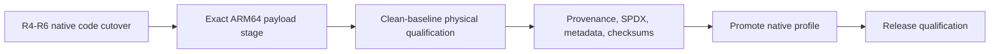

# Flux Rust-Unification Implementation Roadmap

Last revised: 2026-07-28

This roadmap is the authoritative execution order for the Flux rewrite. The
[blueprint](fluxd-blueprint.md) and [technical specification](fluxd-technical-specification.md)
define the target contracts; this document decides what to build next and what must wait.

## Executive Decision

The scheduling objective is now **one Rust-owned runtime as soon as safely possible**.

The first releasable runtime is:

- one `fluxd` process owning Desired State, configuration and subscription compilation,
  Generation assembly, network observation, xtables and policy routing, address reconciliation,
  Sing-Box supervision, control/CLI, recovery, and offline cleanup;
- one separately versioned Sing-Box process as the external Proxy Engine;
- only platform-required installer, boot-launch, disable, and uninstall glue outside Rust, with no
  shell networking policy, runtime orchestration, or cleanup implementation;
- one conventional, fully Rust-owned xtables TPROXY Capture Path.

Native nftables and managed TUN mutation adapters, eBPF, and ipset acceleration are not requirements
for that release. Capability-first discovery and deterministic Capture Path selection are safety
infrastructure, not additional release backends: they preserve ADR-0005's target order while the
only currently activatable Rust path remains xtables. Additional adapters must not delay removal of
the shell runtime, standalone `addrsyncd`, or packaged `jq`.

Physical Android authority remains mandatory before production native networking activation. It is
no longer a global scheduling barrier: host-side runtime composition, configuration, subscription, CLI,
address reconciliation, testing, and package removal work proceed in parallel.

## Non-Negotiable Invariants

Rust unification does not relax the safety design:

1. Exactly one component may write each Flux-owned kernel object at a time.
2. No cutover or rollback may create a shell/Rust dual-writer interval.
3. Capture detaches before its Proxy Engine is stopped or replaced.
4. A candidate becomes active only after exact readback and the required functional canary pass.
5. Failure settles to old-active, new-active, or verified clean fail-open state.
6. Durable recovery binds boot, process, namespace, Generation, artifact, tool, route, and ownership
   identity rather than trusting names or exit status.
7. Host, namespace, emulator, and WSA results never mint physical Android release authority.
8. Flux does not package, load, unload, or implicitly depend on `.ko`, KPM, or opaque kernel payloads.
9. Unsupported optional mechanisms report unavailable or degraded behavior; they never weaken the
   conventional correctness path.
10. The rewrite remains pre-release until the Rust-only gate in ADR-0011 passes.

## Current Baseline

The code-first R4-R6 cutover is complete in commits `8bf0533`, `1863553`, and `6180397`.
Production composition now selects the native Rust runtime; the legacy shell bridge, standalone
helper daemon, compatibility configuration, packaged `jq`, and bridge package profile are removed.
This is an implementation checkpoint, not release qualification.

| Area | Delivered evidence | Production status |
|---|---|---|
| Control and lifecycle | Unix control socket, serialized intent, durable administrative state, startup recovery, runtime status | Rust-owned |
| Proxy Engine | Descriptor-pinned Sing-Box validation, launch, readiness, bounded stop/reap, restart compensation | Rust-owned |
| Generation lifecycle | Prepare/attach/verify/publish/retire coordinator with fail-open rollback | Native Rust composition selected |
| Canonical Generation assembly | Desired State, engine/capture artifacts, capability/planning identity, prior lineage, and strict records | Production-connected |
| Network inventory | Strict link/address/route/rule observer with loss recovery | Drives native serialized address reconciliation |
| Canonical xtables | Schema-v2 lowering, native restore/save adapter, durable transaction owner, exact readback and recovery | Production-connected behind exact device admission |
| Functional canary | Detailed evidence model and privileged Linux/Android development harnesses | Final packaged ARM64 qualification remains open |
| Address synchronization | Snapshot-bound native successor/retirement reconciliation | Rust-owned; standalone helper removed |
| Product configuration | Complete strict schema-3 Desired State and canonical engine/capture compilation | Rust-owned; compatibility compiler removed |
| Subscription and assets | Bounded Rust HTTPS worker, compiler, local asset store, Sing-Box validation, active/predecessor recovery, periodic/manual refresh, and Generation reload | Production-connected; shell updater has no runtime caller |
| Package | Schema-4 exact 13-file native inventory and strict verifier | Development-only; final evidence/provenance incomplete |

Verification at the R6 checkpoint:

- `cargo xtask ci`: pass, including workspace tests, strict Clippy, and pinned ARM64 cross-check;
- `cargo xtask build-android`: pass with at least 16 KiB ELF `PT_LOAD` alignment;
- native module-glue syntax and isolated behavior suite: pass;
- physical packaged ARM64 install/runtime/rollback/uninstall qualification: pending.

Future progress is measured by qualifying the exact payload and completing release trust metadata,
not by rebuilding a bridge or adding non-authorizing test infrastructure.

## Delivery Model

The original three lanes converged in the code-first R4-R6 cutover. The remaining executable order
is payload qualification, then release trust completion:

The lane sections below retain the implementation record and define the evidence still required.
They do not authorize rebuilding the retired bridge.

## Gate 0: Freeze The Minimum Release Scope

Status: **complete and collapsed to one native profile by R6 on 2026-07-28; scope freeze remains in
force**.

`conf/manifest.json` schema 4 records one `native` profile, marked `development-only`, with the exact
13-file runtime/module inventory and exactly two binaries. Inventory equality rejects every removed
bridge path and all other undeclared residue. There is no compatibility profile, profile selector,
forbidden-difference list, retired-path list, or `addrsyncd` source/provenance boundary. This gate
still does not authorize release or physical Android behavior.

### Work

- Record xtables TPROXY as the only required first-release mutation adapter while retaining
  ADR-0005's nftables, xtables, TUN, inactive selection order.
- Keep historical bridge evidence in Git/dated records only; do not restore runtime or oracle code.
- Do not implement or activate nftables/TUN mutation, eBPF/ipset acceleration, established-flow
  caching, DIVERT, `sk_lookup`, TC/TCX, kernel extensions, or new proof abstractions unless a P0
  deliverable is blocked on one exact missing fact. Bounded capability discovery and a
  non-authorizing selector remain in scope because backend probes must not trigger autoload and
  absent optional mechanisms must not block a viable path.
- Preserve the machine-checked native inventory: `fluxd`, Sing-Box, Rust-owned
  configuration/assets, and platform glue only.
- Keep the single profile development-only until physical and release-evidence gates pass.

### Exit Gate

- One checked manifest names every final runtime path and rejects all undeclared residue.
- CI verifies one native composition and one module-glue workflow.
- No active work item outside the lanes below can delay Rust unification.

## Lane A: Host Runtime Composition

Goal: make every production Rust component composable and testable on Linux without manufacturing
Android authority.

### A1. One Complete Product Desired State

Status: **complete on 2026-07-25**. Schema 3, the pure Desired State/Capture compiler, canonical
engine publication, and the bounded Rust-to-shell compatibility compiler are production-connected.
The shell phase consumes only Rust's published policy projection plus observed `KFEAT_*` facts; it
does not read `settings.ini`, legacy cache policy, or generated JSON through `jq`. The environment
is derived input, not an authority. The fenced legacy networking writers remain, but no longer
decide product intent.

- Expand `FluxConfig` from daemon-only settings into the typed schema already defined by the
  blueprint: traffic scope, interfaces, application/user policy, family policy, listener,
  subscription, safety, and explicit backend selection.
- Keep strict unknown-field rejection, byte/count budgets, descriptor-relative no-follow loading,
  and schema versioning.
- Replace the `settings.ini` runtime contract. A one-time importer is optional and isolated; it may
  not retain a legacy runtime parser in normal startup.
- Make the existing canonical Sing-Box compiler the production path. One immutable configuration
  snapshot must feed engine validation, Generation identity, and launch.
- Never parse the generated Sing-Box JSON with `jq` or re-export it as shell environment.
- During the fenced bridge interval, translate the typed Capture Program into the existing legacy
  renderer inputs in Rust. Shell may execute the frozen artifacts but must not derive policy from
  `settings.ini` or inspect engine JSON.

Exit met: host tests compile one complete product Desired State into immutable, identity-bound
engine and non-authorizing shadow Capture Program artifacts without a shell process. Production
tests additionally prove atomic read-only publication and fail-closed binding of the shell
manifest's binary, launch identity, timeouts, config digest, and listener to that same snapshot.

### A2. Complete Generation Assembly

**Done 2026-07-25.**

- One internal `GenerationAssembler` facade consumes the exact immutable inputs already
  modeled: Desired State, Network Inventory, Capability Profile, Engine Capability Profile, Android
  planning authority when required, and prior owned state.
- It produces one non-mutating `AdmittedGeneration` projected through a read-only coordinator
  inspection seam. Native-owner consumption remains A4. Raw authorities and partial candidates
  stay private to the assembler.
- It connects the existing `generation_engine_config` compiler instead of adding another
  intermediate identity layer.
- A host/test authority exercises deterministic mechanics without being promotable. Android
  planning admission consumes the non-cloneable physical authority, but even that result remains
  non-mutating until A4 supplies a separately authorized native target.
- Complete Capability Profile and Android planning-evidence digests bind equal-revision profile
  drift, topology scope, census observation/content, policy, journal, namespace, and partial audit.
  The assembly digest also binds exact RPDB placement and complete predecessor identity.
- Prepared Generation records use strict JSON, a 16 KiB limit, lowercase SHA-256 fields,
  contiguous lineage validation, no-follow I/O, and atomic file-plus-directory fsync persistence.
- The existing `NativeXtablesAdmittedTarget` constructor remains private/test-only; A2 adds no
  writer token, activation lease, target conversion, or mutation method.

Exit met: the coordinator can inspect a complete non-mutating Generation on a host, while a
production mutation target remains impossible without Android authority. WSA or host results are
development evidence only and cannot satisfy the physical ARM64 release gate.

### A3. Absorb Address Reconciliation

**Done 2026-07-25.**

- The existing `NetworkInventorySource` is the one observation stream in the daemon reactor. A
  one-shot attachment hands it to the coordinator after reactor binding without adding a thread,
  queue, PID/signal plane, or second netlink implementation.
- The root observer already owns subscribe-before-dump, overrun/truncation recovery, complete-dump
  publication, bounded debounce, duplicate normalization, and loss invalidation. Deterministic
  root-workspace tests cover these behaviors without reading or copying the unlicensed standalone
  implementation.
- Do not preserve a second daemon, a signal/PID discovery control plane, or a parallel raw-netlink
  implementation merely for source compatibility.
- One crate-private reconciler consumes only complete materially changed snapshots and retains the
  exact immutable inventory, realization-neutral host-set plan, and non-authorizing Desired State
  artifacts. Address-derived bypass is compiled before mark assignment, so it consumes no
  per-address RPDB priorities.
- Loss immediately invalidates retained inputs. Repeated failures are suppressed until inventory or
  successfully prepared configuration changes. Named application packages fail closed until an
  authoritative package-to-UID resolver is connected.
- Observed inventory never invokes the bridge address writer. Manual bridge resync remains unchanged
  until A4 transfers capture, routing, and address mutation together under one native owner.

Exit met: deterministic tests cover initial publication, unchanged snapshots, forced configuration
refresh, churn/debounce at the observer, loss/full resync, replacement, and bridge-writer isolation.
The live-daemon shutdown test traverses late source attachment and exact cleanup without invoking
`address-resync`. Exact kernel readback, partial-failure compensation, and privileged lifecycle
tests remain A4 work because A3 deliberately grants no mutation authority.

### A4. Production Native Runtime Writer

Status: **host composition checkpoint complete on 2026-07-25; qualified production selection is
still blocked on C2/Gate 1**.

- The process/netlink Adapter, durable owner, schema-3 identity journal, checksum-protected exact
  target archive, and one runtime transaction lock now compose behind the private writer facade.
  The archive retains at most active plus replacement material and resolves crash recovery without
  consulting current configuration.
- The exported coordinator interface contains only opaque target identity, convergence state/report,
  and `recover()` plus `converge(target | stopped)`. Raw restore, save, route, and rule types remain
  private to `flux-platform`; dry-run output remains diagnostic and non-authorizing.
- The native coordinator adapter reaches recovery and verified stale-capture cleanup before
  accepting a lazy Generation source. It retains at most committed plus candidate targets, starts
  the engine before capture convergence, treats successful exact convergence as structural
  verification, and performs no dispatcher call or legacy state-file publication.
- The adapter rejects any capture target whose embedded Generation differs from the coordinator
  Generation. Address inputs completed while replacement is ineligible remain pending without
  duplicating their bounded artifacts; failed runtime maintenance blocks address work for that turn,
  and only a Ready engine with Published capture may enter address-driven reload.
- Coordinator reload accepts an already prepared successor. Successful address reconciliation can
  prepare that successor and enter the same rollback-capable path; a material address change is
  never applied under the old Generation.
- Deterministic host tests cover recovery-before-source, engine/capture ordering, candidate failure
  with previous-generation restoration, address-driven replacement, stop ordering, clean absence,
  and absence of dispatcher events. The existing 35-test owner/runtime suite remains green.
- Production deliberately remains on `ProcessRuntimeWriter`. Replacing it requires the same physical
  target's C2 mark/RPDB authority, required functional-canary input, a successful real-Adapter
  composition test, explicit completed-versus-deferred native `resync` control semantics, and the
  Gate 1 writer fence. Host or WSA evidence cannot construct that target.

Exit: a privileged Linux namespace test runs the real `fluxd` composition through start, reload,
address churn, crash recovery, stop, and exact cleanup with real xtables/rtnetlink tools and no
runtime shell dispatcher.

## Lane B: Rust Product Plane And Package Removal

Goal: remove host-independent shell and helper ownership before hardware qualification completes.

### B1. Subscription And Asset Manager

Status: **complete on 2026-07-26**.

- One capacity-one synchronous Rust worker owns HTTPS-only retrieval, at most five redirects, one
  global timeout, independent encoded/decoded byte limits, aggregate rule-asset work, node count,
  URI/JSON/Base64 decoding, normalization, filtering, stable naming, template merge, and exact
  Sing-Box validation. Static WebPKI roots are explicit; Android user/enterprise roots are not
  inherited.
- A strict no-follow content-addressed store retains one active and at most one predecessor
  snapshot, rehashes every referenced config/asset during recovery, promotes only a verified
  predecessor, and makes cleanup-pending state explicit. Failed retrieval, parse, validation,
  persistence, source-stability, or activation preserves the prior active snapshot.
- Startup recovers without network access, fetches once only when enabled with no recoverable
  snapshot, and guards a newly published bootstrap candidate until initial runtime admission.
  Periodic and manual refresh use the same operation; `fluxd subscription update` reports updated,
  updated-deferred, unchanged, disabled, busy, or a stable typed failure.
- Completed candidates enter the existing serialized coordinator reload/rollback path. The current
  bridge supports subscription-backed activation only for the packaged root-owned Sing-Box identity;
  secure non-root store traversal remains a later compatibility task.
- `scripts/init` no longer calls or requires the former shell updater in either ownership mode. The
  no-caller updater was retired from source and both package profiles after its source-binding and
  rollback regressions passed; manifest schema 3 prevents its path from returning.
- Flux does not yet own a separate persisted Sing-Box FakeIP/reverse-mapping database. B1 binds the
  exact canonical engine configuration and rule assets; a future owned cache must introduce its own
  versioned migration/corruption contract rather than delaying updater retirement for nonexistent
  state.

Exit met: subscription refresh and reload execute through `fluxd` without runtime `curl`, AWK,
`jq`, or shell. Forty-nine subscription-focused tests, nine startup-admission tests, the live
shutdown test, strict Clippy/rustfmt, diff hygiene, the full `fluxd` suite, and the pinned
Android/API-31 cross-build pass. No WSA or physical ARM64 runtime qualification is claimed.

### B2. Direct Control And Observation

- **B2.1 complete 2026-07-26:** direct `fluxd` aliases cover status, start, stop, restart, reload,
  resync, same-user bounded diagnostics and fixed-stream logs, plus a non-publishing
  explain/dry-run view. The temporary `scripts/fluxctl` contained only argument forwarding until
  B2.4 removed it. Explain
  reports configured intent and canonical engine identity; resolved package UIDs and live inventory
  remain part of later complete Generation assembly rather than this non-authorizing view.
- **B2.2 complete 2026-07-26:** mutation-capable profiles observe `flux.toml`, the selected engine
  template, the selected subscription URL file, and module `disable` inside `DaemonReactor`.
  Parent-directory watches recover from overflow, invalidation, missing paths, atomic replacement,
  and ancestor-directory replacement. Two typed facts coalesce behind the existing serialized
  writer, startup-gap reconciliation uses metadata identity, and observed subscription inputs
  schedule one immediate or pending refresh. Module boot no longer starts `inotifyd`; the no-caller
  event adapter is retired from source and both package profiles, with its old path denied by
  manifest schema 3.
- **B2.3 complete 2026-07-26:** one bounded `fluxd cleanup --offline` path now acquires a
  persistent daemon lease before startup recovery, consumes durable ownership records and exact
  absence checks, and is delegated by the platform uninstall glue. Shell never reconstructs rules.
- **B2.4 complete 2026-07-26:** `scripts/fluxctl`, its legacy-init dependency, the external
  dispatcher lifecycle alias, and the cache-mutating shell preview branch are removed. Direct Rust
  CLI tests and the dispatcher/package contracts pass. The no-caller event adapter remains only in
  the development bridge inventory; the exact Rust-only stage excludes it and every other declared
  bridge-only artifact.
- Keep status honest: distinguish desired, observed, verification, degraded, and recovery-pending
  state.

Exit: all supported runtime and diagnostic commands work with only `fluxd` plus Sing-Box running.

### B3. Rust-Only Package Profile

Status: **structural/code cutover complete in R6 on 2026-07-28; release qualification open**.

- Schema 4 has one exact native profile with `fluxd`, Sing-Box, configuration/assets, and platform
  glue. It rejects every undeclared file rather than maintaining a compatibility difference list.
- Root platform glue is bounded and contains no networking policy, subscription retrieval,
  configuration compilation, or owned-state cleanup implementation.
- The installer is fresh-only, the module-local service runs a bounded daemon restart loop, and
  uninstall delegates online/offline recovery to Rust.
- ARM64 and x86_64 Android links require at least 16 KiB load alignment and structured ELF
  validation.
- Legacy helper binaries, configuration, runtime scripts, source-policy/oracle tooling, and oracle
  fixtures are deleted.
- Remaining work is trusted physical evidence, complete provenance/licenses, SPDX, build metadata,
  checksums, reproducibility/signing, and explicit profile promotion.

Exit for release: the verifier accepts the exact payload with every release-evidence gate complete.

## Lane C: Physical Android Qualification

Goal: produce the exact non-forgeable authority required by one conventional native target.

This lane starts whenever a rooted physical ARM64 target is available. A first cutover target should
be Android/Linux 5.10 because it is the minimum support boundary; release qualification later adds
the maintained newer/vendor profile.

### C1. Bind One Reviewed Device Profile

- Run the explicit-serial, read-only ARM64 preflight.
- Bind product/build/vendor/security patch, AVB/lock, kernel build, boot, network namespace, SELinux
  policy, netd, Connectivity APEX, Flux binary, Sing-Box binary, and exact tool identities.
- Authenticate the runtime netd/Connectivity artifacts to the reviewed source profile.
- Capture mangle hooks, RPDB, routes, links, listeners, namespaces, and required tool behavior
  without mutating Flux state.

Exit: the target is viable for the full qualification procedure. This still grants no mutation.

### C2. Complete Mark, RPDB, And Topology Authority

- Complete the point-in-time fwmark census across every required source and packet/socket/conntrack
  plane for the selected candidate.
- Resolve the ADR-0013 ordered INPUT-writer case on the actual target. Prove hook and route order,
  interface selector scope, listener delivery, observer semantics, and outside-mask preservation.
- Select collision-free mark values, table, rule priority, route metric, protocols, loopback
  identity, and Traffic Domain anchors from live evidence.
- Prove default VPN-respecting behavior, including always-on/lockdown, per-app/profile selection,
  and Android-owned routing. A root-owned `fluxd` or Sing-Box socket does not automatically inherit
  the intercepted UID's network selection. For each admitted Traffic Domain, either leave VPN-owned
  traffic uncaptured or bind engine egress to an exact, profile-probed per-origin mechanism. Private
  netd behavior is an adapter contract, not a generic core assumption.
- Consume the exact authority once when assembling the target; re-observation or drift requires a
  fresh authority.

Exit: one `AndroidMarkPlanningAuthority` can complete exactly one Generation target on the bound
boot/namespace/device profile.

### C3. Functional And Coexistence Qualification

- Run dual-stack TCP/UDP local OUTPUT and forwarded/tether canaries through the actual Sing-Box
  listener, including loopback reinjection and exact capture counter bounds.
- Cover DNS, representative fake-IP behavior, application allow/deny, owner and secondary user,
  Wi-Fi/mobile handover, tethering, Private DNS, CLAT/NAT64 where available, and coexistence with
  Android VPN policy.
- Prove that engine-created outbound sockets follow the admitted Android network context. Include
  libc/netd fwmark behavior and reject engine/socket paths that bypass the required platform hook.
- Restart netd during an active Generation and require inventory invalidation, full redump,
  reauthorization where identities changed, and convergence before Running is restored.
- Prove cleanup and rollback after failures at every external command/kernel acknowledgement
  boundary.
- Confirm required xtables targets are already available without Flux loading a kernel module.
- Record payload-bound, boot-bound, source-revision-bound evidence through the package verifier.

Exit: the exact native target is cutover-ready. Evidence from a different boot, binary, namespace,
or device does not transfer.

## Gate 1: Native Writer Code Cutover And Qualification

Status: **code cutover complete in R4-R5; physical qualification pending**.

The code-first correction deliberately allowed intermediate commits that were not release artifacts.
The native composition was selected and the bridge was deleted before the final packaged device
run. Therefore the project cannot retroactively claim that this source revision observed a live
bridge-to-native fence transfer on the target. Historical device state is preserved only as prior
evidence, not as authority for the new payload.

The remaining Gate 1 procedure starts from an independently proven clean Flux baseline:

1. Stop the existing user runtime and prove exact Flux process and kernel-object absence.
2. Preserve the customized old runtime/module trees in a validated root-only device-local backup.
3. Install the exact native payload only after `/data/adb/flux` is absent.
4. Converge the reviewed Generation, attach capture last, read back every owned object, and require
   the scoped functional canary before Running.
5. Inject bounded native failures and prove verified clean fail-open recovery without a second
   writer or compatibility fallback.
6. Exercise restart, address churn, stop, offline cleanup, reboot recovery, and uninstall.
7. Prove zero Flux-owned residue, then restore the exact pre-test backup or leave Flux absent
   according to the reviewed test outcome.

This procedure qualifies fresh native ownership and cleanup. It does not manufacture evidence for
the retired live-transfer step.

### Exit Gate

- Production `run_daemon` constructs the native writer, consumes live inventory, and selects the
  required functional canary.
- Legacy runtime writers, helper daemons, and shell networking mutation are absent from the
  production call graph.
- Every tested failure ends old-active, new-active, or verified clean fail-open.
- Reboot and same-/previous-boot journal recovery pass on the physical target.
- Native `resync` returns completion only after exact no-change or successor convergence; queued work
  is reported explicitly as accepted/deferred rather than as a completed kernel mutation.

## Gate 2: Rust-Only Package

Status: **structural/code gate complete in R6; evidence/promotion gate pending**.

Prerequisites for promotion: the remaining Gate 1 physical qualification and Lane B release
metadata are complete for the exact staged payload.

The package must satisfy all of the following:

- Runtime binaries are exactly `fluxd` and the external Sing-Box engine.
- No packaged `jq`, `addrsyncd`, `curl` adapter, runtime shell controller, or legacy configuration
  compiler exists.
- Platform glue only installs, execs/restarts, disables, or invokes the Rust offline-cleanup command.
- One authoritative configuration schema and one immutable Generation journal exist.
- `fluxd status` reports a functionally verified native runtime, not structural compatibility.
- Package verification rejects legacy runtime paths, kernel payloads, incomplete device evidence,
  mutable/unpinned sources, invalid licenses, mismatched SBOM/checksums, and Android ELF programs
  without 16 KB-compatible `LOAD` alignment.

The first four structural bullets are implemented by schema 4 and the module-glue policy. The
status/physical evidence and release metadata bullets remain open. Passing all of Gate 2 means the
architecture is Rust-unified and payload-qualified; it still does not by itself authorize a public
release because final trust and release qualification follow.

## Release Qualification

### Required Host Gates

- Format, workspace check/test, Clippy with warnings denied, and Android cross-check.
- Unit/model/property tests for configuration, Generation assembly, planner, state machine,
  journal replay, and failure injection.
- The disposable dual-stack user/mount/network namespace topology and exact-cleanup checkpoint is
  required in standard Linux CI. It remains mechanism evidence because it installs no capture and
  does not run the production-shaped native composition.
- **Complete 2026-07-26:** `cargo xtask test-native-composition-linux` is required on the supported
  Linux runner and executes the dispatcher-free production-shaped composition through start,
  ordinary and subscription reload, address successor, engine recovery, failed-candidate
  settlement, crash recovery, stop, idempotent offline recovery, forbidden-subprocess audit, and
  exact dual-stack cleanup. It cannot construct Android authority and does not authorize production
  writer selection.
- Fuzz targets for TOML/JSON/control/subscription inputs and netlink/xtables readback parsers, with a
  bounded CI smoke run and retained crash corpus.
- Unsafe operations in unsafe functions and undocumented unsafe blocks are denied workspace-wide
  through the standard strict Clippy gate. The locked root workspace advisory/license/source policy
  is also required in standard Linux CI with a digest-pinned cargo-deny binary. The explicit
  38-file/264-block unsafe-boundary review completed on 2026-07-26 and corrected zero process-signal
  targets before `kill(2)`; its documented triggers require review again when a boundary or ABI
  changes. Reproducible build/provenance checks remain required, and neither workspace audit
  approves the excluded `addrsyncd` bridge license or replaces the final package SBOM.

### Required Android Set

| Dimension | Minimum release evidence |
|---|---|
| Kernel | Linux 5.10 baseline and one maintained newer LTS |
| Kernel style | At least one GKI and one vendor-modified profile |
| Page size | 4 KB runtime plus packaged 16 KB-compatible ELF verification |
| Root framework | Every framework advertised by the release |
| Network | Wi-Fi, mobile, IPv4/IPv6, handover, and NAT64/CLAT where available |
| Traffic | Local apps, tethering, TCP, UDP/QUIC transport, DNS, and long-lived flows |
| Identity | Owner plus one secondary user/profile |
| Coexistence | Private DNS, Android VPN policy, and reboot/recovery |
| Backend | Only the conventional xtables path unless another backend is advertised |

### Reliability And Performance Gates

- Startup reaches functionally verified Running within 5 seconds after Android boot readiness,
  excluding subscription retrieval.
- p95 address-change convergence is below 250 ms after the configured debounce.
- No netlink loss is accepted without full resynchronization.
- Idle CPU is statistically indistinguishable from zero outside bounded maintenance ticks.
- RSS is no more than 20 percent above the measured bridge plus `addrsyncd` baseline unless a
  documented Rust TLS cost is accepted.
- Packet-path throughput/regression is within 5 percent of the conventional bridge baseline.
- Disk-full, read-only state, corrupted journal, killed `fluxd`, killed Sing-Box, externally removed
  rules, hung tools, netd restart, and network churn satisfy the fail-open/recovery invariants.

Only after Gate 2 and all advertised release qualification gates pass may this branch produce a
release candidate or release.

## Prioritized Backlog

The list below is the working order. Items with the same prefix may run in parallel.

### P0: Rust Unification

1. `P0-G0` **Done 2026-07-28:** freeze optional scope and collapse the temporary profiles into one
   exact native development contract.
2. `P0-A1` **Done 2026-07-25:** make `FluxConfig` the complete product Desired State, connect canonical
   engine publication, and remove shell/`jq` product-policy derivation from Rust-owned preparation.
3. `P0-A2` **Done 2026-07-25:** implement the complete non-mutating Generation assembler,
   read-only coordinator inspection, evidence/lineage identity, and bounded prepared record.
4. `P0-A3` **Done 2026-07-25:** feed `NetworkInventorySource` into serialized non-mutating
   reconciliation, bind exact snapshot provenance, and absorb address-observation behavior/tests.
5. `P0-A4` **Production code selection done 2026-07-28:** the exact archive/facade/coordinator path,
   qualified target source, typed resync, native offline recovery, and required real namespace
   composition pass; final payload qualification remains C1-C3.
6. `P0-B1` **Done 2026-07-26:** move subscription, asset, template processing, validated snapshot
   recovery, periodic/manual refresh, and Generation reload into Rust; retire every runtime caller
   of the packaged updater oracle.
7. `P0-B2` **Done 2026-07-26:** Rust owns direct control, observation, diagnostics, offline cleanup,
   and uninstall delegation; the forwarding wrapper and shell preview path are removed.
8. `P0-B3` **Code gate done 2026-07-28:** schema 4 has one exact native stage; bridge profiles,
   helpers, configs, scripts, and oracle tooling are removed; ARM64 ELF alignment is enforced.
9. `P0-C1` **Collection machinery and reviewed target evidence partially complete:** bind the final
   staged `fluxd` plus Sing-Box payload to one fresh physical ARM64 qualification run.
10. `P0-C2` **Planning implementation complete, final payload proof pending:** rerun exact
    mark/RPDB/topology admission on the unchanged qualification identity.
11. `P0-C3` Pass packaged functional, VPN/netd, dual-stack, tethering, failure, and cleanup
    qualification.
12. `P0-D1` **Code cutover done 2026-07-28:** native Rust composition is selected and legacy runtime
    ownership is deleted. Complete the bounded install/boot/runtime/rollback/uninstall proof before
    treating Gate 2 as release-qualified.

### P1: Release Assurance

1. **Privileged production-composition host gate complete 2026-07-26:** the exact test is required
   in supported Linux CI; physical Android qualification remains separate.
2. **Dependency and unsafe-boundary assurance complete 2026-07-26:** the locked root workspace has
   a required advisory/license/source gate, and all 264 unsafe blocks in root-workspace targets have
   an explicit semantic audit with re-audit triggers. A bounded deterministic parser-fuzz smoke is
   now required in CI; add coverage visibility, a retained crash corpus, and sanitizer applicability
   evidence. Removed bridge code is outside the package and must not be copied back without a new
   source/license review.
3. Qualify the second maintained Android kernel/vendor profile and every advertised root framework.
4. Capture final resource/performance baselines and chaos evidence.
5. Complete SBOM, source/hash/license, build metadata, reproducibility/signing, migration, and
   rollback documentation.

### P2: After The Rust-Only Release

1. Implement the native nftables mutation adapter behind the existing capability selector;
   promote only with real-device behavioral qualification and atomic/readback parity.
2. Implement managed TUN behind the same selector only for a concrete product scope that qualified
   netfilter paths cannot meet.
3. Add eBPF observation, then acceleration, only when a conventional fallback remains complete and
   benchmarks show material value.
4. Revisit ipset, established-flow caching, DIVERT, `sk_lookup`, TC/TCX, and heterogeneous Traffic
   Domain planning independently; none may bypass the selector's qualification states.
5. Consume an already-loaded kernel extension only under a separate ADR and exact read-only
   interface; never make Flux a module loader.

## Progress Reporting Rules

- Update this roadmap by backlog ID and gate outcome, not by appending implementation diaries to
  stable ADRs.
- A delivered pure type, parser, receipt, or test fixture is evidence for its consuming item; it is
  not a completed milestone unless the next production boundary can use it.
- Every status update names the production caller, changed owner, tests run, remaining authority,
  and package files removed or still required.
- When a hardware lane blocks, record the exact missing device/evidence and continue all independent
  P0 host work.
- Do not start a P2 item while an unblocked P0 item remains.
