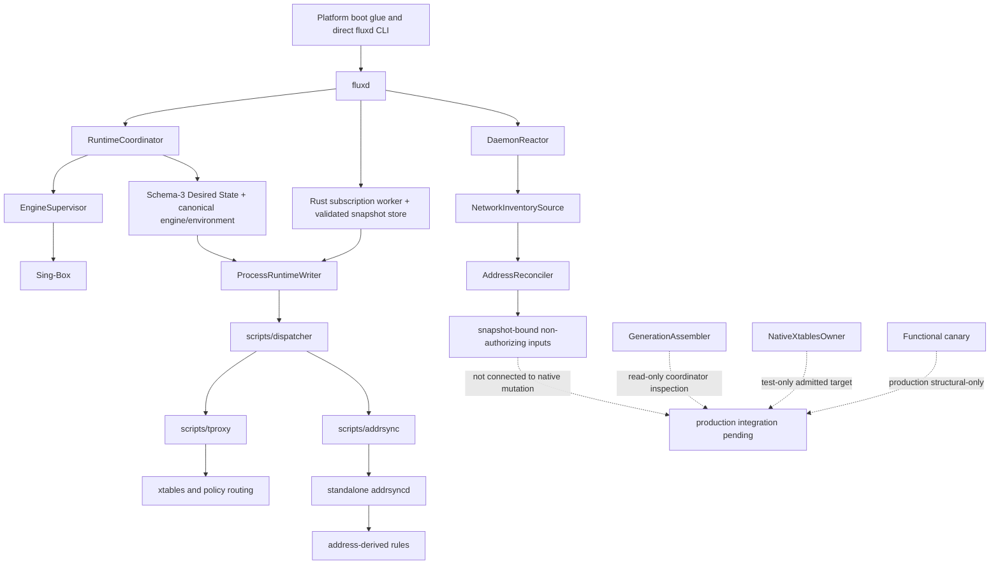
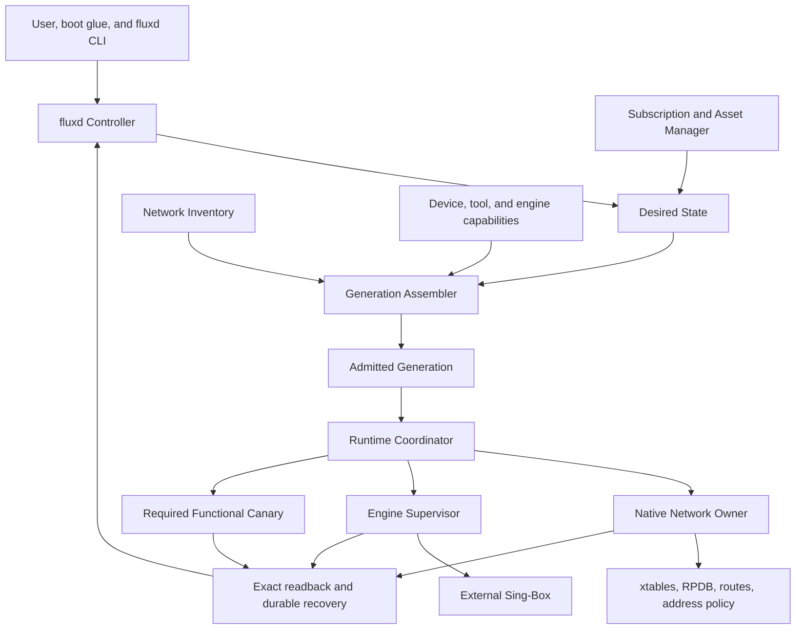

# Flux Comprehensive Project Review

Review date: 2026-07-23
Implementation status updated: 2026-07-26

## Conclusion

Flux has a strong safety architecture and a weak delivery topology.

The important design decisions are sound: one Controller, immutable Generations, one writer per
owned object, exact readback, fail-open compensation, capability evidence from the actual device,
and an external supervised Sing-Box engine. The implementation also contains substantial, tested
Rust machinery for those decisions.

At the review baseline, the project was not close to its declared Rust-only release boundary in
production composition. Since then, Gate 0, A1-A4, and B1-B3 have landed: schema-3 `FluxConfig` owns
the complete product Desired State, A2 assembles complete non-mutating Generations, A3 consumes live
network inventory into snapshot-bound Capture Program inputs, A4 composes the native writer behind
non-forgeable authority, Rust now owns subscription/control/observation/offline cleanup, and an exact
13-path Rust-only package skeleton is machine-checked. The main topology problem remains: `fluxd`
still constructs `ProcessRuntimeWriter` and delegates networking mutation to shell;
`scripts/tproxy` remains the actual xtables/RPDB writer; standalone `addrsyncd` remains a second
runtime owner; and production uses structural rather than functional verification.

The recommendation is **not to rewrite the rewrite**. Keep the architecture and change the
schedule immediately:

1. Make one Rust-owned conventional xtables runtime the sole P0 outcome.
2. Run host runtime composition, the Rust product plane, and physical Android qualification in
   parallel.
3. Join them only at one fenced native-writer cutover.
4. Remove shell networking, standalone `addrsyncd`, packaged `jq`, and legacy configuration as part
   of that cutover, not in a distant final phase.
5. Defer nftables, TUN, eBPF, ipset, and new proof abstractions until the Rust-only gate passes.

This direction is now encoded in the revised
[implementation roadmap](implementation-roadmap.md).

## Review Basis

The review covered:

- all 39 tracked Markdown files, including 13 ADRs, the blueprint, technical specification,
  functional-canary contract, alternatives, current roadmap, research notes, and development guide;
- the production entry point, daemon composition, coordinator, engine supervisor, configuration,
  protocol, reactor, network observer, native xtables owner, policy-routing code, package verifier,
  shell runtime, installer, and `addrsyncd` submodule;
- Git state and recent implementation history through `d4b08be`;
- current CI, test entry points, package inventory, direct dependencies, source size, and dormant
  production seams;
- maintained open-source projects and first-party Linux, Android, Netfilter, iproute2, Rust, and
  Sing-Box sources summarized in the
  [open-source architecture comparison](../research/open-source-architecture-comparison-2026-07.md).

`cargo xtask ci` passed during this review. The root workspace reported 984 passed, 0 failed, and
12 ignored tests. The excluded `addrsyncd` submodule reported 98 passed, 0 failed, and 1 ignored.

No physical Android ARM64 target was attached. This review makes no new mark, RPDB, SELinux,
VPN/netd coexistence, or release-qualification claim from host or WSA evidence.

## What Flux Is Designing

The target is a rooted-Android transparent-networking controller, not another proxy engine.
Sing-Box remains the data plane. Flux is responsible for turning user intent plus live device facts
into one recoverable networking Generation.

The design has seven substantive modules:

1. **Controller** accepts administrative intent and exposes observed state.
2. **Desired State and Subscription** validate user policy and external endpoint snapshots.
3. **Capability and Inventory** establish exact device, tool, engine, route, rule, link, address,
   namespace, and ownership facts.
4. **Generation Assembler** compiles immutable engine and Capture Program artifacts from one coherent
   input set.
5. **Runtime Coordinator** sequences prepare, activate, verify, publish, retire, compensate, and
   recover.
6. **Native Network Owner** performs the admitted xtables/RPDB/address transaction and exact
   readback.
7. **Engine Supervisor** validates and owns the external Sing-Box child.

The architectural thesis is correct: mutation authority should be difficult to construct and easy
to audit, while runtime callers see a small reconcile/recover interface rather than raw firewall
verbs.

## What Runs Today

That graph explains the core discrepancy. Rust owns control decisions and Sing-Box, but the shell
bridge and a second Rust daemon still own networking side effects. The project is a carefully
managed hybrid, not a Rust-owned runtime.

## Implementation Assessment

| Responsibility | Current owner | Assessment | Required change |
|---|---|---|---|
| Administrative intent and control | `fluxd` | Strong | Keep |
| Serialized lifecycle and compensation | `RuntimeCoordinator` | Strong but adapter-bound | Connect native effects |
| Sing-Box supervision | `EngineSupervisor` | Strong | Connect canonical config/canary |
| Product configuration | Complete schema-3 Rust Desired State; legacy settings are rollback-only | A1 complete | Keep one authority through native cutover |
| Generation compilation | Complete non-mutating Rust assembler; bridge still snapshots networking artifacts | A2 complete, activation disconnected | Connect native writer |
| Capture and RPDB | `scripts/tproxy` | Legacy owner | Native owner cutover |
| Network observation | Rust observer plus serialized `AddressReconciler` | A3 complete, non-authorizing | Feed native Generation activation |
| Address synchronization | standalone `addrsyncd`; native Rust maintenance is host-composed but not selected | Second production mutation owner remains | Select only at Gate 1 |
| Runtime verification | Structural in production | Insufficient for release | Required functional adapter |
| Subscription/assets | Bounded Rust worker and content-addressed active/predecessor store | B1 complete; updater exists only in the development bridge | Rust-only stage excludes the oracle |
| CLI/events/diagnostics | Direct Rust lifecycle/status/diagnostics/log/explain, internal reactor file observation, and bounded offline cleanup | B2 complete; no-caller event file exists only in the bridge | Rust-only stage excludes the adapter |
| Package verification | Exact bridge and Rust-only contracts, source policy, source binding, and staging | B3 structurally complete; release status intentionally failing | Retain status through Gate 1 and add real provenance/evidence |
| Optional backends | Specification/research only | Not on critical path | Defer |

## Strengths

### 1. The Failure Model Is Better Than The Typical Shell Proxy Module

Flux explicitly models Desired and Observed State, immutable Generations, partial activation,
pending detachment, candidate rollback, terminal publication failure, and crash recovery. Capture
is detached before engine shutdown, and failure compensation aims for connectivity rather than a
false Running state. These are the right invariants for a privileged networking controller.

### 2. Single-Writer Ownership Is Concrete

The shared writer fence, parent/child process identities, boot and namespace binding, native lease,
journal, and exact absence checks are much stronger than an advisory PID file. The native owner
keeps ownership until it can prove active or clean-absent state and does not infer success from a
zero process exit.

### 3. Boundary Parsing And I/O Are Defensive

Configuration, manifests, control packets, netlink frames, process output, restore/save output, and
state files are bounded. Sensitive filesystem access uses no-follow and descriptor-relative checks.
Process identity binds PID, start time, executable/artifact, and descriptors. Unknown or ambiguous
kernel data generally fails closed rather than being normalized into authority.

### 4. Android Risk Is Treated Honestly

The project recognizes that Linux 5.10 is only a floor, Android uses packet/socket/conntrack mark
bits, RPDB priority is policy, VPN/netd ordering matters, and vendor kernels/SELinux can invalidate
generic assumptions. WSA and namespace tests are correctly described as mechanism evidence rather
than ARM64 production authority.

### 5. The Native Xtables Owner Is Substantial

This is not merely a renderer. It already covers stable roots, private generation chains,
descriptor-pinned tools, policy routing, exact save/readback projection, failure injection,
rollback, crash recovery, cleanup, durable identity, and the shell transition lease. That work is
the main reason xtables is the shortest Rust-unification path.

### 6. Tests And Documentation Capture Intent

The model and parser suite is broad, CI denies Clippy warnings, Android cross-checks run, shell
semantics are pinned, and package provenance is unusually strict for a rooted-device module. The
documentation records rejected shortcuts and platform uncertainty rather than hiding them.

## Findings And Weaknesses

### P0. The Roadmap Optimized Proof Production Instead Of Ownership Convergence

The old active backlog stopped at a physical-device mark boundary, while configuration,
subscription, CLI, address integration, and package removal waited behind the native cutover. Those
areas do not need a mark grant to be implemented and verified. Hardware unavailability therefore
idled unrelated P0 work and extended the hybrid indefinitely.

Recommendation: use parallel lanes and measure progress by production callers and removed runtime
owners. The revised roadmap does this.

### P0. The Most Important Rust Work Is Outside Production Composition

The A2 Generation assembler now reaches a read-only coordinator inspection seam, and A3 feeds the
live inventory source into serialized non-mutating address reconciliation. Both remain intentionally
disconnected from production mutation. Native target admission is test-only, and the functional
canary is structural-only in production.
Individually strong modules can still fail at their joins: input freshness, lifetime, error
translation, rollback ordering, reactor scheduling, and package startup are integration risks.

Recommendation: the next native integration milestone remains an end-to-end host composition
through the real coordinator and real tools. A2 supplies bounded Generation assembly and A3 supplies
snapshot-bound address inputs; A4 must consume both under one native writer rather than adding
another detached identity or mutation owner.

### P0. The Runtime Boundary Is Still Split Across Too Many Owners

`fluxd`, the dispatcher, `scripts/tproxy`, `scripts/addrsync`, and standalone `addrsyncd` jointly
implement one logical transaction. The lease prevents simultaneous writes, but it cannot make the
composition simple. Every boundary creates additional process identity, timeout, state transfer,
error mapping, packaging, and recovery work.

Recommendation: converge on `fluxd` plus Sing-Box. Keep shell only where the root framework
requires it to install or exec the daemon.

### P0. The Product Configuration Had Two Authorities (A1 Resolved)

At the review baseline, Rust's live `FluxConfig` contained four daemon controls while
`settings.ini` controlled the product. Shell/AWK generated an environment, `jq` mutated and
inspected Sing-Box JSON, and the canonical Rust compiler was disconnected.

Result (2026-07-25): one versioned TOML document is authoritative for Flux routing, capture, and
lifecycle policy; the separate template remains the source for Sing-Box-specific policy. Rust
compiles canonical Sing-Box JSON, the non-authorizing shadow Capture Program artifact, and a strict 41-field compatibility environment. The
shell bridge accepts only that environment plus observed `KFEAT_*`; it cannot source legacy policy
or re-parse generated JSON. The remaining boundary is Generation/network-effect ownership, not
configuration authority.

### P0. Address Synchronization Must Be Absorbed, Not Preserved As A Sidecar

The submodule contains useful loss recovery, readiness, batching, dump reconciliation, and cleanup
work. The root workspace already contains a more general inventory observer, address host-set
planner, and policy-routing machinery. Keeping both architectures would duplicate raw netlink,
reactor, process-control, configuration, and ownership logic.

Recommendation: port behavior and tests into the root modules, drive one reconciliation loop from
`NetworkInventorySource`, and remove PID/signal/sidecar control. Prefer address-derived pre-mark
bypass inside the Capture Program; retain native address rules only if physical evidence proves
they are semantically required.

Result (2026-07-25): `fluxd` now attaches the daemon reactor's one inventory source to a reconciler
running in the existing serialized coordinator worker. It invalidates stale snapshots and compiles
exact-provenance host bypass and Desired State artifacts without invoking the legacy writer or
granting kernel authority. The standalone bridge remains only until A4 transfers all networking
mutation atomically.

The submodule currently declares `UNLICENSED`, while the root is GPL-3.0-only and the release
verifier rejects unreviewed license references. Resolve ownership/licensing before copying code or
claiming a compliant SBOM.

### P0. The Package Verifier Proves The Wrong Package

It correctly checks AArch64 ELF identity, hashes, immutable revisions, evidence, SBOM, checksums,
and kernel-payload exclusion. It also requires exactly four bridge binaries and the legacy scripts.
A passing verifier is therefore not evidence for ADR-0011.

Recommendation: add a separate Rust-only package profile now and let it fail until the required
files are removed. This makes the final state measurable throughout the work.

Status update: B3 implements that recommendation with exact 13/28-path contracts, profile-specific
source binding, no-policy platform-glue checks, and a still-failing Rust-only release status. A
passing development bridge remains non-authorizing.

### P0. VPN Respect Is Not Yet An Engine Egress Contract

AOSP selects a socket's implicit network from the calling UID. Outbound sockets created by
root-owned `fluxd` or Sing-Box therefore do not automatically inherit an intercepted application's
secure, per-app, or work-profile VPN context. AOSP has private system-proxy behavior for selecting a
network on behalf of another UID, but it is not a stable public NDK contract, and Flux does not yet
bind it to the external engine's socket lifecycle.

Recommendation: make this an admission decision per Traffic Domain. When
`respect_android_vpn=true`, either leave VPN-owned traffic outside capture or prove a profile-bound,
runtime-probed per-origin egress mechanism for the exact engine socket. Test accepted and outbound
marks across secure, bypassable, lockdown, per-app, and work-profile VPNs. Fail closed when neither
path can be proven.

### P1. Functional Verification Is Rich In Types But Absent From Production

Production deliberately chooses `StructuralOnlyCompatibility`. The canary implementation and
privileged harnesses are large, but their positive production authorities remain uninhabited. This
is honest, yet it means Running currently proves structure rather than actual end-to-end capture and
delivery.

Recommendation: stop expanding the canary schema unless a field is required by the concrete
Android adapter. Connect the host mechanism path first, then implement the smallest device producer
that can authorize the exact conventional target.

### P1. The Test Pyramid Is Broad At The Bottom And Open At The Top

984 root tests and extensive failure injection are strong evidence for pure logic. Critical Linux
namespace canaries are ignored by normal workspace tests, physical device tests are external, and
there are no committed fuzz, dependency-vulnerability, sanitizer/Miri, or coverage gates. The
workspace does deny unsafe operations in unsafe functions and undocumented unsafe blocks, and the
disposable non-capture topology checkpoint is now required separately in Linux CI. Neither replaces
the missing production-composition test or an explicit unsafe-boundary audit.

Recommendation: make one privileged real-composition namespace job required before cutover; add
bounded fuzz smoke tests for exposed parsers; add dependency/license and unsafe review gates; keep
physical-device evidence payload-bound and separate.

### P1. Complexity Is Concentrated In Several Very Large Modules

The root workspace has 138,646 Rust lines, with 7,317 lines in `functional_canary.rs`, 4,987 in
`runtime_coordinator.rs`, 4,280 in `engine_supervisor.rs`, and several multi-thousand-line harnesses.
Large files are not automatically bad: these modules hide meaningful state-machine complexity.
The concern is that proof types, execution, parsing, and test harness machinery increasingly evolve
together.

Recommendation: do not perform a broad cleanup before unification. After the native composition is
green, keep each facade but move pure transition reduction, effect execution, durable encoding, and
test harnesses into private submodules. Add no abstraction unless it removes caller-visible
complexity or is consumed by the next production step.

### P1. Documentation Mixes Decisions, Specification, Status, And Work Logs

The documentation is careful but repetitive. Accepted ADRs contain long implementation histories;
the old roadmap was 1,001 lines; several files referred to backlog numbers that no longer matched
the execution plan. That makes the current truth expensive to find.

Recommendation: ADRs record stable decisions, the technical specification records contracts, this
review records evidence, and the roadmap alone records live status. Refer to named gates rather than
numbered backlog positions.

## External Comparison And Primary-Source Lessons

The detailed source pins and links are in the
[comparison report](../research/open-source-architecture-comparison-2026-07.md). The main design
lessons are:

1. Mature networking systems centralize desired-state ownership in one daemon even when packet
   processing or kernel tools remain external. This supports the existing `fluxd` plus Sing-Box
   decision and argues against preserving `addrsyncd` as a peer owner.
2. Kernel-facing libraries and projects keep netlink sequencing, ACK/extack handling, loss recovery,
   and backend details behind narrow reconcile-style interfaces. Flux's native owner follows this
   pattern; its currently disconnected construction does not.
3. nftables can replace a ruleset in one netlink batch, while legacy `iptables-restore` commits per
   table. Neither nftables nor `ip -batch` creates an atomic transaction spanning netfilter, RPDB,
   routes, listener readiness, and Sing-Box. Flux still needs its Generation journal, readback, and
   compensation model whichever backend it uses.
4. TPROXY remains constrained to PREROUTING, so local OUTPUT classification plus policy rerouting
   back through a mark-qualified loopback PREROUTING path is consistent with upstream kernel
   behavior. Marks must preserve unrelated bits and RPDB priorities must be explicit.
5. Android and vendor capability cannot be inferred from kernel version or executable name. Actual
   tool backend, module presence, hook order, SELinux permission, lock path, and backports require
   live probing. This validates Flux's physical evidence boundary.
6. Peer rooted-Android proxy modules are useful behavioral references but often retain shell/global
   state ownership. They are compatibility oracles, not target architectures for a single-owner
   Rust controller.
7. Android 15 includes 16 KB-page devices. With the pinned NDK r27d, compatible ELF alignment needs
   explicit linker flags and package verification; source-level Android compatibility is not enough.

### Why Not Switch To Nftables Now?

Native nftables remains the preferred long-term backend because private tables/sets and atomic
ruleset batches are materially better primitives. It is not the fastest path to Rust unification:

- Flux already has a tested native xtables owner, readback model, recovery journal, and transition
  lease; it has no production nftables encoder/owner.
- Android nftables availability, features, xtables compatibility representation, SELinux access,
  and vendor behavior are less universal than the conventional xtables path.
- Routing and listener changes still require cross-subsystem ordering and compensation, so nftables
  does not remove the hardest Generation problem.
- Implementing and qualifying two backends before removing shell would increase rather than reduce
  the integration surface.

Ship one Rust-owned xtables path first. Re-evaluate nftables immediately afterward using measured
limitations and real-device capability evidence.

## Alternatives Considered

| Option | Benefit | Cost/risk | Decision |
|---|---|---|---|
| Continue the old serial roadmap | Preserves current evidence order | Hardware blocks unrelated Rust work; hybrid persists | Reject |
| Big-bang replacement | Superficially short | Highest rollback, Android, and integration risk | Reject |
| Keep `addrsyncd` as a Rust sidecar | Reuses working code quickly | Preserves split state/reactor/control/netlink ownership | Reject |
| Switch to nftables before cutover | Better netfilter atomicity | New implementation/device gate delays Rust-only ownership | Defer |
| Parallel host/product/device lanes with one fenced cutover | Uses available work, preserves authority and single writer | Requires disciplined gate ownership | Adopt |
| Publish the hybrid bridge | Earlier artifact | Violates ADR-0011 and fossilizes compatibility seams | Reject |

## Recommended Target Composition

The key interface is `GenerationAssembler -> AdmittedGeneration -> RuntimeCoordinator`. Partial
receipts remain private to the assembler. The native owner keeps a small `converge/recover`
interface. The coordinator owns ordering; it does not learn netlink or restore details. Inventory
publishes immutable complete snapshots and only schedules reconciliation.

## Revised Work Plan

The canonical plan is the [Rust-unification roadmap](implementation-roadmap.md). In summary:

### Lane A: Host Runtime Composition

- **A1 complete:** the Rust Desired State, canonical engine publication, Capture Program compiler,
  and bounded bridge-input translation are connected and host-tested.
- **A2 complete:** one assembler now binds complete capability/planning evidence and predecessor
  lineage into a non-mutating `AdmittedGeneration`, with strict prepared-record persistence and
  read-only coordinator inspection.
- **A3 complete:** the daemon's one `NetworkInventorySource` now drives serialized, stale-invalidating,
  non-mutating address reconciliation with snapshot-bound Capture Program provenance.
- **A4 host composition complete:** the native writer facade, recovery, coordinator adapter, and
  address maintenance are connected behind exact authority. Production selection remains blocked on
  C2/Gate 1 physical authority and real namespace lifecycle evidence.

### Lane B: Rust Product Plane

- **B1 complete:** subscription retrieval, assets, template merge, Sing-Box validation,
  active/predecessor recovery, periodic/manual refresh, and Generation reload run in `fluxd`; the
  shell updater has no runtime caller.
- **B2.1 complete:** lifecycle aliases, authoritative status, bounded same-user diagnostics/logs,
  and non-authorizing explain/preview run directly through `fluxd`.
- **B2.2 complete:** bounded parent-directory inotify observation, dynamic path retargeting,
  watch-loss reconciliation, disable-state handling, and observed subscription refresh run inside
  `DaemonReactor`; the shell watcher/event invocation path is gone.
- **B2 complete:** the daemon-exclusive offline cleanup contract is connected, and the forwarding
  wrapper, direct dispatcher lifecycle alias, and cache-mutating preview path are removed.
- **B3 structural package gate complete:** the exact 13-path Rust-only stage excludes `jq`, legacy
  configs, all runtime scripts, and standalone `addrsyncd`; the active 28-path bridge retains its
  rollback artifacts until Gate 1. Minimal installer/watchdog source is separately policy-checked.

### Lane C: Physical Android Authority

- Bind one explicit Android 5.10/ARM64 device and runtime source profile.
- Complete mark/RPDB/topology authority and required outside-bit preservation.
- Pass functional capture, VPN/netd coexistence, dual-stack, tethering, user policy, and cleanup
  canaries.

### Join: Fenced Writer Cutover

- Prepare in Rust while the shell owner is still active.
- Quiesce and prove legacy absence.
- While capture is detached, make the exact Sing-Box child ready.
- Transfer the writer fence before the first native write.
- Converge routes/rules, attach capture last, read back, functionally verify, and publish.
- On failure, reach native clean absence before a development rollback reacquires the fence.
- Remove the replaced runtime components after the qualified transfer.

## Definition Of Rust-Unified

The project has reached the required boundary only when all are true:

- `run_daemon` constructs and uses the native owner, live inventory, complete Generation, and
  required functional canary;
- `ProcessRuntimeWriter` and production shell phase dispatch are absent from the call graph;
- no standalone `addrsyncd`, packaged `jq`, runtime shell controller, or legacy config compiler
  ships;
- `fluxd` owns subscription, CLI, recovery, and offline cleanup;
- platform shell glue cannot mutate or reconstruct networking state;
- the package inventory contains only `fluxd`, Sing-Box, Rust-owned configuration/assets, and
  permitted platform glue;
- the conventional xtables path passes required host, physical Android, recovery, performance,
  security, 16 KB ELF, provenance, and license gates.

Optional backend count is not part of this definition.

## Immediate Decisions And Risks

| Item | Required decision/action | Consequence if deferred |
|---|---|---|
| `addrsyncd` license | Apply an explicit compatible license or reimplement from behavior/tests | Cannot safely absorb or pass final provenance |
| Subscription trust | Decide whether private endpoints require a typed custom-CA contract | Static WebPKI roots intentionally exclude Android user/enterprise roots |
| Address realization | Qualify pre-mark host bypass; fall back to same-owner native address rules only if needed | Sidecar cannot be removed |
| VPN egress | Prove capture exclusion or exact per-origin engine-socket selection | `respect_android_vpn` would be an unsupported claim |
| 16 KB ELF | Add r27d linker alignment flags and verify every packaged `LOAD` segment | Package may fail on 16 KB Android devices |
| Physical device | Attach one rooted 5.10/ARM64 target, then a maintained newer/vendor target | Native production authority and release stay blocked |
| Privileged CI | Require real composition namespace tests and parser fuzz smoke | Unit suite can remain green while integration is broken |
| Package profile | Done: keep the checked Rust-only verifier failing until final ownership converges | Weakening or bypassing it would make bridge verification misleading |

The structural host/package work through B3 is complete. The next release-authorizing step is C1/C2
on a rooted physical ARM64 device: bind one reviewed profile and produce exact mark/RPDB/topology
authority. WSA may continue to exercise x86_64 mechanisms but cannot unlock production A4 selection,
which remains correctly blocked on C2/Gate 1. Do not spend this interval on optional backends or new
detached proof types.
