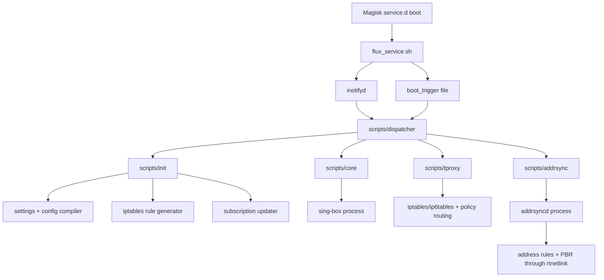

# Current Flux System Baseline

This historical note records the legacy shell baseline at repository commit `c978b75` (`Add CLI control plane, TUN mode, PBR, multi-user proxy, and perf mode`). It is based on that checked-in implementation rather than the README alone. It does not describe current Rust-owned bridge admission: Phase 1 now rejects TUN during `prepare` pending an exact-device single-owner and forced-death route-cleanup canary.

## Scope and size

- Runtime shell under `scripts/`: 3,508 lines across 11 files.
- `addrsyncd` Rust implementation: 7,654 lines under `addrsyncd/src/`.
- Deployment target: a rooted Android device using Magisk, KernelSU, or APatch.
- Current proxy engine: an external `sing-box` process.
- Current interception path: iptables mangle/TPROXY, with an opt-in Sing-Box TUN mode.
- Stated kernel floor: Linux 5.10, although the current implementation does not parse and enforce the running kernel version.

Primary local sources:

- [`flux_service.sh`](../../flux_service.sh)
- [`scripts/dispatcher`](../../scripts/dispatcher)
- [`scripts/init`](../../scripts/init)
- [`scripts/config`](../../scripts/config)
- [`scripts/rules`](../../scripts/rules)
- [`scripts/tproxy`](../../scripts/tproxy)
- [`scripts/core`](../../scripts/core)
- [`scripts/updater.sh`](../../scripts/updater.sh)
- [`addrsyncd/src`](../../addrsyncd/src)

### `addrsyncd` migration provenance

The standalone [`addrsyncd/Cargo.toml`](../../addrsyncd/Cargo.toml) currently declares `license = "UNLICENSED"`, while the rewrite workspace is GPL-3.0-only. Until the copyright holder records an explicit compatible grant, source text and non-trivial implementation expression from the standalone crate must not be copied into the workspace.

The Phase 3 rtnetlink decoder foundation is therefore an independent implementation from the Linux UAPI layout and the documented/fixture-level behavior that Flux must preserve. Its module structure, error model, parsing flow, and tests were written anew; the standalone code remains a behavioral reference and rollback artifact. Every later migration slice must keep this distinction or record the permission/provenance that authorizes direct reuse.

## Current runtime topology

The dispatcher is the nominal orchestrator, but ownership is distributed:

- `dispatcher` decides state transitions.
- `init` compiles configuration and cached rule programs.
- `core` owns the Sing-Box PID and readiness check.
- `tproxy` owns iptables rules, policy routes, compatibility sysctls, and cleanup snapshots.
- `addrsyncd` independently owns address-derived rules and exposes a separate process lifecycle.
- `inotifyd` owns event delivery but has no durable queue or state convergence contract.

## Existing strengths worth preserving

1. **A central state-transition script already exists.** `dispatcher` is explicitly documented as the only shell orchestrator and converges startup failures through `_state_fail`.
2. **Critical generated files use temp-and-rename.** Configuration caches, PID files, generated rules, and deployed subscription output generally avoid in-place writes.
3. **Rules are precompiled before application.** `scripts/rules` emits restore files and `scripts/tproxy` applies them with `iptables-restore --noflush`, reducing per-rule process overhead.
4. **Cleanup remembers the active generation.** Runtime snapshots retain the prior family, marks, routes, feature toggles, and cleanup programs instead of assuming the new configuration matches active state.
5. **`addrsyncd` is already event-driven Rust.** It uses netlink, `epoll`, `timerfd`, `signalfd`, batched acknowledgements, bounded maintenance work, startup cleanup, and compensating resync logic.
6. **Kernel interaction already prefers netlink for policy routing.** The `addrsyncd pbr` command builds route and rule messages directly and classifies idempotent kernel errors.
7. **Configuration input is treated as untrusted.** The shell configuration compiler validates a schema instead of directly sourcing `settings.ini`.

These behaviors should move behind `fluxd` interfaces rather than be discarded.

## Rewrite drivers

### 1. Lifecycle ownership is split

There is no process that can answer, atomically, “Does observed device state match the requested Flux state?” Shell scripts start three independent paths and infer readiness from a port, a TUN interface, and a daemon status command. A failure after one path succeeds relies on best-effort cleanup rather than a recorded transaction or reconciliation loop.

### 2. Capability detection is descriptive, not executable

`scripts/config` infers support from `/proc/config.gz`, loaded module directories, procfs tables, and command presence. That is useful evidence but does not prove that a rule, netlink family, BPF program type, helper, map type, or TUN operation can be used under the device's SELinux and capability policy.

The Rust `KernelContract` defines `5.10` and maps missing-syscall errors to an unsupported-kernel message, but it does not parse `uname` or reject kernels below the floor. The rewrite needs both:

- a hard version-floor check for policy and support reporting;
- active, side-effect-contained probes for actual feature selection.

### 3. Several advertised backends are placeholders

- `RULE_BACKEND` accepts only `iptables_restore`.
- `BYPASS_SET_BACKEND` accepts `zone`, `ipset`, or `auto`, but rule generation always emits the fixed 16-zone chain structure.
- `KFEAT_NFT` and `KFEAT_IPSET` are detected but do not select production adapters.
- The legacy TUN mode delegates `auto_route` and `strict_route` to Sing-Box; Flux does not own or reconcile the TUN interface and routes. This remains baseline evidence, not a mode admitted by the Rust-owned Phase 1 bridge.
- eBPF is explicitly documented as future diagnostic/auxiliary work and has no loader or program lifecycle.

### 4. Mutation is not atomic across subsystems

iptables restore is atomic per table invocation, and many files are atomically replaced, but a Flux transition spans multiple independently committed systems:

1. Sing-Box process/configuration;
2. IPv4 and IPv6 netfilter programs;
3. policy rules and local routes;
4. address-derived rules;
5. sysctls and Android settings;
6. optional QUIC blocking.

The current order can expose partial generations. The rewrite needs a plan/prepare/commit/verify/revert protocol and a reconciler that can repair interrupted commits after restart.

### 5. Configuration and reload semantics are fragmented

User and generated state spans `settings.ini`, `addrsyncd.toml`, `template.json`, generated `config.json`, cached shell assignments, cached iptables programs, active cleanup snapshots, and event marker files. Different files trigger different restart paths, but current `dispatcher` restarts the full stack for all three watched configuration files.

### 6. Android identity and network changes are modeled narrowly

- Per-app policy reads `/data/system/packages.list` during rule generation.
- Multi-user expansion assumes user IDs `0..99` for the `all` option.
- Package install/remove, user lifecycle, UID reuse, VPNs, stacked interfaces, CLAT, OEM netd changes, and default-network transitions are not represented as first-class events.
- `addrsyncd` observes interface addresses, not the complete Android network topology or netd-owned routing changes.
- Current Flux marks occupy the low byte under mask `0xff`; AOSP netd uses bits 0–15 for its `netId` field, so the rewrite must not carry these values forward without remapping and live conflict analysis.
- Current Flux policy rules use priority `2025`, ahead of AOSP netd's documented VPN/default-network priority lattice; the rewrite must define and test whether Android VPN policy is respected rather than assuming this placement is safe.

### 7. Process supervision is shell/PID based

Sing-Box uses a PID file plus `/proc/<pid>/cmdline` validation. `addrsyncd` scans `/proc` for a matching daemon and signals it. A single long-lived supervisor can use child handles, pidfds where available, exit notifications, bounded restart policy, and one control socket.

### 8. Observability is retrospective

Diagnostics concatenate cached files, selected `ip rule` output, iptables chains, and Sing-Box validation. There is no stable machine-readable status model, selected-backend explanation, reconciliation history, health stream, or correlation ID spanning a state transition.

### 9. Privilege is broad and permanent

The runtime is designed around root. It does not yet separate privileged setup from steady-state work, minimize Linux capabilities, constrain filesystem access, or apply a seccomp policy after initialization. Android SELinux behavior is also not captured as a capability input.

### 10. Real-device validation is not yet a release gate

`addrsyncd/docs/baseline-android.env` still contains `BASELINE_CAPTURED_AT=UNSET`. The benchmark script correctly refuses to treat the placeholder as a valid baseline, so the project currently has no checked-in real-device performance gate.

## Migration map

| Current implementation | Target `fluxd` responsibility |
|---|---|
| `flux_service.sh` | Minimal boot wait and `fluxd daemon` launcher only |
| `scripts/dispatcher` | Desired-state reconciler and event scheduler |
| `scripts/init` | Validation, compilation, migration, and preflight planner |
| `scripts/config` | Typed versioned configuration plus capability probe registry |
| `scripts/rules` | Pure capture-policy compiler producing backend-neutral intent |
| `scripts/tproxy` | Transaction coordinator plus nftables/xtables/ipset/routing adapters |
| `scripts/core` | Sing-Box supervisor adapter |
| `scripts/addrsync` + `addrsyncd` | In-process network observer and address/rule reconciler |
| `scripts/updater.sh` | Subscription fetch/parse/transform module with atomic deployment |
| `scripts/fluxctl` | Thin `fluxd` CLI client over the local control socket |
| `scripts/log` | Structured tracing, Android log adapter, and bounded file sink |

## Compatibility obligations for the rewrite

- Preserve installation on Magisk, KernelSU, and APatch.
- Preserve existing `settings.ini` and `addrsyncd.toml` through a one-way migration path before removing them.
- Keep legacy `fluxctl` commands as shell wrappers or command aliases during transition.
- Retain TPROXY behavior until nftables and TUN backends pass device conformance tests.
- Never take ownership of unrelated netd/vendor rules; every kernel object must carry a Flux identity or be reconstructible from the active generation record.
- Support only kernel 5.10 and newer, with explicit diagnostics for an unsupported floor and separately reported missing capabilities.
