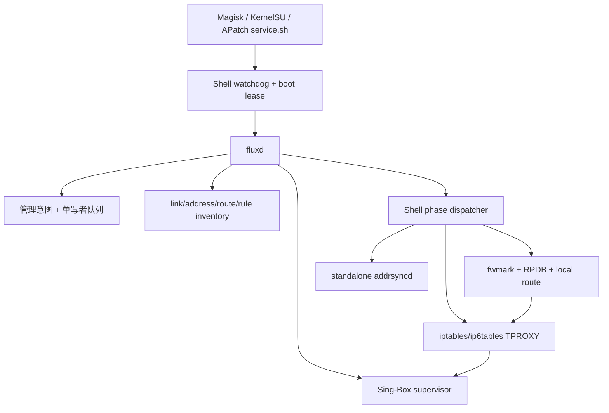

# Flux 当前实现复核（2026-07-12）

本记录补充 [`current-system-baseline.md`](current-system-baseline.md)。旧基线固定在提交 `c978b75`，而本轮复核对象已经推进到提交 `4360d7996a2ed920143092c3e7be30b10f3bb702`（`feat: fail closed on opaque RPDB attributes`）。因此这里重点记录 Rust 重写已经形成的真实能力、仍由旧数据面承担的责任，以及本轮源码复核发现的高优先级问题。

> **历史快照说明：** 正文描述的是提交 `4360d79` 的实现，不应当作当前 HEAD 的实时状态。下方“快照后的进展”记录截至 `868729f` 的后续变化；仍未解决的问题继续保留为设计和回归依据。

> **规划已更新：** 本文“建议的近期顺序”保留为历史研究结论，不再代表当前执行顺序。现行计划以
> ADR-0011 与 `implementation-roadmap.md` 为准：先完成 Rust 所有权切换并删除被替代的旧运行时；
> eBPF、`.ko` 和额外 canary 基础设施不得挤占主线，也不存在可发布的中间 bridge 版本。

## 快照后的进展（截至 `868729f`）

在本快照之后，Network Inventory 已经进入纯规划层，而不再只是未消费的只读库存。分支已经加入：版本化 Android RPDB 分类、按 Traffic Domain 聚合的拓扑可行性报告、正向设备策略约束的 mark planning authority，以及第一块 snapshot-bound RPDB fwmark census fragment。

这些提交仍然刻意不产生 priority、table、mark lease 或 mutation 权限。下一顺序应是：先把精确 Android 产品/构建/vendor、kernel build、verified boot、SELinux policy、netd/Connectivity artifact、工具、boot 和 namespace 身份纳入 freshness-bound profile；再用稳定的平台 artifact 身份查询编译期审阅策略目录，由目录给出唯一 netd profile，并把选中的 assertion 绑定到包含执行工具、verified boot、boot ID 与当前 namespace 的完整 profile；随后完成剩余 census cells 和跨来源同一时点 coordinator。执行文件不能把自身完整哈希嵌回同一执行文件作为编译期 key，运行时 manifest 也不能为自己创建设备授权；这一修正由 ADR-0014 记录。

## 结论先行

1. Flux 已经不是普通的“Magisk 启动脚本集合”。Rust `fluxd` 已经拥有管理意图、串行控制、Sing-Box 子进程、Generation、启动恢复和失败补偿；Shell 被压缩为一个仍然很大的网络写入 Adapter。
2. 当前最有价值的资产是生命周期安全性：候选引擎先通过身份校验和就绪验证，再挂接 Capture Path；停止时必须先证明 Capture Path 已摘除，才允许终止引擎。
3. 当前正确性瓶颈仍在旧 xtables/RPDB 数据面。固定低字节 mark、固定 priority/table、被动能力检测和结构性 `capture-verify` 尚不能证明 Android VPN、Private DNS、多网络和真实流量语义正确。
4. 在本快照点，Rust 已经能原子发布 link/address/route/rule 网络库存，但库存尚未进入 mark 冲突审计、RPDB 放置或后端选择；后续进展见上方历史说明。
5. 本轮还发现若干独立于重写路线的规则语义问题：过宽的 `100.0.0.0/8` bypass、空白名单退化为全代理、TUN 模式仍安装 Flux PBR，以及 `addrsyncd` 在初始同步完成前报告 ready。
6. 外部项目研究支持现有总体方向：保留 xtables/TUN 正确性基线，以 active probe 和 Generation 为前提逐步加入 nftables、`xt_bpf`、观测型 eBPF 和经过验证的 fast path，而不是直接把 dae 或内核模块包装进 Magisk。

## 当前运行拓扑

安装器将 [`flux_service.sh`](../../flux_service.sh) 部署为模块本地 `service.sh`，并删除旧的全局 `service.d` 副本。watchdog 使用 PID、进程启动 tick 和 boot ID 建立同一启动周期内的唯一租约；`fluxd` 就绪后才启动配置与 disable 文件的 `inotifyd` 监听。

`fluxd` 的 mutating 启动顺序是：

1. 收集 kernel、boot ID、SELinux 和 Shell bridge 元数据；低于 Linux 5.10 或 boot ID 不可验证时保持只读。
2. 在读取当前用户配置前执行 `startup-recover`，避免坏配置阻碍旧 Capture Path 的清理。
3. 读取并持久化本次启动周期的管理意图。
4. 通过单一 `flux-legacy-writer` 队列串行执行所有网络状态变化。
5. 准备不可变 Generation，校验 Sing-Box、配置和 launcher 的 SHA-256，执行 `sing-box check`。
6. 启动并验证引擎就绪，再启动地址同步、挂接 TPROXY、验证 Capture Path，最后发布 `RUNNING`。

停止顺序反向执行。如果摘除 Capture Path 失败，`RuntimeCoordinator` 进入 `DetachPending`，保留引擎和所有权证据，不允许在未知网络状态上启动另一代引擎。相关实现位于 [`runtime_coordinator.rs`](../../crates/fluxd/src/runtime_coordinator.rs)、[`engine_supervisor.rs`](../../crates/fluxd/src/engine_supervisor.rs) 和 [`scripts/dispatcher`](../../scripts/dispatcher)。

## 已经值得保留的设计

### 1. Generation 和失败补偿

Shell 先生成私有 Generation 目录、配置、规则和 engine manifest，随后将目录变为只读。候选启动失败时，Rust 协调器会尝试重新激活上一代；若回滚也失败，则发布可诊断的失败状态，而不是假定清理成功。

### 2. 引擎所有权验证

Rust 不再只依赖 PID 文件。它绑定可执行文件、配置、launcher 和 Generation 身份，验证监听端口或 TUN 链路确实属于被监督的 child，并在直接启动路径使用 parent-death 约束。这比同类模块普遍采用的 `pidof`/PID 文件模型可靠得多。

### 3. 私有控制面

控制 socket 使用 `SOCK_SEQPACKET`、权限 `0600`，并逐连接验证 `SO_PEERCRED` 与 daemon euid。这个边界应继续作为 UI、CLI 和未来诊断接口的唯一管理入口，避免暴露默认密码的 LAN HTTP 管理面。

### 4. 严格配置与只读网络库存

`flux.toml` 有大小上限、严格 schema、未知字段拒绝和 symlink 防护；旧 `settings.ini` 也先通过 AWK schema 编译，而不是直接 source 用户输入。Rust 网络观察器已经能在一个一致 epoch 中发布 link/address/route/rule 库存，为后续冲突分析、Network Epoch 和后端规划提供了正确基础。

## 当前数据面

| 维度 | 当前实现 |
|---|---|
| Capture Path | 默认 xtables TPROXY；Sing-Box TUN 为可选模式 |
| 流量入口 | `PREROUTING` 覆盖转发/热点；`OUTPUT` 覆盖本机应用 |
| 应用身份 | `/data/system/packages.list` + `xt_owner`，只适用于 OUTPUT |
| 决策缓存 | `CONNMARK` 缓存 PROXY/BYPASS；可选 `xt_socket` DIVERT |
| 地址集合 | 固定 16 区 goto 骨架；尚未启用真实 ipset/nft set backend |
| 路由 | IPv4 mark `0x14`、IPv6 mark `0x19`、mask `0xff`、table/pref `2025` |
| 动态地址 | standalone `addrsyncd` 在 priority `1900` 维护本机地址到 main table 的规则 |
| 原子边界 | `iptables-restore --noflush` 可保证单表提交；跨引擎、规则、RPDB、地址同步仍非一个内核事务 |
| 验证 | 检查进程、运行时文件、cleanup artifact 和 mode；不是端到端数据包 canary |

主要规则生成位于 [`scripts/rules`](../../scripts/rules)，应用和清理位于 [`scripts/tproxy`](../../scripts/tproxy)。

## 本轮发现的问题

### P0：Android mark 与 RPDB 共存仍未完成

当前 `0xff` mask 会覆盖 Android fwmark 的 `netId` 低 16 位，priority `2025` 的语义也可能先于 netd 的 VPN/default-network 策略。结果不只是“Flux 自己的 mark 可能冲突”，还可能让非 Flux 流量误命中 local route、绕过 VPN 或破坏 lockdown 语义。

这项风险已经被 [`ADR 0006`](../adr/0006-allocate-marks-after-android-conflict-analysis.md) 正确识别。本快照点已有 RPDB placement 和 fwmark audit 基础；此后 inventory 已进入纯 planner，但仍没有分配或 activation lease。任何持久 mutation 之前仍必须完成精确设备身份、受审阅策略目录、完整 27-cell census、writer/preservation canary 和新鲜度验证。

### P0：`capture-verify` 仍是结构验证

[`scripts/dispatcher`](../../scripts/dispatcher) 的 `_state_capture_verify` 只确认：

- attached Generation 与候选一致；
- `addrsyncd status` 成功；
- runtime/cleanup 文件存在；
- `PROXY_MODE` 与候选一致。

它没有验证规则内容、RPDB 选择、listener 到 TPROXY 的真实流量、DNS、防环路、IPv6、VPN 或 fail-open。Generation 只有通过受控 TCP/UDP/DNS canary 后才能被称为功能性 verified。

### P0：能力检测尚未证明能力可用

Rust mutation gate 目前主要依赖 kernel floor 和 boot identity；Shell 主要读取 `/proc/config.gz`、模块目录和命令是否存在。这无法区分 unsupported、SELinux denied、缺少 userspace extension、hook 冲突、厂商回移 bug 或暂态失败。

每个候选 backend 都需要 create/use/observe/delete probe，并保留原始 errno、extack、verifier 或命令错误。NetProxy-Magisk 对 `xt_bpf` 同时检查配置和执行 `probe` 的做法证明这种模式在 Magisk 模块中可落地，但 Flux 应使用可审计源码和更严格的副作用边界。

### P1：`addrsyncd` ready 早于初始同步完成

standalone daemon 建立 epoll 状态后立即通知 ready，此时 `startup_cleanup_pending` 仍为 true，初始 dump、清理和规则收敛尚未完成。上层只检查进程 status，因此可能在地址 bypass 规则尚未就绪时发布 `RUNNING`。

迁入 `fluxd` 后，ready 必须至少代表：初始 dump 完整、loss 状态清除、所需规则已 apply 并重新 dump 验证。过程状态可以单独报告为 `Starting`，不能复用“进程已进入 event loop”作为“网络状态已收敛”。

### P1：固定 bypass 列表包含过宽的 `100.0.0.0/8`

[`scripts/rules`](../../scripts/rules) 将整个 `100/8` 设为 direct，而 RFC 6598 的运营商级 NAT 只有 `100.64.0.0/10`。除非这是经过明确记录的产品策略，否则会让大量公网目的地址绕过代理。该常量应改为规范前缀，并加入编译器 fixture 防止回归。

### P1：空白名单会退化为全代理

应用白名单模式下，如果 `APP_LIST` 为空，规则构建函数直接返回，没有生成终止规则；随后 `PROXY_OUTPUT` 的默认动作仍然代理流量。因此“白名单为空”的直觉语义与实际行为相反。

建议把空集合语义写入 typed Capture Policy：白名单空集应代理零个应用；黑名单空集应代理所有允许范围内的应用。编译器应对空集做显式分支并用 golden test 固定。

### P0：TUN 模式仍安装 Flux fwmark PBR

TUN 模式下规则生成器会输出空 mangle 程序，但 [`scripts/tproxy`](../../scripts/tproxy) 仍对每个启用地址族执行 `_route apply`。同时 Sing-Box 自己启用 `auto_route=true` 和 `strict_route=true`。这形成两个不完整的路由 owner，并继续暴露低字节 mark 冲突。

在 `EngineOwnedTun` 方案完成前，TUN 模式至少应证明 Flux PBR 是必要且不会与 Sing-Box/netd 重叠；否则应停止安装这组规则。

### P2：身份与配置生命周期仍有旧路径裂缝

- 包安装、卸载、UID 重用和新 Android user 不会自动触发应用规则重编译；`all` 仅枚举 user `0..99`。
- 当 Sing-Box 以 `root:root` 运行时，owner 防环路规则也会让其他 root/root 流量 bypass。
- `fluxd status` 已直接返回 Rust-owned Sing-Box 状态；旧 `fluxctl` shell 包装器已删除。
- 安装迁移没有覆盖全部 TUN、用户范围和 `PROXY_MODE` 字段。
- `fluxd cleanup --offline` 与 `uninstall.sh` 已完成 Rust 委托；设备级运行资格仍未验证。
- `conf/manifest.json` 的二进制来源、版本和 SHA-256 仍为空，stage 工具没有验证它们。

## 与外部项目比较时的定位

| 维度 | Flux 当前优势 | 当前缺口 |
|---|---|---|
| 生命周期 | 单写者、Generation、启动恢复、capture-first detach | Shell 网络 Adapter 仍承担大量隐式状态 |
| Android 适配 | Magisk/KSU/APatch、本机/热点、UID、动态地址 | mark/RPDB/VPN/Private DNS 语义未完成 |
| 数据面 | xtables 基线覆盖面广 | 无 native nft、真实 ipset、生产 eBPF |
| 动态网络 | 已有完整 Rust inventory，且快照后已驱动部分纯 planner | 尚未进入 runtime reconciliation/native mutation |
| 验证 | 引擎所有权验证强 | Capture Path 没有真实数据包 probe |
| 安全边界 | 私有 peer-credential socket | 稳态 root、无 capability drop/seccomp、供应链 manifest 未闭环 |
| 发布证据 | host Rust 测试较强 | Shell 行为测试未进 CI，真实 Android/性能/VPN 矩阵缺失 |

详细外部项目对照与 `xt_bpf` 实验建议见 [`peer-kernel-projects-2026-07.zh-CN.md`](peer-kernel-projects-2026-07.zh-CN.md)。

## 建议的近期顺序

1. 先修复可独立验证的规则语义：`100.64.0.0/10`、空白名单、TUN PBR owner、旧 CLI 状态和安装迁移。
2. 完成精确设备/构建/artifact 身份和编译期审阅策略目录，再补齐剩余 census fragments 与 27-cell coordinator；不要从“扫描未发现冲突”直接跳到 lease。
3. 为 xtables TPROXY、route、TUN、nftables 和 `xt_bpf` 建立有副作用边界的 active probe registry。
4. 把 `capture-verify` 升级为 Generation-scoped TCP/UDP/DNS canary。稳态能力分为 supported、unsupported、denied、conflicting、broken 和 unknown；暂态失败作为带 retry/backoff 的 probe-attempt 证据记录。
5. 将 standalone `addrsyncd` 的 readiness 改成“初始收敛完成”，随后再迁入 `fluxd` 的同一 reactor。
6. 在传统规则保持完整正确的前提下，实验 `xt_bpf` 观测/正向 fast path；不要先引入物理接口 TC 或 LKM。
7. 建立至少两台 5.10/5.15 Android 设备与一台 6.1+ 设备的 VPN、CLAT、热点、IPv6、Private DNS 和 crash-recovery 基线。

## 本地主要证据

- 启动与 watchdog：[`flux_service.sh`](../../flux_service.sh)、[`customize.sh`](../../customize.sh)
- Generation 与 Shell writer：[`scripts/dispatcher`](../../scripts/dispatcher)
- 规则编译：[`scripts/rules`](../../scripts/rules)
- xtables/RPDB 适配：[`scripts/tproxy`](../../scripts/tproxy)
- Rust daemon admission：[`crates/fluxd/src/daemon.rs`](../../crates/fluxd/src/daemon.rs)
- 生命周期协调：[`crates/fluxd/src/runtime_coordinator.rs`](../../crates/fluxd/src/runtime_coordinator.rs)
- 引擎监督：[`crates/fluxd/src/engine_supervisor.rs`](../../crates/fluxd/src/engine_supervisor.rs)
- 控制面：[`crates/flux-core/src/control.rs`](../../crates/flux-core/src/control.rs)、[`crates/fluxd/src/socket.rs`](../../crates/fluxd/src/socket.rs)
- 网络库存：[`crates/flux-platform/src/network_observer`](../../crates/flux-platform/src/network_observer)
- standalone readiness：[`addrsyncd/src/daemon/service.rs`](../../addrsyncd/src/daemon/service.rs)
