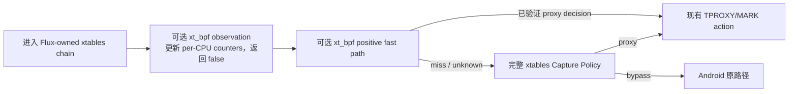

# dae、Re:Kernel 与 Android 透明代理/内核项目研究（2026-07）

研究日期：2026-07-12（Asia/Singapore），Flux 进度基线于 2026-07-13 刷新。本轮将上游仓库浅克隆到操作系统临时目录，只读取源码，不向 Flux vendoring 任何第三方代码。结论固定到下表 commit，避免默认分支继续变化后失去可复查性。

## 结论先行

1. 用户所说的 `re-kernel` 最合理指向 [`Sakion-Team/Re-Kernel`](https://github.com/Sakion-Team/Re-Kernel)。它是为 Android 冻结/“墓碑”工具提供 Binder、Signal、Network 事件和 socket 清理能力的 LKM/eBPF 项目，**不是透明代理数据面**。
2. dae 最值得学习的是“real direct”：首包在 TC eBPF 中决定 direct/block/proxy，direct 流量完全不进入用户态。它的统一规则 IR、连接决策缓存和 DNS answer → domain-rule bitmap 也很有价值。
3. dae 不适合直接包装成 Android Magisk 模块。v2.0.0 名义最低为 Linux 5.17，但实际内核 CI 已集中到 6.6/6.12；它还会整体写 skb mark、依赖命名 netns/BTF/TC/cgroup，并以 16 字节进程名作为重要身份信息，这些都与 Android netd、多网络和 UID 模型冲突。
4. NetProxy-Magisk 展示了一个比“直接上 TC/XDP”更现实的 Android eBPF 切口：将 pinned `BPF_PROG_TYPE_SOCKET_FILTER` 作为 iptables `xt_bpf` match，用 UID hash map 和 CIDR LPM trie 缩短规则链，真正的 TPROXY/REDIRECT 仍由 xtables 完成。
5. AOSP Android 12/13 的 5.10 base config 确实启用 `BPF_SYSCALL`、BPF JIT、cgroup BPF 和 `CONFIG_NETFILTER_XT_MATCH_BPF`；AOSP iptables 也支持 `--object-pinned`。这使 `xt_bpf` 值得做 Flux 实验，但仍不能替代运行时 probe。
6. `xt_bpf` 不需要接管物理接口 qdisc、Android root cgroup 或 XDP，冲突面天然小于 dae 式 TC 数据面。只使用 `__sk_buff`、稳定 helper 和 maps 时也可以避免 BTF/CO-RE 依赖。
7. Flux 第一版 `xt_bpf` 不应直接决定 bypass。最安全的顺序是：先做永远返回 false 的观测程序；再做“命中已验证 proxy 决策则快进、未命中继续传统完整分类”的正向 fast path。
8. Re:Kernel 的 boot-loop marker、ring buffer、typed Netlink 和派生项目 ReKernel-X 的逆序 rollback 值得借鉴；它的私有 kprobe、LKM/KMI 分发、无内部授权 Netlink/abstract socket 不应成为 Flux 核心路径。
9. AndroidTProxyShell 的 dry-run、启动参数快照和独立 capture backend 很实用；MagicNet 的 loopback-only 控制面、PID-aware lock、临时文件 + rename 和 coexistence-first 模式设计也值得吸收。
10. 不应复制 opaque eBPF/LKM 二进制、开放全接口管理 API、固定 secret、硬编码 sysctl 恢复值或未经哈希验证的 root 下载物。Flux 的优势应继续是可审计、可回滚、可解释的 Generation 和 Capability Profile。

## 研究快照

| 项目 | 固定版本 | 定位 | 许可证 |
|---|---|---|---|
| Flux | `868729fcce4d076b11e7746d8ec39369f26159f2` | Android root 透明代理；Rust 控制面 + xtables/TUN 数据面；已加入 RPDB mark census 首个 fragment | GPL-3.0-only |
| dae | `v2.0.0`, `fee4c8661059bfc5a60ca8eaad59a1030cb35128` | Linux TC/cgroup eBPF 透明代理 | AGPL-3.0-only |
| Re:Kernel | `824f20b7b73f17a8ae6ea034ac6209f64f1452e9` | Android 冻结事件 LKM/eBPF 层 | GPL-2.0 |
| ReKernel-X | `6b13ac6318798c74b4b73cc98b8a0a35de2951c9` | Re:Kernel 派生；强化 rollback 与 typed Netlink | GPL-2.0 |
| NetProxy-Magisk | `16ba555b502110360a0d891de37a6ecddb7692c4` (`nightly`) | sing-box + TPROXY/REDIRECT + `xt_bpf` matcher + IPSet LKM | GPL-3.0 |
| Box for Root | `a87244943abdd1cf0f278c708001b2aef56adb9c` | 多核心 Magisk/KSU/APatch 透明代理 | GPL-3.0 |
| AndroidTProxyShell | `303f3c66db9ce9b052dbacfa5a58957fd1943d84` | 可独立复用的 Android TPROXY/REDIRECT shell backend | GPL-3.0 |
| MagicNet | `b008b5f60f4a7ceaf85efc955f65fc300c8126de` | sing-box TUN/显式代理编排与本地控制面 | MIT |
| IPSET_LKM | `0ce7e1247b67b8d4e2723b9e54d2c383927e6bc1` | 为 Android 分发 ipset/xt_set 内核模块 | GPL-2.0-or-later |
| Linux | `v5.10`, `2c85ebc57b3e1817b6ce1a6b703928e113a90442` | `xt_bpf`、socket-filter helper 与 BPF UAPI | GPL-2.0-only |
| AOSP iptables | `672d4a9452846646a3017d255fae319e12d92295` | Android xtables userspace，包括 `--object-pinned` | GPL-2.0 |
| AOSP kernel configs | `bd79f38685cf939ab836dd8ddd2e01506ccff47a` | Android base kernel capability 要求 | Apache-2.0 |

## 项目分类

这些项目不能放在同一条“谁更快”的排行榜中：

| 类别 | 项目 | 对 Flux 的主要价值 |
|---|---|---|
| 同类 Android 模块 | NetProxy、Box for Root、AndroidTProxyShell | Magisk 生命周期、TPROXY/REDIRECT、UID、热点、兼容性和用户体验 |
| 高能力数据面参考 | dae | real direct、TC/cgroup hooks、规则 IR、flow cache、DNS bitmap |
| Android 内核相邻项目 | Re:Kernel、ReKernel-X | LKM/eBPF 生命周期、Binder/Signal/Network 事件、Netlink、boot-loop 保护 |
| 共存/控制面参考 | MagicNet | loopback 控制面、原子配置、锁、显式代理/TUN 模式取舍 |
| 内核原语 | Linux `xt_bpf`、AOSP iptables/config | 判断低冲突 eBPF 中间层是否真实可行 |
| 兼容性附件 | IPSET_LKM | 说明 LKM 能补齐功能，也说明 KMI、启动和供应链成本 |

## 1. dae：学习数据面思想，不直接移植

### 1.1 real direct 是核心收益

dae 在 LAN/WAN TC ingress/egress 上解析首包，结合 cgroup socket hooks 建立 socket cookie → PID/进程名关系，然后在内核中执行 route：

- direct：返回 `TC_ACT_OK`，不创建用户态代理连接；
- block：返回 `TC_ACT_SHOT`；
- proxy：重定向到 `dae0`/`dae0peer`，再通过 mark、local route 和 socket assignment 交给用户态 listener。

这比“所有流量先进 TUN/代理，再让代理 direct”更节省 fd、端口、上下文切换和用户态状态，尤其适合 BT、游戏和大量短连接。源码入口见 [dae TC/cgroup programs](https://github.com/daeuniverse/dae/blob/fee4c8661059bfc5a60ca8eaad59a1030cb35128/control/kern/tproxy.c) 和 [working principle](https://github.com/daeuniverse/dae/blob/fee4c8661059bfc5a60ca8eaad59a1030cb35128/docs/en/how-it-works.md)。

### 1.2 统一规则 IR、DNS bitmap 和连接缓存

dae 先把 domain、IP、port、protocol、MAC、process、DSCP 等规则正规化，再同时生成内核 matcher 与用户态镜像。IP/MAC 进入 LPM map-of-maps，连接最终决策进入 `conn_state_map`，后续包跳过完整规则求值。

DNS 不是旁路组件：A/AAAA answer 会转换成“该 IP 命中了哪些 domain rule”的 bitmap，写入 BPF map。后续连接只需用目的 IP 查 bitmap，即可把 domain 证据带入内核路由决策。一个 IP 对应多个域名时做 OR 合并，这能保持引用一致，但不能解决共享 CDN IP 的语义歧义。

值得概念性移植：

- 一个 Capture Policy IR，多 backend 编译；
- 首包决策 + per-flow cache；
- DNS cache 同时作为 domain routing 控制面数据库；
- map 容量、overflow、janitor 和 drop/fail-open 都进入显式状态；
- reload 以新旧 Generation 切换，而不是 kill/start。

### 1.3 Android 不兼容点

1. dae v2.0.0 文档要求 kernel >=5.17，当前 CI 只覆盖 6.6/6.12，并明确因 verifier 限制放弃 6.1。Android 5.10/5.15 不能按版本号乐观启用。
2. direct 路径会整体赋值 `skb->mark`，默认私有 mark 还有 `0x100`。Android netd 把 fwmark 用于 netId、VPN protect、permission 等语义，必须按审计后的 mask 合并，不能清零或覆盖整值。
3. dae 使用命名 netns、`/run/netns`、TC、cgroup v2、BTF/CO-RE 和较新的 helpers；Android 的 SELinux、bpffs、vendor kernel 和 netd ownership 都可能阻止它。
4. process name 最长 16 字节，不适合作为 Android 包/进程身份主键；Flux 应以 UID/user/package epoch 为主。
5. DNS→IP 学习在 Private DNS、App DoH、缓存和共享 IP 下不完整；不能把 domain direct 当成永远可靠的真实身份。
6. `wan_interface: auto` 与桌面 Linux 默认路由模型不等价于 Android Wi-Fi/蜂窝/CLAT/VPN 的持续变化。

因此 dae 应作为长期“高能力 tier”参考，而不是 Flux 5.10 基线依赖。

## 2. Re:Kernel：事件层，而不是代理

### 2.1 身份确认与实际能力

精确项目名、Android/AArch64 定位、活跃提交和同时存在的 `LKM-Source/`、`eBPF-Source/` 共同指向 [`Sakion-Team/Re-Kernel`](https://github.com/Sakion-Team/Re-Kernel/tree/824f20b7b73f17a8ae6ea034ac6209f64f1452e9)。README 推荐 Linux >=5.10 使用 Magisk LKM，旧内核则集成进内核源码。

它观察：

- Binder transaction/reply/free-buffer；
- 对冻结进程发送的 fatal signal；
- 被选择 UID 收到的 TCP 数据；
- 可选地销毁指定 PID 的 IPv4/IPv6 TCP/UDP socket。

LKM 网络 hook 位于 `NF_INET_LOCAL_IN`，最终始终 `NF_ACCEPT`；eBPF 网络程序挂在 `kprobe/sk_filter_trim_cap`，只向 ring buffer 写事件。它不重定向数据包，也不实现 TPROXY/TUN，所以不能替代 Flux Capture Path。

### 2.2 值得借鉴

- [`template/post-fs-data.sh`](https://github.com/Sakion-Team/Re-Kernel/blob/824f20b7b73f17a8ae6ea034ac6209f64f1452e9/template/post-fs-data.sh) 在加载 `.ko` 前写 `.boot` marker；若上次启动未能清除 marker，下次启动自动创建模块 `disable`。这是简单有效的 boot-loop quarantine 思路。
- eBPF 版本用 ring buffer、UID hash map、epoll 和独立用户态 daemon，把高频事件变成有界异步通道。
- Generic Netlink family 有版本、NLA policy 和 multicast group；比私有文本 procfs 协议更易演进。
- 派生项目 [ReKernel-X](https://github.com/myflavor/ReKernel-X/tree/6b13ac6318798c74b4b73cc98b8a0a35de2951c9) 在 module init 失败时逆序注销 hook，并调用 `tracepoint_synchronize_unregister()`；Binder hook 也用状态位做局部 rollback。这与 Flux 的 prepare/compensate/retire 模型一致。

### 2.3 不应照搬

1. 原始 LKM 的 Generic Netlink ops 没有 `GENL_ADMIN_PERM`、capability 或 sender UID 检查，`killNet` 可以请求销毁任意 PID socket；安全完全依赖外部 SELinux。
2. eBPF daemon 的 abstract Unix socket 没有 `SO_PEERCRED` 检查，能连接者可修改监控 UID 并接收事件。
3. module init 某个 hook 失败时直接返回，没有释放此前成功注册的 hook；内核模块中这种部分初始化比用户态泄漏更危险。
4. binder kprobe 注册路径存在返回值检查错误：调用结果没有写回 `rc`，随后检查旧值。
5. eBPF 依赖设备 BTF 与私有 kprobe symbol；README 甚至要求不兼容时从设备 BTF 重新生成 `vmlinux.h`。这不是可广泛分发的稳定 ABI。
6. README 的“内核模块无法被检测”不是可依赖的安全承诺；LKM、sysfs/proc、BPF objects、hook 和行为都可能成为检测面。

Flux 可以把 Binder/Signal 事件作为未来诊断或后台策略输入，但不应让它成为 Capture Path 正确性的依赖。

## 3. NetProxy-Magisk：`xt_bpf` 是本轮最有价值的新线索

### 3.1 实际架构

NetProxy 的透明代理仍由 iptables 完成：自动探测 TPROXY，失败回退 REDIRECT，配合 DNS、UID、MAC、热点、policy route 和 Sing-Box。eBPF 只替代部分匹配工作：

1. 配置默认启用 `EBPF_MATCHER_ENABLE=1`，要求 `CONFIG_NETFILTER_XT_MATCH_BPF` 与 hash/LPM maps。
2. Shell 先检查二进制、kernel config，再执行 `ebpf-matcher probe`；失败将 `HAS_BPF=0`。
3. loader 根据 UID mode 和 CN CIDR 生成 policy JSON，把 IPv4/IPv6、OUTPUT/PREROUTING 四个 socket-filter 程序 pin 到 bpffs。
4. iptables 在 TPROXY/MARK/REDIRECT action 前插入 `-m bpf --object-pinned ...`。
5. BPF 返回“不匹配”时自然绕过该 action；loader 失败则回到 `xt_owner` + ipset。

关键包装代码见 [feature probe](https://github.com/Fanju6/NetProxy-Magisk/blob/16ba555b502110360a0d891de37a6ecddb7692c4/src/module/scripts/network/tproxy.sh#L566-L579)、[pinned match](https://github.com/Fanju6/NetProxy-Magisk/blob/16ba555b502110360a0d891de37a6ecddb7692c4/src/module/scripts/network/tproxy.sh#L1296-L1338) 和 [policy/load lifecycle](https://github.com/Fanju6/NetProxy-Magisk/blob/16ba555b502110360a0d891de37a6ecddb7692c4/src/module/scripts/network/tproxy.sh#L1626-L1712)。

### 3.2 为什么它比物理接口 TC 更适合先实验

- hook ownership 仍在 Flux 已经拥有的 xtables chain 内，不需要创建/接管 `clsact` qdisc；
- 不附着 Android root cgroup，不与 netd 的全局 cgroup programs 争用；
- socket-filter 使用稳定 `__sk_buff` context、packet access、maps 和 `bpf_get_socket_uid` 时可不依赖 BTF；
- rule insertion 失败时传统 xtables compiler 仍可生成完整路径；
- 可以分别编译 OUTPUT 与 PREROUTING 程序：OUTPUT 可读取 socket UID，PREROUTING 只做地址/端口/协议判断；
- map lookup 能把大量 UID/CIDR 规则压缩为固定数量 match。

### 3.3 需要警惕的实现细节

- 固定 checkout 中 `ebpf-matcher` 是 stripped、静态链接的 AArch64 Go ELF；仓库没有找到对应源码或可复现 build workflow。其 SHA-256 为 `9535b9310fe04ef07c21c388669051bcfea7b3c7aefde59e15f4b3f56d7c759e`。Flux 应独立实现并发布源码/SBOM，不复制 opaque artifact。
- wrapper 注释说明 loader 会动态应用 `allow netd * bpf ...` 一类 SELinux policy。Flux 不应静默扩大 netd 的全局权限；probe 失败应报告 denied 并降级。
- 默认管理端点绑定 `<device-ip>:9999`，secret 固定为 `singbox`；配置中还有全接口 mixed/API listener。Flux 应继续使用 loopback 或 filesystem Unix socket，并生成随机凭据。
- `post-fs-data` 早期加载按内核版本分发的 IPSet `.ko`。major/minor 匹配不能证明 KMI/vermagic/vendor ABI 一致，LKM 不应成为 Flux 通用 fallback。
- feature detection 仍大量依赖 `/proc/config.gz`，sysctl 清理存在写死 `0` 而不是恢复原值的路径。active probe 和 journal 仍需加强。

## 4. Linux/AOSP 对 `xt_bpf` 可行性的证据

### 4.1 Android 5.10 基础配置

AOSP Android 12/13 的 5.10 base configs 包含：

```text
CONFIG_BPF_JIT=y
CONFIG_BPF_SYSCALL=y
CONFIG_CGROUP_BPF=y
CONFIG_NETFILTER_XT_MATCH_BPF=y
```

固定来源：[Android 12 5.10 base config](https://android.googlesource.com/kernel/configs/+/bd79f38685cf939ab836dd8ddd2e01506ccff47a/s/android-5.10/android-base.config) 和 [Android 13 5.10 base config](https://android.googlesource.com/kernel/configs/+/bd79f38685cf939ab836dd8ddd2e01506ccff47a/t/android-5.10/android-base.config)。

这只是 eligibility hint。OEM 配置、模块装载、userspace extension、bpffs label、SELinux 和 helper/verifier 行为仍可能不同，所以 Flux 必须实际创建、pin、引用、发包、观察、删除。

### 4.2 Linux `xt_bpf`

Linux 5.10 的 [`net/netfilter/xt_bpf.c`](https://github.com/torvalds/linux/blob/2c85ebc57b3e1817b6ce1a6b703928e113a90442/net/netfilter/xt_bpf.c) 明确：

- pinned path 通过 `bpf_prog_get_type_path()` 获取；
- 程序类型必须是 `BPF_PROG_TYPE_SOCKET_FILTER`；
- 每个包执行程序，非零表示 match；
- rule destroy 时释放 program 引用。

Linux 5.10 的 socket-filter helper table 包含 `bpf_get_socket_uid`，它从 `skb->sk` 读取 socket owner；无 full socket 时返回 overflowuid。因而 UID 只能在真实具备 socket association 的路径上使用，不能假定 PREROUTING/tether 包都有 UID。

### 4.3 AOSP iptables

AOSP [`extensions/libxt_bpf.c`](https://android.googlesource.com/platform/external/iptables/+/672d4a9452846646a3017d255fae319e12d92295/extensions/libxt_bpf.c) 的 revision 1 支持：

```text
-m bpf --object-pinned /sys/fs/bpf/... -j <target>
```

它使用 `BPF_OBJ_GET` 打开 pinned object，再把 FD 传给 xtables rule。manpage 还强调 xtables 看到的是 network-layer packet，没有 Ethernet header。Flux probe 必须使用与真实 hook 完全相同的 program、family、table 和 chain context。

## 5. 建议的 Flux `xt_bpf` 实验路线

`xt_bpf` 应被视为“可选观测/正向加速层”，不是新的必选 Capture Path。



### 阶段 A：观测，不改变决策

- 程序读取 family/protocol/port/UID/cookie 等可用字段并更新 bounded per-CPU counters；
- 最终始终返回 `0`，因此所在 iptables rule 不匹配，后续传统规则完整执行；
- 只验证 program load、pin、iptables reference、packet context、map read 和 cleanup；
- 不动态修改 SELinux，不可用时报告明确 degradation。

### 阶段 B：只加速正向 proxy 命中

- 从同一个 Capture Policy 编译 UID/CIDR/port maps；
- 仅当 BPF 对“应代理”有完整证据时返回非零并跳到既有 proxy action；
- miss、overflowuid、fragment ambiguity、unsupported header 或 map generation mismatch 全部继续传统 classifier；
- 暂不让 BPF 直接 `RETURN` bypass，避免 false positive 绕过代理/VPN 策略；
- 用传统 classifier 作为 oracle，记录抽样 parity counters。

### 阶段 C：连接决策 cache

- 阶段 B 的 proxy-positive classifier 在首次完整 map 评估后，把已验证的 proxy decision 写入 bounded LRU flow map；
- 后续包通过 cookie/五元组命中时快进 proxy action；
- 连接结束、Network Epoch、Generation 切换和容量压力有明确回收语义；
- direct/bypass cache 只有经过真实设备 parity 和 failure tests 后再考虑。

### Generation 与 pin 生命周期

建议目录：

```text
/sys/fs/bpf/flux/<boot-id>/<generation>/
  out_v4
  out_v6
  pre_v4
  pre_v6
  maps/...
```

准备新一代时创建全新 maps/programs/pins，插入引用新路径的私有 chains，验证后只切换稳定 jump。清理顺序必须是：先删除引用程序的 xtables rules，再 unpin programs/maps，最后删除目录。crash recovery 根据 journal 和 Flux chain identity 重建所有权；绝不扫描或删除其他 bpffs 对象。

### Active probe 清单

1. bpffs 已挂载且 Flux-owned 子目录可创建、label 可用；
2. `BPF_MAP_TYPE_HASH`、`LPM_TRIE`、per-CPU map 的真实 create/update/lookup/delete；
3. `BPF_PROG_TYPE_SOCKET_FILTER` load 和所需 helper/verifier；
4. IPv4/IPv6 direct packet access 和 fragment/extension-header行为；
5. AOSP/vendor iptables revision 1 与 `--object-pinned`；
6. 在私有 canary chain 中引用程序并发送受控 packet，验证 match/counter；
7. 删除 rule 后 program ref 和 pin 清理符合预期；
8. SELinux denied、missing extension、verifier reject、map unsupported 和 hook semantics broken 分开分类。

### 必须先有的 benchmark

比较至少四组 workload：

- 小 UID/小 CIDR：传统规则可能更快；
- 大 UID/小 CIDR；
- 小 UID/大 CIDR；
- 大 UID/大 CIDR + 高并发短连接。

记录首次 apply 时间、每包 CPU、每连接首包延迟、map memory、battery/thermal、规则更新中断窗口和传统 fallback 的差异。没有明确收益时不应增加生产复杂度。

## 6. 其他同类项目的启发

### Box for Root

优点：支持多 root 管理器/多代理核心，经典 TPROXY/REDIRECT/TUN、UID/GID、热点、DNS 和对称清理完整；核心生命周期与规则生命周期分开，网络变化可只刷新局部链。

需要避免：外置全局 `service.d`、大量 shell/inotify/crond ownership、source root 配置、未经签名/哈希的下载、`--insecure`/`--no-check-certificate` 和 `chmod 6755`。它说明兼容性知识有价值，但不是 Flux 目标控制面形态。

### AndroidTProxyShell

最适合当“行为 oracle/兼容 backend”研究：

- 不绑定具体 proxy engine；
- 支持 dry-run/verbose；
- 保存启动时 runtime config，停止按当时参数清理；
- TPROXY/REDIRECT、DNS、UID、MAC、IPv6、热点和 ipset 组合清晰。

需要独立改进：source 配置、通用 chain 名、config-only feature detection、硬编码 forwarding 恢复值和无跨子系统 journal。

### MagicNet

值得吸收：

- 把显式 local proxy、external TUN、hybrid 和 root TUN 分成不同共存模式；
- listener/control 默认 loopback；
- PID-aware lock、临时文件 + atomic rename、fswatch 只触发幂等 apply；
- support bundle 与敏感信息脱敏；
- 不把未完成 eBPF redirect 自动晋升为默认。

它也说明另一条产品路线：当“绝对透明”会与 Android VPN/网络 owner 冲突时，可以提供 proxy/external-tun 模式作为低冲突能力，而不是偷偷改变系统策略。

### ReKernel-X

它不是代理，但它展示了一个通用原则：每个注册动作都要有成功位，任何中途失败都逆序 rollback，并在卸载 trace hook 后等待同步完成。Flux 用户态同样应对 route、rule、chain、program、pin、child 和 sysctl 采用显式 prepared/active/retired 状态。

## 7. 决策矩阵

| 上游思想/实现 | Flux 决策 | 原因 |
|---|---|---|
| dae real-direct 目标 | 长期采用概念 | 最大性能/电量收益，但 Android hook 与 mark 需要重设计 |
| dae 统一规则 IR | 采用 | 同一语义生成 xtables/nft/TUN/eBPF 与 userspace oracle |
| dae DNS bitmap | 研究原型 | 有价值但受 Private DNS/DoH/shared IP 限制 |
| dae 完整 TC/cgroup/netns 数据面 | 暂缓 | 5.10/5.15、netd、SELinux、BTF、qdisc ownership 风险高 |
| NetProxy `xt_bpf` matcher | 优先 spike | AOSP 5.10 有基础支持，且复用 Flux-owned xtables hook |
| NetProxy opaque loader/LKM | 不采用 | 不可审计、不可复现、KMI 与 SELinux 风险 |
| Re:Kernel boot-loop marker | 改造采用 | 可用于启动周期 quarantine，但用户态 daemon 仍以 journal 为主 |
| Re:Kernel Binder/Signal events | 可选诊断 | 不参与 Capture Path 正确性 |
| Re:Kernel 私有 kprobe/LKM core | 不采用 | ABI、rollback、授权和设备覆盖成本过高 |
| ReKernel-X staged rollback | 采用原则 | 与 Flux Generation/compensation 一致 |
| AndroidTProxyShell dry-run/runtime snapshot | 采用 | 便于 backend oracle、诊断和可靠 cleanup |
| MagicNet loopback/lock/atomic config | 采用 | 减少控制面暴露与竞态 |
| Box for Root 多核心支持 | 不作为近期目标 | 会扩大引擎方言、监督和测试矩阵；先稳定 Sing-Box contract |
| IPSET LKM 作为默认兼容层 | 不采用 | 内核模块不是跨设备稳定 ABI；native/bounded fallback 更安全 |

## 8. 对 Flux 的优先级建议

### P0：正确性、安全与供应链

1. 先完成 Android-safe mark/mask/RPDB lease，再做任何新的 fast path。
2. 所有管理接口使用 loopback 或 `0600` filesystem Unix socket，并验证 peer credential；Netlink 需要 capability/UID/SELinux policy。
3. journal 记录并恢复原始 sysctl、route/rule、chain、DNS、BPF pin 和 child ownership，禁止“停止时一律写 0”。
4. 第三方 core/rules/eBPF/LKM 全部记录来源、版本、SHA-256、license 和可复现 build provenance；默认拒绝 manifest 空值。
5. 把真实 TCP/UDP/DNS canary 纳入 Generation publish gate。

### P1：backend 与 probe

1. 从同一 Capture Policy 编译 xtables、未来 nftables、TUN 和测试 oracle。
2. 每个 backend 实现 `probe -> plan/dry-run -> prepare -> activate -> verify -> rollback`。
3. 引入唯一资源命名与 boot/generation identity；不复用 `PROXY_*`、`BLOCK_QUIC`、`cnip` 等通用全局名称。
4. 将 Network Inventory 接入 hook 冲突、mark、priority、interface 与 VPN coexistence 规划。

### P2：eBPF

1. 先实现源码可审计的 `xt_bpf` observation spike。
2. 再实现 proxy-positive fast path；传统 classifier 继续覆盖所有 miss。
3. 之后才评估 TUN TC observation、flow cache 和 dae 式 direct fast path。
4. 物理接口 TC/XDP、Android root cgroup、LKM 和全 eBPF redirect 继续保持实验性。

更完整的 hook、child-cgroup、TC socket assignment、TCX/netfilter BPF 与 `.ko` 边界复核见 [`ebpf-and-kernel-extensions-2026-07.md`](ebpf-and-kernel-extensions-2026-07.md)。

### P3：工程与设备证据

1. 把 Shell behavior tests 纳入 CI，并给每个 backend 建立 golden/differential tests。
2. 发布脱敏 support bundle、dry-run plan、selected-backend explanation 和 probe evidence。
3. 真实设备矩阵至少覆盖 5.10/5.15/6.1+、Magisk/KSU/APatch、VPN/lockdown、CLAT、热点、IPv6、Private DNS、OEM iptables 和 crash recovery。

## 许可证与 provenance

- dae 为 AGPL-3.0-only。学习架构思想并独立实现比复制代码更稳妥；直接派生需要单独评估网络源代码义务。
- Re:Kernel/Linux kernel code为 GPL-2.0 系列，Flux 为 GPL-3.0-only。内核程序和用户态组合的具体分发边界需要保持清晰 provenance。
- NetProxy、Box for Root、AndroidTProxyShell 为 GPL-3.0；仍应避免复制没有独立价值的 shell 表达，优先以行为 fixture 和 UAPI 独立实现。
- AOSP iptables 的用户态 extension 与 Linux UAPI 可作为协议/行为参考；Flux 应记录引用来源、commit 和重新实现边界。
- 本文不是法律意见。任何复制第三方源码或静态链接第三方组件的计划都应先做 license review。

## 固定来源索引

### dae

- Repository: https://github.com/daeuniverse/dae/tree/fee4c8661059bfc5a60ca8eaad59a1030cb35128
- How it works: https://github.com/daeuniverse/dae/blob/fee4c8661059bfc5a60ca8eaad59a1030cb35128/docs/en/how-it-works.md
- Kernel requirements: https://github.com/daeuniverse/dae/blob/fee4c8661059bfc5a60ca8eaad59a1030cb35128/docs/en/README.md
- BPF data plane: https://github.com/daeuniverse/dae/blob/fee4c8661059bfc5a60ca8eaad59a1030cb35128/control/kern/tproxy.c
- Control plane: https://github.com/daeuniverse/dae/blob/fee4c8661059bfc5a60ca8eaad59a1030cb35128/control/control_plane.go
- Reload path: https://github.com/daeuniverse/dae/blob/fee4c8661059bfc5a60ca8eaad59a1030cb35128/cmd/run.go

### Re:Kernel / ReKernel-X

- Re:Kernel: https://github.com/Sakion-Team/Re-Kernel/tree/824f20b7b73f17a8ae6ea034ac6209f64f1452e9
- LKM lifecycle: https://github.com/Sakion-Team/Re-Kernel/blob/824f20b7b73f17a8ae6ea034ac6209f64f1452e9/LKM-Source/rekernel_main.c
- Generic Netlink: https://github.com/Sakion-Team/Re-Kernel/blob/824f20b7b73f17a8ae6ea034ac6209f64f1452e9/LKM-Source/rekernel_netlink.c
- Netfilter observer: https://github.com/Sakion-Team/Re-Kernel/blob/824f20b7b73f17a8ae6ea034ac6209f64f1452e9/LKM-Source/rekernel_netfilter.c
- eBPF programs/daemon: https://github.com/Sakion-Team/Re-Kernel/tree/824f20b7b73f17a8ae6ea034ac6209f64f1452e9/eBPF-Source
- ReKernel-X staged lifecycle: https://github.com/myflavor/ReKernel-X/blob/6b13ac6318798c74b4b73cc98b8a0a35de2951c9/LKM-Source/rkx.c

### Android proxy peers

- NetProxy-Magisk: https://github.com/Fanju6/NetProxy-Magisk/tree/16ba555b502110360a0d891de37a6ecddb7692c4
- Box for Root: https://github.com/taamarin/box_for_magisk/tree/a87244943abdd1cf0f278c708001b2aef56adb9c
- AndroidTProxyShell: https://github.com/CHIZI-0618/AndroidTProxyShell/tree/303f3c66db9ce9b052dbacfa5a58957fd1943d84
- MagicNet: https://github.com/LIghtJUNction/MagicNet/tree/b008b5f60f4a7ceaf85efc955f65fc300c8126de
- IPSET_LKM: https://github.com/TanakaLun/IPSET_LKM/tree/0ce7e1247b67b8d4e2723b9e54d2c383927e6bc1

### Linux / AOSP

- Linux v5.10 `xt_bpf`: https://github.com/torvalds/linux/blob/2c85ebc57b3e1817b6ce1a6b703928e113a90442/net/netfilter/xt_bpf.c
- Linux v5.10 socket-filter helpers: https://github.com/torvalds/linux/blob/2c85ebc57b3e1817b6ce1a6b703928e113a90442/net/core/filter.c
- Linux v5.10 `xt_bpf` UAPI: https://github.com/torvalds/linux/blob/2c85ebc57b3e1817b6ce1a6b703928e113a90442/include/uapi/linux/netfilter/xt_bpf.h
- AOSP iptables `libxt_bpf`: https://android.googlesource.com/platform/external/iptables/+/672d4a9452846646a3017d255fae319e12d92295/extensions/libxt_bpf.c
- AOSP Android 12 5.10 config: https://android.googlesource.com/kernel/configs/+/bd79f38685cf939ab836dd8ddd2e01506ccff47a/s/android-5.10/android-base.config
- AOSP Android 13 5.10 config: https://android.googlesource.com/kernel/configs/+/bd79f38685cf939ab836dd8ddd2e01506ccff47a/t/android-5.10/android-base.config
